<!-- markdownlint-capture -->
<!-- markdownlint-disable -->

# Code Metrics

This file is dynamically maintained by a bot, *please do not* edit this by hand. It represents various [code metrics](https://aka.ms/dotnet/code-metrics), such as cyclomatic complexity, maintainability index, and so on.

<div id='benchmarks'></div>

## Benchmarks :heavy_check_mark:

The *Benchmarks.csproj* project file contains:

- 1 namespaces.
- 5 named types.
- 112 total lines of source code.
- Approximately 32 lines of executable code.
- The highest cyclomatic complexity is 1 :heavy_check_mark:.

<details>
<summary>
  <strong id="aptacode-geometry-benchmarks">
    Aptacode.Geometry.Benchmarks :heavy_check_mark:
  </strong>
</summary>
<br>

The `Aptacode.Geometry.Benchmarks` namespace contains 5 named types.

- 5 named types.
- 112 total lines of source code.
- Approximately 32 lines of executable code.
- The highest cyclomatic complexity is 1 :heavy_check_mark:.

<details>
<summary>
  <strong id="creationbenchmark">
    CreationBenchmark :heavy_check_mark:
  </strong>
</summary>
<br>

- The `CreationBenchmark` contains 4 members.
- 27 total lines of source code.
- Approximately 6 lines of executable code.
- The highest cyclomatic complexity is 1 :heavy_check_mark:.

| Member kind | Line number | Maintainability index | Cyclomatic complexity | Depth of inheritance | Class coupling | Lines of source / executable code |
| :-: | :-: | :-: | :-: | :-: | :-: | :-: |
| Method | <a href='https://github.com/Aptacode/Geometry/blob/main/Benchmarks/CreationBenchmark.cs#L17' title='Primitive CreationBenchmark.CreateEllipse()'>17</a> | 93 | 1 :heavy_check_mark: | 0 | 3 | 5 / 1 |
| Method | <a href='https://github.com/Aptacode/Geometry/blob/main/Benchmarks/CreationBenchmark.cs#L11' title='Primitive CreationBenchmark.CreatePoint()'>11</a> | 100 | 1 :heavy_check_mark: | 0 | 3 | 5 / 1 |
| Method | <a href='https://github.com/Aptacode/Geometry/blob/main/Benchmarks/CreationBenchmark.cs#L23' title='Primitive CreationBenchmark.CreatePolygon()'>23</a> | 93 | 1 :heavy_check_mark: | 0 | 3 | 5 / 1 |
| Method | <a href='https://github.com/Aptacode/Geometry/blob/main/Benchmarks/CreationBenchmark.cs#L29' title='Primitive CreationBenchmark.CreatePolyline()'>29</a> | 93 | 1 :heavy_check_mark: | 0 | 3 | 5 / 1 |

<a href="#CreationBenchmark-class-diagram">:link: to `CreationBenchmark` class diagram</a>

<a href="#aptacode-geometry-benchmarks">:top: back to Aptacode.Geometry.Benchmarks</a>

</details>

<details>
<summary>
  <strong id="ellipsecollisionbenchmarks">
    EllipseCollisionBenchmarks :heavy_check_mark:
  </strong>
</summary>
<br>

- The `EllipseCollisionBenchmarks` contains 2 members.
- 18 total lines of source code.
- Approximately 8 lines of executable code.
- The highest cyclomatic complexity is 1 :heavy_check_mark:.

| Member kind | Line number | Maintainability index | Cyclomatic complexity | Depth of inheritance | Class coupling | Lines of source / executable code |
| :-: | :-: | :-: | :-: | :-: | :-: | :-: |
| Method | <a href='https://github.com/Aptacode/Geometry/blob/main/Benchmarks/EllipseCollisionBenchmarks.cs#L12' title='IEnumerable<object[]> EllipseCollisionBenchmarks.CollidingPrimitives()'>12</a> | 78 | 1 :heavy_check_mark: | 0 | 2 | 7 / 4 |
| Method | <a href='https://github.com/Aptacode/Geometry/blob/main/Benchmarks/EllipseCollisionBenchmarks.cs#L22' title='bool EllipseCollisionBenchmarks.PointCollision(Primitive a, Primitive b)'>22</a> | 88 | 1 :heavy_check_mark: | 0 | 4 | 6 / 2 |

<a href="#EllipseCollisionBenchmarks-class-diagram">:link: to `EllipseCollisionBenchmarks` class diagram</a>

<a href="#aptacode-geometry-benchmarks">:top: back to Aptacode.Geometry.Benchmarks</a>

</details>

<details>
<summary>
  <strong id="fastanddirtyconfig">
    FastAndDirtyConfig :heavy_check_mark:
  </strong>
</summary>
<br>

- The `FastAndDirtyConfig` contains 1 members.
- 14 total lines of source code.
- Approximately 2 lines of executable code.
- The highest cyclomatic complexity is 1 :heavy_check_mark:.

| Member kind | Line number | Maintainability index | Cyclomatic complexity | Depth of inheritance | Class coupling | Lines of source / executable code |
| :-: | :-: | :-: | :-: | :-: | :-: | :-: |
| Method | <a href='https://github.com/Aptacode/Geometry/blob/main/Benchmarks/FastAndDirtyConfig.cs#L9' title='FastAndDirtyConfig.FastAndDirtyConfig()'>9</a> | 86 | 1 :heavy_check_mark: | 0 | 1 | 11 / 2 |

<a href="#FastAndDirtyConfig-class-diagram">:link: to `FastAndDirtyConfig` class diagram</a>

<a href="#aptacode-geometry-benchmarks">:top: back to Aptacode.Geometry.Benchmarks</a>

</details>

<details>
<summary>
  <strong id="pointcollisionbenchmarks">
    PointCollisionBenchmarks :heavy_check_mark:
  </strong>
</summary>
<br>

- The `PointCollisionBenchmarks` contains 4 members.
- 33 total lines of source code.
- Approximately 14 lines of executable code.
- The highest cyclomatic complexity is 1 :heavy_check_mark:.

| Member kind | Line number | Maintainability index | Cyclomatic complexity | Depth of inheritance | Class coupling | Lines of source / executable code |
| :-: | :-: | :-: | :-: | :-: | :-: | :-: |
| Method | <a href='https://github.com/Aptacode/Geometry/blob/main/Benchmarks/PointCollisionBenchmarks.cs#L12' title='IEnumerable<object[]> PointCollisionBenchmarks.CollidingPrimitives()'>12</a> | 78 | 1 :heavy_check_mark: | 0 | 2 | 7 / 4 |
| Method | <a href='https://github.com/Aptacode/Geometry/blob/main/Benchmarks/PointCollisionBenchmarks.cs#L20' title='IEnumerable<object[]> PointCollisionBenchmarks.NonCollidingPrimitives()'>20</a> | 76 | 1 :heavy_check_mark: | 0 | 2 | 7 / 4 |
| Method | <a href='https://github.com/Aptacode/Geometry/blob/main/Benchmarks/PointCollisionBenchmarks.cs#L30' title='bool PointCollisionBenchmarks.PointCollision(Primitive a, Primitive b)'>30</a> | 88 | 1 :heavy_check_mark: | 0 | 4 | 6 / 2 |
| Method | <a href='https://github.com/Aptacode/Geometry/blob/main/Benchmarks/PointCollisionBenchmarks.cs#L37' title='bool PointCollisionBenchmarks.PointNonCollision(Primitive a, Primitive b)'>37</a> | 88 | 1 :heavy_check_mark: | 0 | 4 | 6 / 2 |

<a href="#PointCollisionBenchmarks-class-diagram">:link: to `PointCollisionBenchmarks` class diagram</a>

<a href="#aptacode-geometry-benchmarks">:top: back to Aptacode.Geometry.Benchmarks</a>

</details>

<details>
<summary>
  <strong id="program">
    Program :heavy_check_mark:
  </strong>
</summary>
<br>

- The `Program` contains 1 members.
- 10 total lines of source code.
- Approximately 2 lines of executable code.
- The highest cyclomatic complexity is 1 :heavy_check_mark:.

| Member kind | Line number | Maintainability index | Cyclomatic complexity | Depth of inheritance | Class coupling | Lines of source / executable code |
| :-: | :-: | :-: | :-: | :-: | :-: | :-: |
| Method | <a href='https://github.com/Aptacode/Geometry/blob/main/Benchmarks/Program.cs#L8' title='int Program.Main(string[] args)'>8</a> | 86 | 1 :heavy_check_mark: | 0 | 3 | 7 / 2 |

<a href="#Program-class-diagram">:link: to `Program` class diagram</a>

<a href="#aptacode-geometry-benchmarks">:top: back to Aptacode.Geometry.Benchmarks</a>

</details>

</details>

<a href="#benchmarks">:top: back to Benchmarks</a>

<div id='demo'></div>

## Demo :heavy_check_mark:

The *Demo.csproj* project file contains:

- 3 namespaces.
- 12 named types.
- 611 total lines of source code.
- Approximately 248 lines of executable code.
- The highest cyclomatic complexity is 7 :heavy_check_mark:.

<details>
<summary>
  <strong id="global+namespace">
    &lt;global namespace&gt; :heavy_check_mark:
  </strong>
</summary>
<br>

The `<global namespace>` namespace contains 1 named types.

- 1 named types.
- 12 total lines of source code.
- Approximately 14 lines of executable code.
- The highest cyclomatic complexity is 1 :heavy_check_mark:.

<details>
<summary>
  <strong id="program$">
    &lt;Program&gt;$ :heavy_check_mark:
  </strong>
</summary>
<br>

- The `<Program>$` contains 1 members.
- 12 total lines of source code.
- Approximately 14 lines of executable code.
- The highest cyclomatic complexity is 1 :heavy_check_mark:.

| Member kind | Line number | Maintainability index | Cyclomatic complexity | Depth of inheritance | Class coupling | Lines of source / executable code |
| :-: | :-: | :-: | :-: | :-: | :-: | :-: |
| Method | <a href='https://github.com/Aptacode/Geometry/blob/main/Demo/Program.cs#L1' title='<top-level-statements-entry-point>'>1</a> | 72 | 1 :heavy_check_mark: | 0 | 4 | 12 / 7 |

<a href="#global+namespace">:top: back to &lt;global namespace&gt;</a>

</details>

</details>

<details>
<summary>
  <strong id="aptacode-geometry-demo-pages-benchmark">
    Aptacode.Geometry.Demo.Pages.Benchmark :heavy_check_mark:
  </strong>
</summary>
<br>

The `Aptacode.Geometry.Demo.Pages.Benchmark` namespace contains 8 named types.

- 8 named types.
- 337 total lines of source code.
- Approximately 122 lines of executable code.
- The highest cyclomatic complexity is 6 :heavy_check_mark:.

<details>
<summary>
  <strong id="benchmarkbase">
    BenchmarkBase :heavy_check_mark:
  </strong>
</summary>
<br>

- The `BenchmarkBase` contains 8 members.
- 57 total lines of source code.
- Approximately 20 lines of executable code.
- The highest cyclomatic complexity is 2 :heavy_check_mark:.

| Member kind | Line number | Maintainability index | Cyclomatic complexity | Depth of inheritance | Class coupling | Lines of source / executable code |
| :-: | :-: | :-: | :-: | :-: | :-: | :-: |
| Field | <a href='https://github.com/Aptacode/Geometry/blob/main/Demo/Pages/Benchmark/Benchmark.razor.cs#L7' title='string BenchmarkBase._order'>7</a> | 93 | 0 :heavy_check_mark: | 0 | 0 | 1 / 1 |
| Property | <a href='https://github.com/Aptacode/Geometry/blob/main/Demo/Pages/Benchmark/Benchmark.razor.cs#L17' title='ILogger<IndexBase> BenchmarkBase.Logger'>17</a> | 100 | 2 :heavy_check_mark: | 0 | 3 | 5 / 1 |
| Method | <a href='https://github.com/Aptacode/Geometry/blob/main/Demo/Pages/Benchmark/Benchmark.razor.cs#L48' title='void BenchmarkBase.OrderByFastest()'>48</a> | 85 | 1 :heavy_check_mark: | 0 | 1 | 6 / 3 |
| Method | <a href='https://github.com/Aptacode/Geometry/blob/main/Demo/Pages/Benchmark/Benchmark.razor.cs#L41' title='void BenchmarkBase.OrderByGroup()'>41</a> | 85 | 1 :heavy_check_mark: | 0 | 1 | 6 / 3 |
| Method | <a href='https://github.com/Aptacode/Geometry/blob/main/Demo/Pages/Benchmark/Benchmark.razor.cs#L55' title='void BenchmarkBase.OrderBySlowest()'>55</a> | 85 | 1 :heavy_check_mark: | 0 | 1 | 6 / 3 |
| Method | <a href='https://github.com/Aptacode/Geometry/blob/main/Demo/Pages/Benchmark/Benchmark.razor.cs#L30' title='void BenchmarkBase.OrderResults()'>30</a> | 74 | 1 :heavy_check_mark: | 0 | 3 | 10 / 4 |
| Field | <a href='https://github.com/Aptacode/Geometry/blob/main/Demo/Pages/Benchmark/Benchmark.razor.cs#L11' title='IEnumerable<ProfileFunctionResult> BenchmarkBase.Results'>11</a> | 93 | 0 :heavy_check_mark: | 0 | 3 | 1 / 1 |
| Method | <a href='https://github.com/Aptacode/Geometry/blob/main/Demo/Pages/Benchmark/Benchmark.razor.cs#L21' title='void BenchmarkBase.RunOnClick()'>21</a> | 75 | 1 :heavy_check_mark: | 0 | 8 | 10 / 4 |

<a href="#BenchmarkBase-class-diagram">:link: to `BenchmarkBase` class diagram</a>

<a href="#aptacode-geometry-demo-pages-benchmark">:top: back to Aptacode.Geometry.Demo.Pages.Benchmark</a>

</details>

<details>
<summary>
  <strong id="geometryprofilefunctions">
    GeometryProfileFunctions :heavy_check_mark:
  </strong>
</summary>
<br>

- The `GeometryProfileFunctions` contains 1 members.
- 52 total lines of source code.
- Approximately 25 lines of executable code.
- The highest cyclomatic complexity is 1 :heavy_check_mark:.

| Member kind | Line number | Maintainability index | Cyclomatic complexity | Depth of inheritance | Class coupling | Lines of source / executable code |
| :-: | :-: | :-: | :-: | :-: | :-: | :-: |
| Method | <a href='https://github.com/Aptacode/Geometry/blob/main/Demo/Pages/Benchmark/GeometryProfileFunctions.cs#L9' title='IReadOnlyList<ProfileFunction> GeometryProfileFunctions.GeometryFunctions()'>9</a> | 50 | 1 :heavy_check_mark: | 0 | 11 | 49 / 25 |

<a href="#GeometryProfileFunctions-class-diagram">:link: to `GeometryProfileFunctions` class diagram</a>

<a href="#aptacode-geometry-demo-pages-benchmark">:top: back to Aptacode.Geometry.Demo.Pages.Benchmark</a>

</details>

<details>
<summary>
  <strong id="primitivecreationt">
    PrimitiveCreation&lt;T&gt; :heavy_check_mark:
  </strong>
</summary>
<br>

- The `PrimitiveCreation<T>` contains 7 members.
- 49 total lines of source code.
- Approximately 20 lines of executable code.
- The highest cyclomatic complexity is 6 :heavy_check_mark:.

| Member kind | Line number | Maintainability index | Cyclomatic complexity | Depth of inheritance | Class coupling | Lines of source / executable code |
| :-: | :-: | :-: | :-: | :-: | :-: | :-: |
| Field | <a href='https://github.com/Aptacode/Geometry/blob/main/Demo/Pages/Benchmark/PrimitiveCreation.cs#L7' title='Func<Random, T> PrimitiveCreation<T>._createPrimitive'>7</a> | 100 | 0 :heavy_check_mark: | 0 | 2 | 1 / 0 |
| Field | <a href='https://github.com/Aptacode/Geometry/blob/main/Demo/Pages/Benchmark/PrimitiveCreation.cs#L8' title='string PrimitiveCreation<T>._primitiveName'>8</a> | 100 | 0 :heavy_check_mark: | 0 | 0 | 1 / 0 |
| Field | <a href='https://github.com/Aptacode/Geometry/blob/main/Demo/Pages/Benchmark/PrimitiveCreation.cs#L9' title='Random PrimitiveCreation<T>._random'>9</a> | 93 | 0 :heavy_check_mark: | 0 | 1 | 1 / 1 |
| Method | <a href='https://github.com/Aptacode/Geometry/blob/main/Demo/Pages/Benchmark/PrimitiveCreation.cs#L11' title='PrimitiveCreation<T>.PrimitiveCreation()'>11</a> | 58 | 6 :heavy_check_mark: | 0 | 10 | 27 / 16 |
| Method | <a href='https://github.com/Aptacode/Geometry/blob/main/Demo/Pages/Benchmark/PrimitiveCreation.cs#L49' title='void PrimitiveCreation<T>.Run()'>49</a> | 96 | 1 :heavy_check_mark: | 0 | 3 | 4 / 1 |
| Method | <a href='https://github.com/Aptacode/Geometry/blob/main/Demo/Pages/Benchmark/PrimitiveCreation.cs#L44' title='void PrimitiveCreation<T>.Setup()'>44</a> | 96 | 1 :heavy_check_mark: | 0 | 1 | 4 / 1 |
| Method | <a href='https://github.com/Aptacode/Geometry/blob/main/Demo/Pages/Benchmark/PrimitiveCreation.cs#L39' title='string PrimitiveCreation<T>.Title()'>39</a> | 100 | 1 :heavy_check_mark: | 0 | 0 | 4 / 1 |

<a href="#PrimitiveCreation&lt;T&gt;-class-diagram">:link: to `PrimitiveCreation&lt;T&gt;` class diagram</a>

<a href="#aptacode-geometry-demo-pages-benchmark">:top: back to Aptacode.Geometry.Demo.Pages.Benchmark</a>

</details>

<details>
<summary>
  <strong id="primitivefunctiont">
    PrimitiveFunction&lt;T&gt; :heavy_check_mark:
  </strong>
</summary>
<br>

- The `PrimitiveFunction<T>` contains 11 members.
- 60 total lines of source code.
- Approximately 22 lines of executable code.
- The highest cyclomatic complexity is 6 :heavy_check_mark:.

| Member kind | Line number | Maintainability index | Cyclomatic complexity | Depth of inheritance | Class coupling | Lines of source / executable code |
| :-: | :-: | :-: | :-: | :-: | :-: | :-: |
| Field | <a href='https://github.com/Aptacode/Geometry/blob/main/Demo/Pages/Benchmark/PrimitiveFunction.cs#L7' title='Func<Random, T> PrimitiveFunction<T>._createPrimitive'>7</a> | 100 | 0 :heavy_check_mark: | 0 | 2 | 1 / 0 |
| Field | <a href='https://github.com/Aptacode/Geometry/blob/main/Demo/Pages/Benchmark/PrimitiveFunction.cs#L8' title='string PrimitiveFunction<T>._operationName'>8</a> | 100 | 0 :heavy_check_mark: | 0 | 0 | 1 / 0 |
| Field | <a href='https://github.com/Aptacode/Geometry/blob/main/Demo/Pages/Benchmark/PrimitiveFunction.cs#L11' title='T PrimitiveFunction<T>._primitive'>11</a> | 100 | 0 :heavy_check_mark: | 0 | 0 | 1 / 0 |
| Field | <a href='https://github.com/Aptacode/Geometry/blob/main/Demo/Pages/Benchmark/PrimitiveFunction.cs#L9' title='string PrimitiveFunction<T>._primitiveName'>9</a> | 100 | 0 :heavy_check_mark: | 0 | 0 | 1 / 0 |
| Field | <a href='https://github.com/Aptacode/Geometry/blob/main/Demo/Pages/Benchmark/PrimitiveFunction.cs#L10' title='Action<T> PrimitiveFunction<T>._primitiveOperation'>10</a> | 100 | 0 :heavy_check_mark: | 0 | 1 | 1 / 0 |
| Field | <a href='https://github.com/Aptacode/Geometry/blob/main/Demo/Pages/Benchmark/PrimitiveFunction.cs#L12' title='Random PrimitiveFunction<T>._random'>12</a> | 100 | 0 :heavy_check_mark: | 0 | 1 | 1 / 0 |
| Method | <a href='https://github.com/Aptacode/Geometry/blob/main/Demo/Pages/Benchmark/PrimitiveFunction.cs#L14' title='PrimitiveFunction<T>.PrimitiveFunction(Action<T> primitiveOperation, string operationName)'>14</a> | 56 | 6 :heavy_check_mark: | 0 | 11 | 30 / 18 |
| Method | <a href='https://github.com/Aptacode/Geometry/blob/main/Demo/Pages/Benchmark/PrimitiveFunction.cs#L55' title='void PrimitiveFunction<T>.Reset()'>55</a> | 93 | 1 :heavy_check_mark: | 0 | 3 | 4 / 1 |
| Method | <a href='https://github.com/Aptacode/Geometry/blob/main/Demo/Pages/Benchmark/PrimitiveFunction.cs#L60' title='void PrimitiveFunction<T>.Run()'>60</a> | 96 | 1 :heavy_check_mark: | 0 | 2 | 4 / 1 |
| Method | <a href='https://github.com/Aptacode/Geometry/blob/main/Demo/Pages/Benchmark/PrimitiveFunction.cs#L50' title='void PrimitiveFunction<T>.Setup()'>50</a> | 96 | 1 :heavy_check_mark: | 0 | 1 | 4 / 1 |
| Method | <a href='https://github.com/Aptacode/Geometry/blob/main/Demo/Pages/Benchmark/PrimitiveFunction.cs#L45' title='string PrimitiveFunction<T>.Title()'>45</a> | 94 | 1 :heavy_check_mark: | 0 | 0 | 4 / 1 |

<a href="#PrimitiveFunction&lt;T&gt;-class-diagram">:link: to `PrimitiveFunction&lt;T&gt;` class diagram</a>

<a href="#aptacode-geometry-demo-pages-benchmark">:top: back to Aptacode.Geometry.Demo.Pages.Benchmark</a>

</details>

<details>
<summary>
  <strong id="profilefunction">
    ProfileFunction :heavy_check_mark:
  </strong>
</summary>
<br>

- The `ProfileFunction` contains 4 members.
- 14 total lines of source code.
- Approximately 0 lines of executable code.
- The highest cyclomatic complexity is 1 :heavy_check_mark:.

| Member kind | Line number | Maintainability index | Cyclomatic complexity | Depth of inheritance | Class coupling | Lines of source / executable code |
| :-: | :-: | :-: | :-: | :-: | :-: | :-: |
| Method | <a href='https://github.com/Aptacode/Geometry/blob/main/Demo/Pages/Benchmark/ProfileFunction.cs#L11' title='void ProfileFunction.Reset()'>11</a> | 100 | 1 :heavy_check_mark: | 0 | 0 | 3 / 0 |
| Method | <a href='https://github.com/Aptacode/Geometry/blob/main/Demo/Pages/Benchmark/ProfileFunction.cs#L15' title='void ProfileFunction.Run()'>15</a> | 100 | 1 :heavy_check_mark: | 0 | 0 | 1 / 0 |
| Method | <a href='https://github.com/Aptacode/Geometry/blob/main/Demo/Pages/Benchmark/ProfileFunction.cs#L7' title='void ProfileFunction.Setup()'>7</a> | 100 | 1 :heavy_check_mark: | 0 | 0 | 3 / 0 |
| Method | <a href='https://github.com/Aptacode/Geometry/blob/main/Demo/Pages/Benchmark/ProfileFunction.cs#L5' title='string ProfileFunction.Title()'>5</a> | 100 | 1 :heavy_check_mark: | 0 | 0 | 1 / 0 |

<a href="#ProfileFunction-class-diagram">:link: to `ProfileFunction` class diagram</a>

<a href="#aptacode-geometry-demo-pages-benchmark">:top: back to Aptacode.Geometry.Demo.Pages.Benchmark</a>

</details>

<details>
<summary>
  <strong id="profilefunctionresult">
    ProfileFunctionResult :heavy_check_mark:
  </strong>
</summary>
<br>

- The `ProfileFunctionResult` contains 6 members.
- 6 total lines of source code.
- Approximately 6 lines of executable code.
- The highest cyclomatic complexity is 2 :heavy_check_mark:.

| Member kind | Line number | Maintainability index | Cyclomatic complexity | Depth of inheritance | Class coupling | Lines of source / executable code |
| :-: | :-: | :-: | :-: | :-: | :-: | :-: |
| Method | <a href='https://github.com/Aptacode/Geometry/blob/main/Demo/Pages/Benchmark/ProfileFunctionResult.cs#L3' title='ProfileFunctionResult.ProfileFunctionResult(string Title, IReadOnlyList<double> Elapsed)'>3</a> | 100 | 1 :heavy_check_mark: | 0 | 1 | 6 / 0 |
| Property | <a href='https://github.com/Aptacode/Geometry/blob/main/Demo/Pages/Benchmark/ProfileFunctionResult.cs#L7' title='double ProfileFunctionResult.Average'>7</a> | 100 | 2 :heavy_check_mark: | 0 | 2 | 1 / 2 |
| Property | <a href='https://github.com/Aptacode/Geometry/blob/main/Demo/Pages/Benchmark/ProfileFunctionResult.cs#L3' title='IReadOnlyList<double> ProfileFunctionResult.Elapsed'>3</a> | 100 | 0 :heavy_check_mark: | 0 | 1 | 1 / 0 |
| Property | <a href='https://github.com/Aptacode/Geometry/blob/main/Demo/Pages/Benchmark/ProfileFunctionResult.cs#L5' title='double ProfileFunctionResult.Fastest'>5</a> | 100 | 2 :heavy_check_mark: | 0 | 2 | 1 / 2 |
| Property | <a href='https://github.com/Aptacode/Geometry/blob/main/Demo/Pages/Benchmark/ProfileFunctionResult.cs#L6' title='double ProfileFunctionResult.Slowest'>6</a> | 100 | 2 :heavy_check_mark: | 0 | 2 | 1 / 2 |
| Property | <a href='https://github.com/Aptacode/Geometry/blob/main/Demo/Pages/Benchmark/ProfileFunctionResult.cs#L3' title='string ProfileFunctionResult.Title'>3</a> | 100 | 0 :heavy_check_mark: | 0 | 0 | 1 / 0 |

<a href="#ProfileFunctionResult-class-diagram">:link: to `ProfileFunctionResult` class diagram</a>

<a href="#aptacode-geometry-demo-pages-benchmark">:top: back to Aptacode.Geometry.Demo.Pages.Benchmark</a>

</details>

<details>
<summary>
  <strong id="profilehelpers">
    ProfileHelpers :heavy_check_mark:
  </strong>
</summary>
<br>

- The `ProfileHelpers` contains 4 members.
- 36 total lines of source code.
- Approximately 10 lines of executable code.
- The highest cyclomatic complexity is 2 :heavy_check_mark:.

| Member kind | Line number | Maintainability index | Cyclomatic complexity | Depth of inheritance | Class coupling | Lines of source / executable code |
| :-: | :-: | :-: | :-: | :-: | :-: | :-: |
| Method | <a href='https://github.com/Aptacode/Geometry/blob/main/Demo/Pages/Benchmark/ProfileHelpers.cs#L8' title='Ellipse ProfileHelpers.CreateEllipse(Random r)'>8</a> | 100 | 1 :heavy_check_mark: | 0 | 3 | 4 / 1 |
| Method | <a href='https://github.com/Aptacode/Geometry/blob/main/Demo/Pages/Benchmark/ProfileHelpers.cs#L14' title='Point ProfileHelpers.CreatePoint(Random r)'>14</a> | 100 | 1 :heavy_check_mark: | 0 | 3 | 4 / 1 |
| Method | <a href='https://github.com/Aptacode/Geometry/blob/main/Demo/Pages/Benchmark/ProfileHelpers.cs#L20' title='Polygon ProfileHelpers.CreatePolygon(Random r)'>20</a> | 74 | 2 :heavy_check_mark: | 0 | 4 | 10 / 4 |
| Method | <a href='https://github.com/Aptacode/Geometry/blob/main/Demo/Pages/Benchmark/ProfileHelpers.cs#L31' title='PolyLine ProfileHelpers.CreatePolyline(Random r)'>31</a> | 74 | 2 :heavy_check_mark: | 0 | 4 | 10 / 4 |

<a href="#ProfileHelpers-class-diagram">:link: to `ProfileHelpers` class diagram</a>

<a href="#aptacode-geometry-demo-pages-benchmark">:top: back to Aptacode.Geometry.Demo.Pages.Benchmark</a>

</details>

<details>
<summary>
  <strong id="profilerunner">
    ProfileRunner :heavy_check_mark:
  </strong>
</summary>
<br>

- The `ProfileRunner` contains 3 members.
- 49 total lines of source code.
- Approximately 19 lines of executable code.
- The highest cyclomatic complexity is 5 :heavy_check_mark:.

| Member kind | Line number | Maintainability index | Cyclomatic complexity | Depth of inheritance | Class coupling | Lines of source / executable code |
| :-: | :-: | :-: | :-: | :-: | :-: | :-: |
| Field | <a href='https://github.com/Aptacode/Geometry/blob/main/Demo/Pages/Benchmark/ProfileRunner.cs#L7' title='IReadOnlyList<ProfileFunction> ProfileRunner._profileFunctions'>7</a> | 100 | 0 :heavy_check_mark: | 0 | 2 | 1 / 0 |
| Method | <a href='https://github.com/Aptacode/Geometry/blob/main/Demo/Pages/Benchmark/ProfileRunner.cs#L9' title='ProfileRunner.ProfileRunner(IReadOnlyList<ProfileFunction> profileFunctions)'>9</a> | 96 | 1 :heavy_check_mark: | 0 | 2 | 4 / 1 |
| Method | <a href='https://github.com/Aptacode/Geometry/blob/main/Demo/Pages/Benchmark/ProfileRunner.cs#L14' title='List<ProfileFunctionResult> ProfileRunner.Run(int batchCount, int batchSize)'>14</a> | 56 | 5 :heavy_check_mark: | 0 | 7 | 39 / 18 |

<a href="#ProfileRunner-class-diagram">:link: to `ProfileRunner` class diagram</a>

<a href="#aptacode-geometry-demo-pages-benchmark">:top: back to Aptacode.Geometry.Demo.Pages.Benchmark</a>

</details>

</details>

<details>
<summary>
  <strong id="aptacode-geometry-demo-pages">
    Aptacode.Geometry.Demo.Pages :heavy_check_mark:
  </strong>
</summary>
<br>

The `Aptacode.Geometry.Demo.Pages` namespace contains 3 named types.

- 3 named types.
- 262 total lines of source code.
- Approximately 112 lines of executable code.
- The highest cyclomatic complexity is 7 :heavy_check_mark:.

<details>
<summary>
  <strong id="asciibase">
    AsciiBase :heavy_check_mark:
  </strong>
</summary>
<br>

- The `AsciiBase` contains 10 members.
- 100 total lines of source code.
- Approximately 43 lines of executable code.
- The highest cyclomatic complexity is 6 :heavy_check_mark:.

| Member kind | Line number | Maintainability index | Cyclomatic complexity | Depth of inheritance | Class coupling | Lines of source / executable code |
| :-: | :-: | :-: | :-: | :-: | :-: | :-: |
| Field | <a href='https://github.com/Aptacode/Geometry/blob/main/Demo/Pages/Ascii.razor.cs#L12' title='int AsciiBase._outputSize'>12</a> | 93 | 0 :heavy_check_mark: | 0 | 0 | 1 / 1 |
| Method | <a href='https://github.com/Aptacode/Geometry/blob/main/Demo/Pages/Ascii.razor.cs#L85' title='void AsciiBase.Draw(Primitive primitive)'>85</a> | 66 | 4 :heavy_check_mark: | 0 | 3 | 16 / 6 |
| Method | <a href='https://github.com/Aptacode/Geometry/blob/main/Demo/Pages/Ascii.razor.cs#L102' title='string AsciiBase.GetColour(int i, int j)'>102</a> | 90 | 2 :heavy_check_mark: | 0 | 0 | 4 / 1 |
| Method | <a href='https://github.com/Aptacode/Geometry/blob/main/Demo/Pages/Ascii.razor.cs#L23' title='void AsciiBase.OnInitialized()'>23</a> | 93 | 1 :heavy_check_mark: | 0 | 2 | 6 / 2 |
| Method | <a href='https://github.com/Aptacode/Geometry/blob/main/Demo/Pages/Ascii.razor.cs#L30' title='void AsciiBase.OnInputChanged(ChangeEventArgs eventArgs)'>30</a> | 87 | 3 :heavy_check_mark: | 0 | 2 | 5 / 2 |
| Method | <a href='https://github.com/Aptacode/Geometry/blob/main/Demo/Pages/Ascii.razor.cs#L36' title='void AsciiBase.OnOutputSizeInputChanged(ChangeEventArgs eventArgs)'>36</a> | 87 | 3 :heavy_check_mark: | 0 | 2 | 5 / 2 |
| Property | <a href='https://github.com/Aptacode/Geometry/blob/main/Demo/Pages/Ascii.razor.cs#L9' title='int[,] AsciiBase.Output'>9</a> | 100 | 2 :heavy_check_mark: | 0 | 0 | 1 / 1 |
| Property | <a href='https://github.com/Aptacode/Geometry/blob/main/Demo/Pages/Ascii.razor.cs#L13' title='int AsciiBase.OutputSize'>13</a> | 94 | 2 :heavy_check_mark: | 0 | 0 | 9 / 3 |
| Method | <a href='https://github.com/Aptacode/Geometry/blob/main/Demo/Pages/Ascii.razor.cs#L42' title='void AsciiBase.Update()'>42</a> | 51 | 6 :heavy_check_mark: | 0 | 2 | 42 / 24 |
| Property | <a href='https://github.com/Aptacode/Geometry/blob/main/Demo/Pages/Ascii.razor.cs#L11' title='string AsciiBase.Value'>11</a> | 100 | 2 :heavy_check_mark: | 0 | 0 | 1 / 1 |

<a href="#AsciiBase-class-diagram">:link: to `AsciiBase` class diagram</a>

<a href="#aptacode-geometry-demo-pages">:top: back to Aptacode.Geometry.Demo.Pages</a>

</details>

<details>
<summary>
  <strong id="canvasbase">
    CanvasBase :heavy_check_mark:
  </strong>
</summary>
<br>

- The `CanvasBase` contains 8 members.
- 99 total lines of source code.
- Approximately 49 lines of executable code.
- The highest cyclomatic complexity is 7 :heavy_check_mark:.

| Member kind | Line number | Maintainability index | Cyclomatic complexity | Depth of inheritance | Class coupling | Lines of source / executable code |
| :-: | :-: | :-: | :-: | :-: | :-: | :-: |
| Field | <a href='https://github.com/Aptacode/Geometry/blob/main/Demo/Pages/Canvas.razor.cs#L17' title='Guid CanvasBase._canvasId'>17</a> | 93 | 0 :heavy_check_mark: | 0 | 2 | 1 / 1 |
| Property | <a href='https://github.com/Aptacode/Geometry/blob/main/Demo/Pages/Canvas.razor.cs#L11' title='BlazorCanvasInterop CanvasBase.BlazorCanvas'>11</a> | 100 | 2 :heavy_check_mark: | 0 | 2 | 2 / 0 |
| Property | <a href='https://github.com/Aptacode/Geometry/blob/main/Demo/Pages/Canvas.razor.cs#L16' title='ElementReference CanvasBase.Canvas'>16</a> | 100 | 2 :heavy_check_mark: | 0 | 1 | 4 / 0 |
| Method | <a href='https://github.com/Aptacode/Geometry/blob/main/Demo/Pages/Canvas.razor.cs#L23' title='Task CanvasBase.OnAfterRenderAsync(bool firstRender)'>23</a> | 74 | 2 :heavy_check_mark: | 0 | 6 | 13 / 5 |
| Method | <a href='https://github.com/Aptacode/Geometry/blob/main/Demo/Pages/Canvas.razor.cs#L35' title='void CanvasBase.OnInputChanged(ChangeEventArgs eventArgs)'>35</a> | 87 | 3 :heavy_check_mark: | 0 | 2 | 5 / 2 |
| Property | <a href='https://github.com/Aptacode/Geometry/blob/main/Demo/Pages/Canvas.razor.cs#L18' title='int CanvasBase.OutputSize'>18</a> | 100 | 2 :heavy_check_mark: | 0 | 0 | 1 / 1 |
| Method | <a href='https://github.com/Aptacode/Geometry/blob/main/Demo/Pages/Canvas.razor.cs#L41' title='void CanvasBase.Update()'>41</a> | 43 | 7 :heavy_check_mark: | 0 | 4 | 65 / 39 |
| Property | <a href='https://github.com/Aptacode/Geometry/blob/main/Demo/Pages/Canvas.razor.cs#L19' title='string CanvasBase.Value'>19</a> | 100 | 2 :heavy_check_mark: | 0 | 0 | 1 / 1 |

<a href="#CanvasBase-class-diagram">:link: to `CanvasBase` class diagram</a>

<a href="#aptacode-geometry-demo-pages">:top: back to Aptacode.Geometry.Demo.Pages</a>

</details>

<details>
<summary>
  <strong id="indexbase">
    IndexBase :heavy_check_mark:
  </strong>
</summary>
<br>

- The `IndexBase` contains 8 members.
- 57 total lines of source code.
- Approximately 20 lines of executable code.
- The highest cyclomatic complexity is 2 :heavy_check_mark:.

| Member kind | Line number | Maintainability index | Cyclomatic complexity | Depth of inheritance | Class coupling | Lines of source / executable code |
| :-: | :-: | :-: | :-: | :-: | :-: | :-: |
| Field | <a href='https://github.com/Aptacode/Geometry/blob/main/Demo/Pages/Index.razor.cs#L8' title='string IndexBase._order'>8</a> | 93 | 0 :heavy_check_mark: | 0 | 0 | 1 / 1 |
| Property | <a href='https://github.com/Aptacode/Geometry/blob/main/Demo/Pages/Index.razor.cs#L18' title='ILogger<IndexBase> IndexBase.Logger'>18</a> | 100 | 2 :heavy_check_mark: | 0 | 2 | 5 / 1 |
| Method | <a href='https://github.com/Aptacode/Geometry/blob/main/Demo/Pages/Index.razor.cs#L49' title='void IndexBase.OrderByFastest()'>49</a> | 85 | 1 :heavy_check_mark: | 0 | 1 | 6 / 3 |
| Method | <a href='https://github.com/Aptacode/Geometry/blob/main/Demo/Pages/Index.razor.cs#L42' title='void IndexBase.OrderByGroup()'>42</a> | 85 | 1 :heavy_check_mark: | 0 | 1 | 6 / 3 |
| Method | <a href='https://github.com/Aptacode/Geometry/blob/main/Demo/Pages/Index.razor.cs#L56' title='void IndexBase.OrderBySlowest()'>56</a> | 85 | 1 :heavy_check_mark: | 0 | 1 | 6 / 3 |
| Method | <a href='https://github.com/Aptacode/Geometry/blob/main/Demo/Pages/Index.razor.cs#L31' title='void IndexBase.OrderResults()'>31</a> | 74 | 1 :heavy_check_mark: | 0 | 3 | 10 / 4 |
| Field | <a href='https://github.com/Aptacode/Geometry/blob/main/Demo/Pages/Index.razor.cs#L12' title='IEnumerable<ProfileFunctionResult> IndexBase.Results'>12</a> | 93 | 0 :heavy_check_mark: | 0 | 3 | 1 / 1 |
| Method | <a href='https://github.com/Aptacode/Geometry/blob/main/Demo/Pages/Index.razor.cs#L22' title='void IndexBase.RunOnClick()'>22</a> | 75 | 1 :heavy_check_mark: | 0 | 8 | 10 / 4 |

<a href="#IndexBase-class-diagram">:link: to `IndexBase` class diagram</a>

<a href="#aptacode-geometry-demo-pages">:top: back to Aptacode.Geometry.Demo.Pages</a>

</details>

</details>

<a href="#demo">:top: back to Demo</a>

<div id='geometry'></div>

## Geometry :radioactive:

The *Geometry.csproj* project file contains:

- 6 namespaces.
- 16 named types.
- 2,074 total lines of source code.
- Approximately 652 lines of executable code.
- The highest cyclomatic complexity is 11 :radioactive:.

<details>
<summary>
  <strong id="aptacode-geometry-collision">
    Aptacode.Geometry.Collision :radioactive:
  </strong>
</summary>
<br>

The `Aptacode.Geometry.Collision` namespace contains 3 named types.

- 3 named types.
- 496 total lines of source code.
- Approximately 176 lines of executable code.
- The highest cyclomatic complexity is 11 :radioactive:.

<details>
<summary>
  <strong id="linesegmentcollisiondetectionmethods">
    LineSegmentCollisionDetectionMethods :radioactive:
  </strong>
</summary>
<br>

- The `LineSegmentCollisionDetectionMethods` contains 7 members.
- 149 total lines of source code.
- Approximately 55 lines of executable code.
- The highest cyclomatic complexity is 11 :radioactive:.

| Member kind | Line number | Maintainability index | Cyclomatic complexity | Depth of inheritance | Class coupling | Lines of source / executable code |
| :-: | :-: | :-: | :-: | :-: | :-: | :-: |
| Method | <a href='https://github.com/Aptacode/Geometry/blob/main/Geometry/Collision/LineSegmentCollisionDetectionMethods.cs#L10' title='bool LineSegmentCollisionDetectionMethods.Intersects((Vector2 P1, Vector2 P2) line, Vector2 point)'>10</a> | 69 | 1 :heavy_check_mark: | 0 | 5 | 9 / 6 |
| Method | <a href='https://github.com/Aptacode/Geometry/blob/main/Geometry/Collision/LineSegmentCollisionDetectionMethods.cs#L52' title='bool LineSegmentCollisionDetectionMethods.Intersects((Vector2 P1, Vector2 P2) line1, (Vector2 P1, Vector2 P2) line2)'>52</a> | 54 | 11 :radioactive: | 0 | 5 | 47 / 18 |
| Method | <a href='https://github.com/Aptacode/Geometry/blob/main/Geometry/Collision/LineSegmentCollisionDetectionMethods.cs#L98' title='bool LineSegmentCollisionDetectionMethods.Intersects((Vector2 P1, Vector2 P2) line, (double A, double B, double C, double D, double E, double F) stdform)'>98</a> | 55 | 3 :heavy_check_mark: | 0 | 5 | 25 / 14 |
| Method | <a href='https://github.com/Aptacode/Geometry/blob/main/Geometry/Collision/LineSegmentCollisionDetectionMethods.cs#L134' title='bool LineSegmentCollisionDetectionMethods.IntersectsCircle((Vector2 P1, Vector2 P2) lineSegment, Vector2 center, float radius)'>134</a> | 63 | 4 :heavy_check_mark: | 0 | 4 | 22 / 8 |
| Method | <a href='https://github.com/Aptacode/Geometry/blob/main/Geometry/Collision/LineSegmentCollisionDetectionMethods.cs#L124' title='bool LineSegmentCollisionDetectionMethods.IsPointInsideCircle(Vector2 circleCenter, float radius, Vector2 point)'>124</a> | 81 | 1 :heavy_check_mark: | 0 | 3 | 9 / 2 |
| Method | <a href='https://github.com/Aptacode/Geometry/blob/main/Geometry/Collision/LineSegmentCollisionDetectionMethods.cs#L22' title='bool LineSegmentCollisionDetectionMethods.OnSegment(Vector2 p, Vector2 q, Vector2 r)'>22</a> | 80 | 4 :heavy_check_mark: | 0 | 3 | 8 / 2 |
| Method | <a href='https://github.com/Aptacode/Geometry/blob/main/Geometry/Collision/LineSegmentCollisionDetectionMethods.cs#L34' title='int LineSegmentCollisionDetectionMethods.Orientation(Vector2 p, Vector2 q, Vector2 r)'>34</a> | 70 | 3 :heavy_check_mark: | 0 | 3 | 20 / 5 |

<a href="#LineSegmentCollisionDetectionMethods-class-diagram">:link: to `LineSegmentCollisionDetectionMethods` class diagram</a>

<a href="#aptacode-geometry-collision">:top: back to Aptacode.Geometry.Collision</a>

</details>

<details>
<summary>
  <strong id="primitivecollisiondetectionmethods">
    PrimitiveCollisionDetectionMethods :heavy_check_mark:
  </strong>
</summary>
<br>

- The `PrimitiveCollisionDetectionMethods` contains 10 members.
- 253 total lines of source code.
- Approximately 90 lines of executable code.
- The highest cyclomatic complexity is 7 :heavy_check_mark:.

| Member kind | Line number | Maintainability index | Cyclomatic complexity | Depth of inheritance | Class coupling | Lines of source / executable code |
| :-: | :-: | :-: | :-: | :-: | :-: | :-: |
| Method | <a href='https://github.com/Aptacode/Geometry/blob/main/Geometry/Collision/PrimitiveCollisionDetectionMethods.cs#L12' title='bool PrimitiveCollisionDetectionMethods.CollidesWith(Ellipse p1, Ellipse p2)'>12</a> | 61 | 4 :heavy_check_mark: | 0 | 8 | 24 / 9 |
| Method | <a href='https://github.com/Aptacode/Geometry/blob/main/Geometry/Collision/PrimitiveCollisionDetectionMethods.cs#L39' title='bool PrimitiveCollisionDetectionMethods.CollidesWith(Point p1, Point p2)'>39</a> | 87 | 1 :heavy_check_mark: | 0 | 4 | 9 / 2 |
| Method | <a href='https://github.com/Aptacode/Geometry/blob/main/Geometry/Collision/PrimitiveCollisionDetectionMethods.cs#L45' title='bool PrimitiveCollisionDetectionMethods.CollidesWith(Point p1, PolyLine p2)'>45</a> | 66 | 4 :heavy_check_mark: | 0 | 8 | 20 / 7 |
| Method | <a href='https://github.com/Aptacode/Geometry/blob/main/Geometry/Collision/PrimitiveCollisionDetectionMethods.cs#L66' title='bool PrimitiveCollisionDetectionMethods.CollidesWith(Point p1, Polygon p2)'>66</a> | 57 | 6 :heavy_check_mark: | 0 | 8 | 31 / 13 |
| Method | <a href='https://github.com/Aptacode/Geometry/blob/main/Geometry/Collision/PrimitiveCollisionDetectionMethods.cs#L98' title='bool PrimitiveCollisionDetectionMethods.CollidesWith(Point p1, Ellipse p2)'>98</a> | 85 | 1 :heavy_check_mark: | 0 | 5 | 5 / 2 |
| Method | <a href='https://github.com/Aptacode/Geometry/blob/main/Geometry/Collision/PrimitiveCollisionDetectionMethods.cs#L108' title='bool PrimitiveCollisionDetectionMethods.CollidesWith(PolyLine p1, PolyLine p2)'>108</a> | 58 | 7 :heavy_check_mark: | 0 | 8 | 36 / 12 |
| Method | <a href='https://github.com/Aptacode/Geometry/blob/main/Geometry/Collision/PrimitiveCollisionDetectionMethods.cs#L141' title='bool PrimitiveCollisionDetectionMethods.CollidesWith(PolyLine p1, Polygon p2)'>141</a> | 59 | 7 :heavy_check_mark: | 0 | 9 | 30 / 11 |
| Method | <a href='https://github.com/Aptacode/Geometry/blob/main/Geometry/Collision/PrimitiveCollisionDetectionMethods.cs#L172' title='bool PrimitiveCollisionDetectionMethods.CollidesWith(PolyLine p1, Ellipse p2)'>172</a> | 60 | 7 :heavy_check_mark: | 0 | 9 | 26 / 11 |
| Method | <a href='https://github.com/Aptacode/Geometry/blob/main/Geometry/Collision/PrimitiveCollisionDetectionMethods.cs#L203' title='bool PrimitiveCollisionDetectionMethods.CollidesWith(Polygon p1, Polygon p2)'>203</a> | 58 | 7 :heavy_check_mark: | 0 | 8 | 35 / 12 |
| Method | <a href='https://github.com/Aptacode/Geometry/blob/main/Geometry/Collision/PrimitiveCollisionDetectionMethods.cs#L235' title='bool PrimitiveCollisionDetectionMethods.CollidesWith(Polygon p1, Ellipse p2)'>235</a> | 60 | 6 :heavy_check_mark: | 0 | 8 | 23 / 11 |

<a href="#PrimitiveCollisionDetectionMethods-class-diagram">:link: to `PrimitiveCollisionDetectionMethods` class diagram</a>

<a href="#aptacode-geometry-collision">:top: back to Aptacode.Geometry.Collision</a>

</details>

<details>
<summary>
  <strong id="vector2collisiondetectionmethods">
    Vector2CollisionDetectionMethods :warning:
  </strong>
</summary>
<br>

- The `Vector2CollisionDetectionMethods` contains 4 members.
- 88 total lines of source code.
- Approximately 31 lines of executable code.
- The highest cyclomatic complexity is 9 :warning:.

| Member kind | Line number | Maintainability index | Cyclomatic complexity | Depth of inheritance | Class coupling | Lines of source / executable code |
| :-: | :-: | :-: | :-: | :-: | :-: | :-: |
| Method | <a href='https://github.com/Aptacode/Geometry/blob/main/Geometry/Collision/Vector2CollisionDetectionMethods.cs#L13' title='bool Vector2CollisionDetectionMethods.CollidesWith(Point p2, Vector2 p1)'>13</a> | 81 | 2 :heavy_check_mark: | 0 | 5 | 8 / 2 |
| Method | <a href='https://github.com/Aptacode/Geometry/blob/main/Geometry/Collision/Vector2CollisionDetectionMethods.cs#L20' title='bool Vector2CollisionDetectionMethods.CollidesWith(PolyLine p2, Vector2 p1)'>20</a> | 67 | 4 :heavy_check_mark: | 0 | 7 | 19 / 7 |
| Method | <a href='https://github.com/Aptacode/Geometry/blob/main/Geometry/Collision/Vector2CollisionDetectionMethods.cs#L40' title='bool Vector2CollisionDetectionMethods.CollidesWith(Polygon p2, Vector2 p1)'>40</a> | 58 | 9 :warning: | 0 | 7 | 30 / 12 |
| Method | <a href='https://github.com/Aptacode/Geometry/blob/main/Geometry/Collision/Vector2CollisionDetectionMethods.cs#L71' title='bool Vector2CollisionDetectionMethods.CollidesWith(Ellipse p2, Vector2 p1)'>71</a> | 61 | 4 :heavy_check_mark: | 0 | 6 | 23 / 10 |

<a href="#Vector2CollisionDetectionMethods-class-diagram">:link: to `Vector2CollisionDetectionMethods` class diagram</a>

<a href="#aptacode-geometry-collision">:top: back to Aptacode.Geometry.Collision</a>

</details>

</details>

<details>
<summary>
  <strong id="aptacode-geometry">
    Aptacode.Geometry :heavy_check_mark:
  </strong>
</summary>
<br>

The `Aptacode.Geometry` namespace contains 1 named types.

- 1 named types.
- 5 total lines of source code.
- Approximately 1 lines of executable code.
- The highest cyclomatic complexity is 0 :heavy_check_mark:.

<details>
<summary>
  <strong id="constants">
    Constants :heavy_check_mark:
  </strong>
</summary>
<br>

- The `Constants` contains 1 members.
- 4 total lines of source code.
- Approximately 1 lines of executable code.
- The highest cyclomatic complexity is 0 :heavy_check_mark:.

| Member kind | Line number | Maintainability index | Cyclomatic complexity | Depth of inheritance | Class coupling | Lines of source / executable code |
| :-: | :-: | :-: | :-: | :-: | :-: | :-: |
| Field | <a href='https://github.com/Aptacode/Geometry/blob/main/Geometry/Constants.cs#L5' title='float Constants.Tolerance'>5</a> | 93 | 0 :heavy_check_mark: | 0 | 0 | 1 / 1 |

<a href="#Constants-class-diagram">:link: to `Constants` class diagram</a>

<a href="#aptacode-geometry">:top: back to Aptacode.Geometry</a>

</details>

</details>

<details>
<summary>
  <strong id="aptacode-geometry-primitives">
    Aptacode.Geometry.Primitives :heavy_check_mark:
  </strong>
</summary>
<br>

The `Aptacode.Geometry.Primitives` namespace contains 7 named types.

- 7 named types.
- 969 total lines of source code.
- Approximately 288 lines of executable code.
- The highest cyclomatic complexity is 5 :heavy_check_mark:.

<details>
<summary>
  <strong id="ellipse">
    Ellipse :heavy_check_mark:
  </strong>
</summary>
<br>

- The `Ellipse` contains 32 members.
- 265 total lines of source code.
- Approximately 90 lines of executable code.
- The highest cyclomatic complexity is 5 :heavy_check_mark:.

| Member kind | Line number | Maintainability index | Cyclomatic complexity | Depth of inheritance | Class coupling | Lines of source / executable code |
| :-: | :-: | :-: | :-: | :-: | :-: | :-: |
| Field | <a href='https://github.com/Aptacode/Geometry/blob/main/Geometry/Primitives/Ellipse.cs#L43' title='(Vector2, Vector2) Ellipse._foci'>43</a> | 100 | 0 :heavy_check_mark: | 0 | 2 | 1 / 0 |
| Field | <a href='https://github.com/Aptacode/Geometry/blob/main/Geometry/Primitives/Ellipse.cs#L24' title='(double A, double B, double C, double D, double E, double F) Ellipse._standardForm'>24</a> | 100 | 0 :heavy_check_mark: | 0 | 1 | 1 / 0 |
| Field | <a href='https://github.com/Aptacode/Geometry/blob/main/Geometry/Primitives/Ellipse.cs#L42' title='bool Ellipse._updateFoci'>42</a> | 93 | 0 :heavy_check_mark: | 0 | 0 | 1 / 1 |
| Field | <a href='https://github.com/Aptacode/Geometry/blob/main/Geometry/Primitives/Ellipse.cs#L23' title='bool Ellipse._updateStandardForm'>23</a> | 93 | 0 :heavy_check_mark: | 0 | 0 | 1 / 1 |
| Method | <a href='https://github.com/Aptacode/Geometry/blob/main/Geometry/Primitives/Ellipse.cs#L65' title='Ellipse.Ellipse(VertexArray vertexArray, BoundingRectangle boundingRectangle, Vector2 radii, float rotation)'>65</a> | 83 | 1 :heavy_check_mark: | 0 | 4 | 11 / 2 |
| Method | <a href='https://github.com/Aptacode/Geometry/blob/main/Geometry/Primitives/Ellipse.cs#L135' title='bool Ellipse.CollidesWith(Vector2 p)'>135</a> | 96 | 1 :heavy_check_mark: | 0 | 2 | 8 / 1 |
| Method | <a href='https://github.com/Aptacode/Geometry/blob/main/Geometry/Primitives/Ellipse.cs#L140' title='bool Ellipse.CollidesWith(Point p)'>140</a> | 96 | 1 :heavy_check_mark: | 0 | 2 | 4 / 1 |
| Method | <a href='https://github.com/Aptacode/Geometry/blob/main/Geometry/Primitives/Ellipse.cs#L145' title='bool Ellipse.CollidesWith(Ellipse p)'>145</a> | 96 | 1 :heavy_check_mark: | 0 | 1 | 4 / 1 |
| Method | <a href='https://github.com/Aptacode/Geometry/blob/main/Geometry/Primitives/Ellipse.cs#L150' title='bool Ellipse.CollidesWith(PolyLine p)'>150</a> | 96 | 1 :heavy_check_mark: | 0 | 2 | 4 / 1 |
| Method | <a href='https://github.com/Aptacode/Geometry/blob/main/Geometry/Primitives/Ellipse.cs#L155' title='bool Ellipse.CollidesWith(BoundingRectangle p)'>155</a> | 96 | 1 :heavy_check_mark: | 0 | 2 | 4 / 1 |
| Method | <a href='https://github.com/Aptacode/Geometry/blob/main/Geometry/Primitives/Ellipse.cs#L160' title='bool Ellipse.CollidesWith(Polygon p)'>160</a> | 96 | 1 :heavy_check_mark: | 0 | 2 | 4 / 1 |
| Method | <a href='https://github.com/Aptacode/Geometry/blob/main/Geometry/Primitives/Ellipse.cs#L73' title='Ellipse Ellipse.Create(float x, float y, float a, float b, float rotation)'>73</a> | 71 | 1 :heavy_check_mark: | 0 | 4 | 9 / 5 |
| Method | <a href='https://github.com/Aptacode/Geometry/blob/main/Geometry/Primitives/Ellipse.cs#L83' title='Ellipse Ellipse.Create(Vector2 position, Vector2 radii, float rotation)'>83</a> | 77 | 1 :heavy_check_mark: | 0 | 4 | 7 / 3 |
| Method | <a href='https://github.com/Aptacode/Geometry/blob/main/Geometry/Primitives/Ellipse.cs#L91' title='Ellipse Ellipse.Create(Vector2 position, float radius)'>91</a> | 92 | 1 :heavy_check_mark: | 0 | 1 | 4 / 1 |
| Method | <a href='https://github.com/Aptacode/Geometry/blob/main/Geometry/Primitives/Ellipse.cs#L108' title='bool Ellipse.Equals(Primitive? other)'>108</a> | 62 | 5 :heavy_check_mark: | 0 | 4 | 22 / 9 |
| Property | <a href='https://github.com/Aptacode/Geometry/blob/main/Geometry/Primitives/Ellipse.cs#L45' title='(Vector2, Vector2) Ellipse.Foci'>45</a> | 76 | 2 :heavy_check_mark: | 0 | 2 | 13 / 4 |
| Method | <a href='https://github.com/Aptacode/Geometry/blob/main/Geometry/Primitives/Ellipse.cs#L220' title='(Vector2 f1, Vector2 f2) Ellipse.GetFoci()'>220</a> | 59 | 3 :heavy_check_mark: | 0 | 4 | 26 / 11 |
| Method | <a href='https://github.com/Aptacode/Geometry/blob/main/Geometry/Primitives/Ellipse.cs#L103' title='int Ellipse.GetHashCode()'>103</a> | 100 | 1 :heavy_check_mark: | 0 | 1 | 8 / 1 |
| Method | <a href='https://github.com/Aptacode/Geometry/blob/main/Geometry/Primitives/Ellipse.cs#L244' title='(double A, double B, double C, double D, double E, double F) Ellipse.GetStandardForm()'>244</a> | 51 | 1 :heavy_check_mark: | 0 | 3 | 28 / 20 |
| Property | <a href='https://github.com/Aptacode/Geometry/blob/main/Geometry/Primitives/Ellipse.cs#L59' title='bool Ellipse.IsCircle'>59</a> | 91 | 2 :heavy_check_mark: | 0 | 3 | 1 / 2 |
| Property | <a href='https://github.com/Aptacode/Geometry/blob/main/Geometry/Primitives/Ellipse.cs#L40' title='Vector2 Ellipse.Position'>40</a> | 94 | 2 :heavy_check_mark: | 0 | 2 | 1 / 2 |
| Property | <a href='https://github.com/Aptacode/Geometry/blob/main/Geometry/Primitives/Ellipse.cs#L22' title='Vector2 Ellipse.Radii'>22</a> | 100 | 2 :heavy_check_mark: | 0 | 1 | 1 / 0 |
| Method | <a href='https://github.com/Aptacode/Geometry/blob/main/Geometry/Primitives/Ellipse.cs#L186' title='Ellipse Ellipse.Rotate(float theta)'>186</a> | 77 | 1 :heavy_check_mark: | 0 | 3 | 9 / 3 |
| Method | <a href='https://github.com/Aptacode/Geometry/blob/main/Geometry/Primitives/Ellipse.cs#L196' title='Ellipse Ellipse.Rotate(Vector2 rotationCenter, float theta)'>196</a> | 77 | 1 :heavy_check_mark: | 0 | 3 | 9 / 3 |
| Property | <a href='https://github.com/Aptacode/Geometry/blob/main/Geometry/Primitives/Ellipse.cs#L21' title='float Ellipse.Rotation'>21</a> | 100 | 1 :heavy_check_mark: | 0 | 0 | 5 / 0 |
| Method | <a href='https://github.com/Aptacode/Geometry/blob/main/Geometry/Primitives/Ellipse.cs#L177' title='Ellipse Ellipse.ScaleAboutCenter(Vector2 delta)'>177</a> | 74 | 1 :heavy_check_mark: | 0 | 4 | 8 / 4 |
| Method | <a href='https://github.com/Aptacode/Geometry/blob/main/Geometry/Primitives/Ellipse.cs#L206' title='Ellipse Ellipse.Skew(Vector2 delta)'>206</a> | 77 | 1 :heavy_check_mark: | 0 | 3 | 9 / 3 |
| Property | <a href='https://github.com/Aptacode/Geometry/blob/main/Geometry/Primitives/Ellipse.cs#L26' title='(double A, double B, double C, double D, double E, double F) Ellipse.StandardForm'>26</a> | 76 | 2 :heavy_check_mark: | 0 | 1 | 13 / 4 |
| Method | <a href='https://github.com/Aptacode/Geometry/blob/main/Geometry/Primitives/Ellipse.cs#L12' title='string Ellipse.ToString()'>12</a> | 91 | 1 :heavy_check_mark: | 0 | 2 | 5 / 1 |
| Method | <a href='https://github.com/Aptacode/Geometry/blob/main/Geometry/Primitives/Ellipse.cs#L169' title='Ellipse Ellipse.Translate(Vector2 delta)'>169</a> | 74 | 1 :heavy_check_mark: | 0 | 5 | 11 / 4 |
| Field | <a href='https://github.com/Aptacode/Geometry/blob/main/Geometry/Primitives/Ellipse.cs#L97' title='Ellipse Ellipse.Unit'>97</a> | 93 | 0 :heavy_check_mark: | 0 | 1 | 1 / 1 |
| Field | <a href='https://github.com/Aptacode/Geometry/blob/main/Geometry/Primitives/Ellipse.cs#L96' title='Ellipse Ellipse.Zero'>96</a> | 93 | 0 :heavy_check_mark: | 0 | 1 | 1 / 1 |

<a href="#Ellipse-class-diagram">:link: to `Ellipse` class diagram</a>

<a href="#aptacode-geometry-primitives">:top: back to Aptacode.Geometry.Primitives</a>

</details>

<details>
<summary>
  <strong id="ellipseextensions">
    EllipseExtensions :heavy_check_mark:
  </strong>
</summary>
<br>

- The `EllipseExtensions` contains 3 members.
- 107 total lines of source code.
- Approximately 46 lines of executable code.
- The highest cyclomatic complexity is 5 :heavy_check_mark:.

| Member kind | Line number | Maintainability index | Cyclomatic complexity | Depth of inheritance | Class coupling | Lines of source / executable code |
| :-: | :-: | :-: | :-: | :-: | :-: | :-: |
| Method | <a href='https://github.com/Aptacode/Geometry/blob/main/Geometry/Primitives/EllipseExtensions.cs#L11' title='BoundingRectangle EllipseExtensions.GetBoundingRectangle(Vector2 position, Vector2 radii, float rotation)'>11</a> | 56 | 2 :heavy_check_mark: | 0 | 5 | 29 / 15 |
| Method | <a href='https://github.com/Aptacode/Geometry/blob/main/Geometry/Primitives/EllipseExtensions.cs#L41' title='(double u0, double u1, double u2, double u3, double u4) EllipseExtensions.GetResultantPolynomial(double a1, double b1, double c1, double d1, double e1, double f1, double a2, double b2, double c2, double d2, double e2, double f2)'>41</a> | 52 | 1 :heavy_check_mark: | 0 | 3 | 25 / 18 |
| Method | <a href='https://github.com/Aptacode/Geometry/blob/main/Geometry/Primitives/EllipseExtensions.cs#L67' title='bool EllipseExtensions.QuarticHasRealRoots(double u0, double u1, double u2, double u3, double u4)'>67</a> | 52 | 5 :heavy_check_mark: | 0 | 3 | 48 / 13 |

<a href="#EllipseExtensions-class-diagram">:link: to `EllipseExtensions` class diagram</a>

<a href="#aptacode-geometry-primitives">:top: back to Aptacode.Geometry.Primitives</a>

</details>

<details>
<summary>
  <strong id="point">
    Point :heavy_check_mark:
  </strong>
</summary>
<br>

- The `Point` contains 15 members.
- 92 total lines of source code.
- Approximately 19 lines of executable code.
- The highest cyclomatic complexity is 4 :heavy_check_mark:.

| Member kind | Line number | Maintainability index | Cyclomatic complexity | Depth of inheritance | Class coupling | Lines of source / executable code |
| :-: | :-: | :-: | :-: | :-: | :-: | :-: |
| Method | <a href='https://github.com/Aptacode/Geometry/blob/main/Geometry/Primitives/Point.cs#L78' title='Point.Point(VertexArray vertexArray, BoundingRectangle boundingRectangle)'>78</a> | 97 | 1 :heavy_check_mark: | 0 | 3 | 7 / 0 |
| Method | <a href='https://github.com/Aptacode/Geometry/blob/main/Geometry/Primitives/Point.cs#L44' title='bool Point.CollidesWith(Vector2 p)'>44</a> | 96 | 1 :heavy_check_mark: | 0 | 2 | 8 / 1 |
| Method | <a href='https://github.com/Aptacode/Geometry/blob/main/Geometry/Primitives/Point.cs#L49' title='bool Point.CollidesWith(Point p)'>49</a> | 96 | 1 :heavy_check_mark: | 0 | 1 | 4 / 1 |
| Method | <a href='https://github.com/Aptacode/Geometry/blob/main/Geometry/Primitives/Point.cs#L54' title='bool Point.CollidesWith(Ellipse p)'>54</a> | 96 | 1 :heavy_check_mark: | 0 | 2 | 4 / 1 |
| Method | <a href='https://github.com/Aptacode/Geometry/blob/main/Geometry/Primitives/Point.cs#L59' title='bool Point.CollidesWith(PolyLine p)'>59</a> | 96 | 1 :heavy_check_mark: | 0 | 2 | 4 / 1 |
| Method | <a href='https://github.com/Aptacode/Geometry/blob/main/Geometry/Primitives/Point.cs#L64' title='bool Point.CollidesWith(BoundingRectangle p)'>64</a> | 96 | 1 :heavy_check_mark: | 0 | 2 | 4 / 1 |
| Method | <a href='https://github.com/Aptacode/Geometry/blob/main/Geometry/Primitives/Point.cs#L69' title='bool Point.CollidesWith(Polygon p)'>69</a> | 96 | 1 :heavy_check_mark: | 0 | 2 | 4 / 1 |
| Method | <a href='https://github.com/Aptacode/Geometry/blob/main/Geometry/Primitives/Point.cs#L82' title='Point Point.Create(float x, float y)'>82</a> | 94 | 1 :heavy_check_mark: | 0 | 1 | 4 / 1 |
| Method | <a href='https://github.com/Aptacode/Geometry/blob/main/Geometry/Primitives/Point.cs#L87' title='Point Point.Create(Vector2 position)'>87</a> | 89 | 1 :heavy_check_mark: | 0 | 3 | 8 / 1 |
| Method | <a href='https://github.com/Aptacode/Geometry/blob/main/Geometry/Primitives/Point.cs#L24' title='bool Point.Equals(Primitive? other)'>24</a> | 75 | 4 :heavy_check_mark: | 0 | 4 | 12 / 3 |
| Method | <a href='https://github.com/Aptacode/Geometry/blob/main/Geometry/Primitives/Point.cs#L35' title='int Point.GetHashCode()'>35</a> | 100 | 1 :heavy_check_mark: | 0 | 1 | 4 / 1 |
| Property | <a href='https://github.com/Aptacode/Geometry/blob/main/Geometry/Primitives/Point.cs#L13' title='Vector2 Point.Position'>13</a> | 94 | 2 :heavy_check_mark: | 0 | 2 | 3 / 2 |
| Method | <a href='https://github.com/Aptacode/Geometry/blob/main/Geometry/Primitives/Point.cs#L17' title='string Point.ToString()'>17</a> | 100 | 1 :heavy_check_mark: | 0 | 1 | 6 / 1 |
| Property | <a href='https://github.com/Aptacode/Geometry/blob/main/Geometry/Primitives/Point.cs#L97' title='Point Point.Unit'>97</a> | 100 | 2 :heavy_check_mark: | 0 | 1 | 1 / 2 |
| Property | <a href='https://github.com/Aptacode/Geometry/blob/main/Geometry/Primitives/Point.cs#L96' title='Point Point.Zero'>96</a> | 100 | 2 :heavy_check_mark: | 0 | 1 | 1 / 2 |

<a href="#Point-class-diagram">:link: to `Point` class diagram</a>

<a href="#aptacode-geometry-primitives">:top: back to Aptacode.Geometry.Primitives</a>

</details>

<details>
<summary>
  <strong id="polygon">
    Polygon :heavy_check_mark:
  </strong>
</summary>
<br>

- The `Polygon` contains 22 members.
- 190 total lines of source code.
- Approximately 47 lines of executable code.
- The highest cyclomatic complexity is 3 :heavy_check_mark:.

| Member kind | Line number | Maintainability index | Cyclomatic complexity | Depth of inheritance | Class coupling | Lines of source / executable code |
| :-: | :-: | :-: | :-: | :-: | :-: | :-: |
| Field | <a href='https://github.com/Aptacode/Geometry/blob/main/Geometry/Primitives/Polygon.cs#L34' title='(Vector2 P1, Vector2 P2)[] Polygon._edges'>34</a> | 100 | 0 :heavy_check_mark: | 0 | 0 | 1 / 0 |
| Field | <a href='https://github.com/Aptacode/Geometry/blob/main/Geometry/Primitives/Polygon.cs#L33' title='bool Polygon._updateEdges'>33</a> | 93 | 0 :heavy_check_mark: | 0 | 0 | 1 / 1 |
| Method | <a href='https://github.com/Aptacode/Geometry/blob/main/Geometry/Primitives/Polygon.cs#L87' title='Polygon.Polygon(VertexArray vertices, BoundingRectangle boundingRectangle)'>87</a> | 91 | 1 :heavy_check_mark: | 0 | 3 | 9 / 1 |
| Method | <a href='https://github.com/Aptacode/Geometry/blob/main/Geometry/Primitives/Polygon.cs#L53' title='bool Polygon.CollidesWith(Vector2 p)'>53</a> | 96 | 1 :heavy_check_mark: | 0 | 2 | 8 / 1 |
| Method | <a href='https://github.com/Aptacode/Geometry/blob/main/Geometry/Primitives/Polygon.cs#L58' title='bool Polygon.CollidesWith(Point p)'>58</a> | 96 | 1 :heavy_check_mark: | 0 | 2 | 4 / 1 |
| Method | <a href='https://github.com/Aptacode/Geometry/blob/main/Geometry/Primitives/Polygon.cs#L63' title='bool Polygon.CollidesWith(Ellipse p)'>63</a> | 96 | 1 :heavy_check_mark: | 0 | 2 | 4 / 1 |
| Method | <a href='https://github.com/Aptacode/Geometry/blob/main/Geometry/Primitives/Polygon.cs#L68' title='bool Polygon.CollidesWith(PolyLine p)'>68</a> | 96 | 1 :heavy_check_mark: | 0 | 2 | 4 / 1 |
| Method | <a href='https://github.com/Aptacode/Geometry/blob/main/Geometry/Primitives/Polygon.cs#L73' title='bool Polygon.CollidesWith(BoundingRectangle p)'>73</a> | 96 | 1 :heavy_check_mark: | 0 | 2 | 4 / 1 |
| Method | <a href='https://github.com/Aptacode/Geometry/blob/main/Geometry/Primitives/Polygon.cs#L78' title='bool Polygon.CollidesWith(Polygon p)'>78</a> | 96 | 1 :heavy_check_mark: | 0 | 1 | 4 / 1 |
| Method | <a href='https://github.com/Aptacode/Geometry/blob/main/Geometry/Primitives/Polygon.cs#L93' title='Polygon Polygon.Create(params Vector2[] vertices)'>93</a> | 78 | 1 :heavy_check_mark: | 0 | 4 | 6 / 3 |
| Method | <a href='https://github.com/Aptacode/Geometry/blob/main/Geometry/Primitives/Polygon.cs#L100' title='Polygon Polygon.Create(params float[] points)'>100</a> | 78 | 1 :heavy_check_mark: | 0 | 3 | 6 / 3 |
| Property | <a href='https://github.com/Aptacode/Geometry/blob/main/Geometry/Primitives/Polygon.cs#L36' title='(Vector2 P1, Vector2 P2)[] Polygon.Edges'>36</a> | 84 | 2 :heavy_check_mark: | 0 | 2 | 12 / 3 |
| Method | <a href='https://github.com/Aptacode/Geometry/blob/main/Geometry/Primitives/Polygon.cs#L19' title='bool Polygon.Equals(Primitive? other)'>19</a> | 88 | 3 :heavy_check_mark: | 0 | 2 | 6 / 1 |
| Method | <a href='https://github.com/Aptacode/Geometry/blob/main/Geometry/Primitives/Polygon.cs#L24' title='int Polygon.GetHashCode()'>24</a> | 100 | 1 :heavy_check_mark: | 0 | 1 | 4 / 1 |
| Method | <a href='https://github.com/Aptacode/Geometry/blob/main/Geometry/Primitives/Polygon.cs#L177' title='Polygon Polygon.Rotate(float theta)'>177</a> | 81 | 1 :heavy_check_mark: | 0 | 1 | 6 / 3 |
| Method | <a href='https://github.com/Aptacode/Geometry/blob/main/Geometry/Primitives/Polygon.cs#L184' title='Polygon Polygon.Rotate(Vector2 rotationCenter, float theta)'>184</a> | 80 | 1 :heavy_check_mark: | 0 | 2 | 6 / 3 |
| Method | <a href='https://github.com/Aptacode/Geometry/blob/main/Geometry/Primitives/Polygon.cs#L170' title='Primitive Polygon.Scale(Vector2 scaleCenter, Vector2 delta)'>170</a> | 80 | 1 :heavy_check_mark: | 0 | 2 | 6 / 3 |
| Method | <a href='https://github.com/Aptacode/Geometry/blob/main/Geometry/Primitives/Polygon.cs#L163' title='Polygon Polygon.ScaleAboutCenter(Vector2 delta)'>163</a> | 81 | 1 :heavy_check_mark: | 0 | 2 | 6 / 3 |
| Method | <a href='https://github.com/Aptacode/Geometry/blob/main/Geometry/Primitives/Polygon.cs#L191' title='Polygon Polygon.Skew(Vector2 delta)'>191</a> | 81 | 1 :heavy_check_mark: | 0 | 2 | 6 / 3 |
| Method | <a href='https://github.com/Aptacode/Geometry/blob/main/Geometry/Primitives/Polygon.cs#L12' title='string Polygon.ToString()'>12</a> | 100 | 1 :heavy_check_mark: | 0 | 1 | 4 / 1 |
| Method | <a href='https://github.com/Aptacode/Geometry/blob/main/Geometry/Primitives/Polygon.cs#L156' title='Polygon Polygon.Translate(Vector2 delta)'>156</a> | 81 | 1 :heavy_check_mark: | 0 | 2 | 6 / 3 |
| Method | <a href='https://github.com/Aptacode/Geometry/blob/main/Geometry/Primitives/Polygon.cs#L137' title='void Polygon.UpdateEdges()'>137</a> | 63 | 3 :heavy_check_mark: | 0 | 7 | 23 / 9 |

<a href="#Polygon-class-diagram">:link: to `Polygon` class diagram</a>

<a href="#aptacode-geometry-primitives">:top: back to Aptacode.Geometry.Primitives</a>

</details>

<details>
<summary>
  <strong id="polyline">
    PolyLine :heavy_check_mark:
  </strong>
</summary>
<br>

- The `PolyLine` contains 23 members.
- 181 total lines of source code.
- Approximately 49 lines of executable code.
- The highest cyclomatic complexity is 4 :heavy_check_mark:.

| Member kind | Line number | Maintainability index | Cyclomatic complexity | Depth of inheritance | Class coupling | Lines of source / executable code |
| :-: | :-: | :-: | :-: | :-: | :-: | :-: |
| Field | <a href='https://github.com/Aptacode/Geometry/blob/main/Geometry/Primitives/PolyLine.cs#L34' title='(Vector2 P1, Vector2 P2)[] PolyLine._lineSegments'>34</a> | 100 | 0 :heavy_check_mark: | 0 | 0 | 1 / 0 |
| Field | <a href='https://github.com/Aptacode/Geometry/blob/main/Geometry/Primitives/PolyLine.cs#L33' title='bool PolyLine._updateLineSegments'>33</a> | 93 | 0 :heavy_check_mark: | 0 | 0 | 1 / 1 |
| Method | <a href='https://github.com/Aptacode/Geometry/blob/main/Geometry/Primitives/PolyLine.cs#L87' title='PolyLine.PolyLine(VertexArray vertices, BoundingRectangle boundingRectangle)'>87</a> | 87 | 1 :heavy_check_mark: | 0 | 4 | 13 / 1 |
| Method | <a href='https://github.com/Aptacode/Geometry/blob/main/Geometry/Primitives/PolyLine.cs#L53' title='bool PolyLine.CollidesWith(Vector2 p)'>53</a> | 96 | 1 :heavy_check_mark: | 0 | 2 | 8 / 1 |
| Method | <a href='https://github.com/Aptacode/Geometry/blob/main/Geometry/Primitives/PolyLine.cs#L58' title='bool PolyLine.CollidesWith(Point p)'>58</a> | 96 | 1 :heavy_check_mark: | 0 | 2 | 4 / 1 |
| Method | <a href='https://github.com/Aptacode/Geometry/blob/main/Geometry/Primitives/PolyLine.cs#L63' title='bool PolyLine.CollidesWith(Ellipse p)'>63</a> | 96 | 1 :heavy_check_mark: | 0 | 2 | 4 / 1 |
| Method | <a href='https://github.com/Aptacode/Geometry/blob/main/Geometry/Primitives/PolyLine.cs#L68' title='bool PolyLine.CollidesWith(PolyLine p)'>68</a> | 96 | 1 :heavy_check_mark: | 0 | 1 | 4 / 1 |
| Method | <a href='https://github.com/Aptacode/Geometry/blob/main/Geometry/Primitives/PolyLine.cs#L73' title='bool PolyLine.CollidesWith(BoundingRectangle p)'>73</a> | 96 | 1 :heavy_check_mark: | 0 | 2 | 4 / 1 |
| Method | <a href='https://github.com/Aptacode/Geometry/blob/main/Geometry/Primitives/PolyLine.cs#L78' title='bool PolyLine.CollidesWith(Polygon p)'>78</a> | 96 | 1 :heavy_check_mark: | 0 | 2 | 4 / 1 |
| Method | <a href='https://github.com/Aptacode/Geometry/blob/main/Geometry/Primitives/PolyLine.cs#L97' title='PolyLine PolyLine.Create(params float[] points)'>97</a> | 74 | 2 :heavy_check_mark: | 0 | 4 | 10 / 4 |
| Method | <a href='https://github.com/Aptacode/Geometry/blob/main/Geometry/Primitives/PolyLine.cs#L110' title='PolyLine PolyLine.Create(params Vector2[] points)'>110</a> | 83 | 1 :heavy_check_mark: | 0 | 4 | 5 / 2 |
| Method | <a href='https://github.com/Aptacode/Geometry/blob/main/Geometry/Primitives/PolyLine.cs#L19' title='bool PolyLine.Equals(Primitive? other)'>19</a> | 88 | 3 :heavy_check_mark: | 0 | 2 | 6 / 1 |
| Method | <a href='https://github.com/Aptacode/Geometry/blob/main/Geometry/Primitives/PolyLine.cs#L24' title='int PolyLine.GetHashCode()'>24</a> | 100 | 1 :heavy_check_mark: | 0 | 1 | 4 / 1 |
| Property | <a href='https://github.com/Aptacode/Geometry/blob/main/Geometry/Primitives/PolyLine.cs#L36' title='(Vector2 P1, Vector2 P2)[] PolyLine.LineSegments'>36</a> | 84 | 2 :heavy_check_mark: | 0 | 2 | 12 / 3 |
| Method | <a href='https://github.com/Aptacode/Geometry/blob/main/Geometry/Primitives/PolyLine.cs#L168' title='PolyLine PolyLine.Rotate(float theta)'>168</a> | 81 | 1 :heavy_check_mark: | 0 | 1 | 6 / 3 |
| Method | <a href='https://github.com/Aptacode/Geometry/blob/main/Geometry/Primitives/PolyLine.cs#L175' title='PolyLine PolyLine.Rotate(Vector2 rotationCenter, float theta)'>175</a> | 80 | 1 :heavy_check_mark: | 0 | 2 | 6 / 3 |
| Method | <a href='https://github.com/Aptacode/Geometry/blob/main/Geometry/Primitives/PolyLine.cs#L161' title='Primitive PolyLine.Scale(Vector2 scaleCenter, Vector2 delta)'>161</a> | 80 | 1 :heavy_check_mark: | 0 | 2 | 6 / 3 |
| Method | <a href='https://github.com/Aptacode/Geometry/blob/main/Geometry/Primitives/PolyLine.cs#L154' title='PolyLine PolyLine.ScaleAboutCenter(Vector2 delta)'>154</a> | 81 | 1 :heavy_check_mark: | 0 | 2 | 6 / 3 |
| Method | <a href='https://github.com/Aptacode/Geometry/blob/main/Geometry/Primitives/PolyLine.cs#L182' title='PolyLine PolyLine.Skew(Vector2 delta)'>182</a> | 81 | 1 :heavy_check_mark: | 0 | 2 | 6 / 3 |
| Method | <a href='https://github.com/Aptacode/Geometry/blob/main/Geometry/Primitives/PolyLine.cs#L12' title='string PolyLine.ToString()'>12</a> | 100 | 1 :heavy_check_mark: | 0 | 1 | 4 / 1 |
| Method | <a href='https://github.com/Aptacode/Geometry/blob/main/Geometry/Primitives/PolyLine.cs#L147' title='PolyLine PolyLine.Translate(Vector2 delta)'>147</a> | 81 | 1 :heavy_check_mark: | 0 | 2 | 6 / 3 |
| Method | <a href='https://github.com/Aptacode/Geometry/blob/main/Geometry/Primitives/PolyLine.cs#L121' title='void PolyLine.UpdateLineSegments()'>121</a> | 60 | 4 :heavy_check_mark: | 0 | 6 | 30 / 10 |
| Field | <a href='https://github.com/Aptacode/Geometry/blob/main/Geometry/Primitives/PolyLine.cs#L108' title='PolyLine PolyLine.Zero'>108</a> | 93 | 0 :heavy_check_mark: | 0 | 1 | 1 / 1 |

<a href="#PolyLine-class-diagram">:link: to `PolyLine` class diagram</a>

<a href="#aptacode-geometry-primitives">:top: back to Aptacode.Geometry.Primitives</a>

</details>

<details>
<summary>
  <strong id="primitive">
    Primitive :heavy_check_mark:
  </strong>
</summary>
<br>

- The `Primitive` contains 24 members.
- 122 total lines of source code.
- Approximately 26 lines of executable code.
- The highest cyclomatic complexity is 2 :heavy_check_mark:.

| Member kind | Line number | Maintainability index | Cyclomatic complexity | Depth of inheritance | Class coupling | Lines of source / executable code |
| :-: | :-: | :-: | :-: | :-: | :-: | :-: |
| Method | <a href='https://github.com/Aptacode/Geometry/blob/main/Geometry/Primitives/Primitive.cs#L10' title='Primitive.Primitive(VertexArray vertices, BoundingRectangle boundingRectangle)'>10</a> | 85 | 1 :heavy_check_mark: | 0 | 2 | 5 / 2 |
| Property | <a href='https://github.com/Aptacode/Geometry/blob/main/Geometry/Primitives/Primitive.cs#L21' title='BoundingRectangle Primitive.BoundingRectangle'>21</a> | 100 | 2 :heavy_check_mark: | 0 | 1 | 1 / 0 |
| Method | <a href='https://github.com/Aptacode/Geometry/blob/main/Geometry/Primitives/Primitive.cs#L56' title='bool Primitive.CollidesWith(Vector2 p)'>56</a> | 100 | 1 :heavy_check_mark: | 0 | 1 | 5 / 0 |
| Method | <a href='https://github.com/Aptacode/Geometry/blob/main/Geometry/Primitives/Primitive.cs#L57' title='bool Primitive.CollidesWith(Point p)'>57</a> | 100 | 1 :heavy_check_mark: | 0 | 1 | 1 / 0 |
| Method | <a href='https://github.com/Aptacode/Geometry/blob/main/Geometry/Primitives/Primitive.cs#L58' title='bool Primitive.CollidesWith(Ellipse p)'>58</a> | 100 | 1 :heavy_check_mark: | 0 | 1 | 1 / 0 |
| Method | <a href='https://github.com/Aptacode/Geometry/blob/main/Geometry/Primitives/Primitive.cs#L59' title='bool Primitive.CollidesWith(PolyLine p)'>59</a> | 100 | 1 :heavy_check_mark: | 0 | 1 | 1 / 0 |
| Method | <a href='https://github.com/Aptacode/Geometry/blob/main/Geometry/Primitives/Primitive.cs#L60' title='bool Primitive.CollidesWith(Polygon p)'>60</a> | 100 | 1 :heavy_check_mark: | 0 | 1 | 1 / 0 |
| Method | <a href='https://github.com/Aptacode/Geometry/blob/main/Geometry/Primitives/Primitive.cs#L61' title='bool Primitive.CollidesWith(BoundingRectangle p)'>61</a> | 100 | 1 :heavy_check_mark: | 0 | 1 | 1 / 0 |
| Method | <a href='https://github.com/Aptacode/Geometry/blob/main/Geometry/Primitives/Primitive.cs#L63' title='bool Primitive.CollidesWithPrimitive(Primitive p)'>63</a> | 88 | 1 :heavy_check_mark: | 0 | 4 | 10 / 1 |
| Method | <a href='https://github.com/Aptacode/Geometry/blob/main/Geometry/Primitives/Primitive.cs#L30' title='bool Primitive.Equals(Primitive? other)'>30</a> | 100 | 1 :heavy_check_mark: | 0 | 0 | 1 / 0 |
| Method | <a href='https://github.com/Aptacode/Geometry/blob/main/Geometry/Primitives/Primitive.cs#L32' title='bool Primitive.Equals(object obj)'>32</a> | 92 | 2 :heavy_check_mark: | 0 | 0 | 4 / 1 |
| Method | <a href='https://github.com/Aptacode/Geometry/blob/main/Geometry/Primitives/Primitive.cs#L28' title='int Primitive.GetHashCode()'>28</a> | 100 | 1 :heavy_check_mark: | 0 | 0 | 6 / 0 |
| Method | <a href='https://github.com/Aptacode/Geometry/blob/main/Geometry/Primitives/Primitive.cs#L37' title='bool Primitive.operator ==(Primitive lhs, Primitive rhs)'>37</a> | 80 | 2 :heavy_check_mark: | 0 | 0 | 9 / 3 |
| Method | <a href='https://github.com/Aptacode/Geometry/blob/main/Geometry/Primitives/Primitive.cs#L47' title='bool Primitive.operator !=(Primitive lhs, Primitive rhs)'>47</a> | 94 | 1 :heavy_check_mark: | 0 | 1 | 4 / 1 |
| Method | <a href='https://github.com/Aptacode/Geometry/blob/main/Geometry/Primitives/Primitive.cs#L84' title='Primitive Primitive.Rotate(float theta)'>84</a> | 78 | 1 :heavy_check_mark: | 0 | 4 | 6 / 3 |
| Method | <a href='https://github.com/Aptacode/Geometry/blob/main/Geometry/Primitives/Primitive.cs#L91' title='Primitive Primitive.Rotate(Vector2 rotationCenter, float theta)'>91</a> | 84 | 1 :heavy_check_mark: | 0 | 4 | 5 / 2 |
| Method | <a href='https://github.com/Aptacode/Geometry/blob/main/Geometry/Primitives/Primitive.cs#L103' title='Primitive Primitive.Scale(Vector2 scaleCenter, Vector2 delta)'>103</a> | 84 | 1 :heavy_check_mark: | 0 | 4 | 5 / 2 |
| Method | <a href='https://github.com/Aptacode/Geometry/blob/main/Geometry/Primitives/Primitive.cs#L97' title='Primitive Primitive.ScaleAboutCenter(Vector2 delta)'>97</a> | 83 | 1 :heavy_check_mark: | 0 | 4 | 5 / 2 |
| Method | <a href='https://github.com/Aptacode/Geometry/blob/main/Geometry/Primitives/Primitive.cs#L122' title='Primitive Primitive.SetPosition(Vector2 position)'>122</a> | 85 | 1 :heavy_check_mark: | 0 | 3 | 5 / 2 |
| Method | <a href='https://github.com/Aptacode/Geometry/blob/main/Geometry/Primitives/Primitive.cs#L115' title='Primitive Primitive.SetSize(Vector2 delta)'>115</a> | 80 | 1 :heavy_check_mark: | 0 | 3 | 6 / 3 |
| Method | <a href='https://github.com/Aptacode/Geometry/blob/main/Geometry/Primitives/Primitive.cs#L109' title='Primitive Primitive.Skew(Vector2 delta)'>109</a> | 85 | 1 :heavy_check_mark: | 0 | 4 | 5 / 2 |
| Method | <a href='https://github.com/Aptacode/Geometry/blob/main/Geometry/Primitives/Primitive.cs#L16' title='string Primitive.ToString()'>16</a> | 100 | 1 :heavy_check_mark: | 0 | 0 | 1 / 0 |
| Method | <a href='https://github.com/Aptacode/Geometry/blob/main/Geometry/Primitives/Primitive.cs#L78' title='Primitive Primitive.Translate(Vector2 delta)'>78</a> | 85 | 1 :heavy_check_mark: | 0 | 4 | 9 / 2 |
| Property | <a href='https://github.com/Aptacode/Geometry/blob/main/Geometry/Primitives/Primitive.cs#L20' title='VertexArray Primitive.Vertices'>20</a> | 100 | 2 :heavy_check_mark: | 0 | 1 | 3 / 0 |

<a href="#Primitive-class-diagram">:link: to `Primitive` class diagram</a>

<a href="#aptacode-geometry-primitives">:top: back to Aptacode.Geometry.Primitives</a>

</details>

<details>
<summary>
  <strong id="polygon-rectangle">
    Polygon.Rectangle :heavy_check_mark:
  </strong>
</summary>
<br>

- The `Polygon.Rectangle` contains 1 members.
- 24 total lines of source code.
- Approximately 11 lines of executable code.
- The highest cyclomatic complexity is 3 :heavy_check_mark:.

| Member kind | Line number | Maintainability index | Cyclomatic complexity | Depth of inheritance | Class coupling | Lines of source / executable code |
| :-: | :-: | :-: | :-: | :-: | :-: | :-: |
| Method | <a href='https://github.com/Aptacode/Geometry/blob/main/Geometry/Primitives/Polygon.cs#L109' title='Polygon Rectangle.FromTwoPoints(Vector2 a, Vector2 b)'>109</a> | 62 | 3 :heavy_check_mark: | 0 | 2 | 21 / 11 |

<a href="#Polygon.Rectangle-class-diagram">:link: to `Polygon.Rectangle` class diagram</a>

<a href="#aptacode-geometry-primitives">:top: back to Aptacode.Geometry.Primitives</a>

</details>

</details>

<details>
<summary>
  <strong id="aptacode-geometry-collision-rectangles">
    Aptacode.Geometry.Collision.Rectangles :heavy_check_mark:
  </strong>
</summary>
<br>

The `Aptacode.Geometry.Collision.Rectangles` namespace contains 2 named types.

- 2 named types.
- 132 total lines of source code.
- Approximately 38 lines of executable code.
- The highest cyclomatic complexity is 4 :heavy_check_mark:.

<details>
<summary>
  <strong id="boundingrectangle">
    BoundingRectangle :heavy_check_mark:
  </strong>
</summary>
<br>

- The `BoundingRectangle` contains 19 members.
- 113 total lines of source code.
- Approximately 37 lines of executable code.
- The highest cyclomatic complexity is 4 :heavy_check_mark:.

| Member kind | Line number | Maintainability index | Cyclomatic complexity | Depth of inheritance | Class coupling | Lines of source / executable code |
| :-: | :-: | :-: | :-: | :-: | :-: | :-: |
| Method | <a href='https://github.com/Aptacode/Geometry/blob/main/Geometry/Collision/Rectangles/BoundingRectangle.cs#L25' title='BoundingRectangle.BoundingRectangle(Vector2 a, Vector2 b)'>25</a> | 61 | 3 :heavy_check_mark: | 0 | 2 | 25 / 12 |
| Property | <a href='https://github.com/Aptacode/Geometry/blob/main/Geometry/Collision/Rectangles/BoundingRectangle.cs#L13' title='Vector2 BoundingRectangle.BottomLeft'>13</a> | 100 | 2 :heavy_check_mark: | 0 | 1 | 1 / 0 |
| Property | <a href='https://github.com/Aptacode/Geometry/blob/main/Geometry/Collision/Rectangles/BoundingRectangle.cs#L15' title='Vector2 BoundingRectangle.Center'>15</a> | 88 | 2 :heavy_check_mark: | 0 | 2 | 1 / 2 |
| Method | <a href='https://github.com/Aptacode/Geometry/blob/main/Geometry/Collision/Rectangles/BoundingRectangle.cs#L58' title='bool BoundingRectangle.CollidesWith(BoundingRectangle rect)'>58</a> | 79 | 4 :heavy_check_mark: | 0 | 3 | 12 / 2 |
| Method | <a href='https://github.com/Aptacode/Geometry/blob/main/Geometry/Collision/Rectangles/BoundingRectangle.cs#L67' title='bool BoundingRectangle.CollidesWith(Vector2 point)'>67</a> | 80 | 4 :heavy_check_mark: | 0 | 3 | 8 / 2 |
| Method | <a href='https://github.com/Aptacode/Geometry/blob/main/Geometry/Collision/Rectangles/BoundingRectangle.cs#L76' title='bool BoundingRectangle.CollidesWith(Primitive primitive)'>76</a> | 86 | 1 :heavy_check_mark: | 0 | 3 | 5 / 2 |
| Method | <a href='https://github.com/Aptacode/Geometry/blob/main/Geometry/Collision/Rectangles/BoundingRectangle.cs#L99' title='bool BoundingRectangle.Equals(object obj)'>99</a> | 92 | 2 :heavy_check_mark: | 0 | 0 | 4 / 1 |
| Method | <a href='https://github.com/Aptacode/Geometry/blob/main/Geometry/Collision/Rectangles/BoundingRectangle.cs#L104' title='bool BoundingRectangle.Equals(BoundingRectangle other)'>104</a> | 90 | 2 :heavy_check_mark: | 0 | 2 | 4 / 1 |
| Method | <a href='https://github.com/Aptacode/Geometry/blob/main/Geometry/Collision/Rectangles/BoundingRectangle.cs#L94' title='int BoundingRectangle.GetHashCode()'>94</a> | 95 | 1 :heavy_check_mark: | 0 | 2 | 8 / 1 |
| Property | <a href='https://github.com/Aptacode/Geometry/blob/main/Geometry/Collision/Rectangles/BoundingRectangle.cs#L19' title='float BoundingRectangle.Height'>19</a> | 94 | 2 :heavy_check_mark: | 0 | 2 | 1 / 2 |
| Method | <a href='https://github.com/Aptacode/Geometry/blob/main/Geometry/Collision/Rectangles/BoundingRectangle.cs#L109' title='bool BoundingRectangle.operator ==(BoundingRectangle lhs, BoundingRectangle rhs)'>109</a> | 94 | 1 :heavy_check_mark: | 0 | 0 | 4 / 1 |
| Method | <a href='https://github.com/Aptacode/Geometry/blob/main/Geometry/Collision/Rectangles/BoundingRectangle.cs#L114' title='bool BoundingRectangle.operator !=(BoundingRectangle lhs, BoundingRectangle rhs)'>114</a> | 94 | 1 :heavy_check_mark: | 0 | 1 | 4 / 1 |
| Property | <a href='https://github.com/Aptacode/Geometry/blob/main/Geometry/Collision/Rectangles/BoundingRectangle.cs#L14' title='Vector2 BoundingRectangle.Size'>14</a> | 91 | 2 :heavy_check_mark: | 0 | 2 | 1 / 2 |
| Property | <a href='https://github.com/Aptacode/Geometry/blob/main/Geometry/Collision/Rectangles/BoundingRectangle.cs#L12' title='Vector2 BoundingRectangle.TopRight'>12</a> | 100 | 2 :heavy_check_mark: | 0 | 1 | 3 / 0 |
| Method | <a href='https://github.com/Aptacode/Geometry/blob/main/Geometry/Collision/Rectangles/BoundingRectangle.cs#L85' title='string BoundingRectangle.ToString()'>85</a> | 93 | 1 :heavy_check_mark: | 0 | 2 | 8 / 1 |
| Property | <a href='https://github.com/Aptacode/Geometry/blob/main/Geometry/Collision/Rectangles/BoundingRectangle.cs#L18' title='float BoundingRectangle.Width'>18</a> | 94 | 2 :heavy_check_mark: | 0 | 2 | 1 / 2 |
| Property | <a href='https://github.com/Aptacode/Geometry/blob/main/Geometry/Collision/Rectangles/BoundingRectangle.cs#L16' title='float BoundingRectangle.X'>16</a> | 100 | 2 :heavy_check_mark: | 0 | 2 | 1 / 2 |
| Property | <a href='https://github.com/Aptacode/Geometry/blob/main/Geometry/Collision/Rectangles/BoundingRectangle.cs#L17' title='float BoundingRectangle.Y'>17</a> | 100 | 2 :heavy_check_mark: | 0 | 2 | 1 / 2 |
| Field | <a href='https://github.com/Aptacode/Geometry/blob/main/Geometry/Collision/Rectangles/BoundingRectangle.cs#L47' title='BoundingRectangle BoundingRectangle.Zero'>47</a> | 88 | 0 :heavy_check_mark: | 0 | 2 | 4 / 1 |

<a href="#BoundingRectangle-class-diagram">:link: to `BoundingRectangle` class diagram</a>

<a href="#aptacode-geometry-collision-rectangles">:top: back to Aptacode.Geometry.Collision.Rectangles</a>

</details>

<details>
<summary>
  <strong id="boundingrectangleextensions">
    BoundingRectangleExtensions :heavy_check_mark:
  </strong>
</summary>
<br>

- The `BoundingRectangleExtensions` contains 1 members.
- 15 total lines of source code.
- Approximately 1 lines of executable code.
- The highest cyclomatic complexity is 1 :heavy_check_mark:.

| Member kind | Line number | Maintainability index | Cyclomatic complexity | Depth of inheritance | Class coupling | Lines of source / executable code |
| :-: | :-: | :-: | :-: | :-: | :-: | :-: |
| Method | <a href='https://github.com/Aptacode/Geometry/blob/main/Geometry/Collision/Rectangles/BoundingRectangleExtensions.cs#L9' title='BoundingRectangle BoundingRectangleExtensions.Translate(BoundingRectangle rectangle, Vector2 delta)'>9</a> | 89 | 1 :heavy_check_mark: | 0 | 3 | 10 / 1 |

<a href="#BoundingRectangleExtensions-class-diagram">:link: to `BoundingRectangleExtensions` class diagram</a>

<a href="#aptacode-geometry-collision-rectangles">:top: back to Aptacode.Geometry.Collision.Rectangles</a>

</details>

</details>

<details>
<summary>
  <strong id="aptacode-geometry-utilities">
    Aptacode.Geometry.Utilities :heavy_check_mark:
  </strong>
</summary>
<br>

The `Aptacode.Geometry.Utilities` namespace contains 1 named types.

- 1 named types.
- 26 total lines of source code.
- Approximately 7 lines of executable code.
- The highest cyclomatic complexity is 1 :heavy_check_mark:.

<details>
<summary>
  <strong id="vector2extensions">
    Vector2Extensions :heavy_check_mark:
  </strong>
</summary>
<br>

- The `Vector2Extensions` contains 4 members.
- 24 total lines of source code.
- Approximately 7 lines of executable code.
- The highest cyclomatic complexity is 1 :heavy_check_mark:.

| Member kind | Line number | Maintainability index | Cyclomatic complexity | Depth of inheritance | Class coupling | Lines of source / executable code |
| :-: | :-: | :-: | :-: | :-: | :-: | :-: |
| Method | <a href='https://github.com/Aptacode/Geometry/blob/main/Geometry/Utilities/Vector2Extensions.cs#L17' title='Vector2 Vector2Extensions.Perp(Vector2 a)'>17</a> | 89 | 1 :heavy_check_mark: | 0 | 4 | 5 / 2 |
| Method | <a href='https://github.com/Aptacode/Geometry/blob/main/Geometry/Utilities/Vector2Extensions.cs#L24' title='float Vector2Extensions.PerpDot(Vector2 a, Vector2 b)'>24</a> | 87 | 1 :heavy_check_mark: | 0 | 3 | 7 / 2 |
| Field | <a href='https://github.com/Aptacode/Geometry/blob/main/Geometry/Utilities/Vector2Extensions.cs#L8' title='Matrix3x2 Vector2Extensions.RotationMatrix'>8</a> | 88 | 0 :heavy_check_mark: | 0 | 2 | 1 / 1 |
| Method | <a href='https://github.com/Aptacode/Geometry/blob/main/Geometry/Utilities/Vector2Extensions.cs#L11' title='float Vector2Extensions.VectorCross(Vector2 a, Vector2 b)'>11</a> | 84 | 1 :heavy_check_mark: | 0 | 3 | 5 / 2 |

<a href="#Vector2Extensions-class-diagram">:link: to `Vector2Extensions` class diagram</a>

<a href="#aptacode-geometry-utilities">:top: back to Aptacode.Geometry.Utilities</a>

</details>

</details>

<details>
<summary>
  <strong id="aptacode-geometry-vertices">
    Aptacode.Geometry.Vertices :warning:
  </strong>
</summary>
<br>

The `Aptacode.Geometry.Vertices` namespace contains 2 named types.

- 2 named types.
- 446 total lines of source code.
- Approximately 142 lines of executable code.
- The highest cyclomatic complexity is 8 :warning:.

<details>
<summary>
  <strong id="vertexarray">
    VertexArray :heavy_check_mark:
  </strong>
</summary>
<br>

- The `VertexArray` contains 14 members.
- 112 total lines of source code.
- Approximately 27 lines of executable code.
- The highest cyclomatic complexity is 5 :heavy_check_mark:.

| Member kind | Line number | Maintainability index | Cyclomatic complexity | Depth of inheritance | Class coupling | Lines of source / executable code |
| :-: | :-: | :-: | :-: | :-: | :-: | :-: |
| Method | <a href='https://github.com/Aptacode/Geometry/blob/main/Geometry/Vertices/VertexArray.cs#L15' title='VertexArray.VertexArray(Vector2[] vertices)'>15</a> | 95 | 2 :heavy_check_mark: | 0 | 2 | 6 / 1 |
| Method | <a href='https://github.com/Aptacode/Geometry/blob/main/Geometry/Vertices/VertexArray.cs#L27' title='VertexArray VertexArray.Create(params Vector2[] vertices)'>27</a> | 89 | 1 :heavy_check_mark: | 0 | 3 | 5 / 2 |
| Method | <a href='https://github.com/Aptacode/Geometry/blob/main/Geometry/Vertices/VertexArray.cs#L33' title='VertexArray VertexArray.Create(params float[] vertices)'>33</a> | 73 | 5 :heavy_check_mark: | 0 | 3 | 20 / 3 |
| Method | <a href='https://github.com/Aptacode/Geometry/blob/main/Geometry/Vertices/VertexArray.cs#L54' title='VertexArray VertexArray.Create(IEnumerable<Vector2> vertices)'>54</a> | 93 | 1 :heavy_check_mark: | 0 | 4 | 5 / 2 |
| Method | <a href='https://github.com/Aptacode/Geometry/blob/main/Geometry/Vertices/VertexArray.cs#L21' title='VertexArray VertexArray.Empty()'>21</a> | 93 | 1 :heavy_check_mark: | 0 | 2 | 5 / 2 |
| Method | <a href='https://github.com/Aptacode/Geometry/blob/main/Geometry/Vertices/VertexArray.cs#L80' title='bool VertexArray.Equals(object obj)'>80</a> | 92 | 2 :heavy_check_mark: | 0 | 0 | 4 / 1 |
| Method | <a href='https://github.com/Aptacode/Geometry/blob/main/Geometry/Vertices/VertexArray.cs#L85' title='bool VertexArray.Equals(VertexArray other)'>85</a> | 97 | 1 :heavy_check_mark: | 0 | 0 | 4 / 1 |
| Method | <a href='https://github.com/Aptacode/Geometry/blob/main/Geometry/Vertices/VertexArray.cs#L75' title='int VertexArray.GetHashCode()'>75</a> | 100 | 1 :heavy_check_mark: | 0 | 1 | 8 / 1 |
| Property | <a href='https://github.com/Aptacode/Geometry/blob/main/Geometry/Vertices/VertexArray.cs#L69' title='int VertexArray.Length'>69</a> | 100 | 2 :heavy_check_mark: | 0 | 1 | 1 / 2 |
| Method | <a href='https://github.com/Aptacode/Geometry/blob/main/Geometry/Vertices/VertexArray.cs#L90' title='bool VertexArray.operator ==(VertexArray lhs, VertexArray rhs)'>90</a> | 65 | 4 :heavy_check_mark: | 0 | 3 | 18 / 7 |
| Method | <a href='https://github.com/Aptacode/Geometry/blob/main/Geometry/Vertices/VertexArray.cs#L109' title='bool VertexArray.operator !=(VertexArray lhs, VertexArray rhs)'>109</a> | 94 | 1 :heavy_check_mark: | 0 | 1 | 4 / 1 |
| Property | <a href='https://github.com/Aptacode/Geometry/blob/main/Geometry/Vertices/VertexArray.cs#L63' title='Vector2 VertexArray.this[int key]'>63</a> | 94 | 2 :heavy_check_mark: | 0 | 1 | 9 / 2 |
| Method | <a href='https://github.com/Aptacode/Geometry/blob/main/Geometry/Vertices/VertexArray.cs#L116' title='string VertexArray.ToString()'>116</a> | 86 | 1 :heavy_check_mark: | 0 | 1 | 6 / 2 |
| Field | <a href='https://github.com/Aptacode/Geometry/blob/main/Geometry/Vertices/VertexArray.cs#L11' title='Vector2[] VertexArray.Vertices'>11</a> | 100 | 0 :heavy_check_mark: | 0 | 0 | 1 / 0 |

<a href="#VertexArray-class-diagram">:link: to `VertexArray` class diagram</a>

<a href="#aptacode-geometry-vertices">:top: back to Aptacode.Geometry.Vertices</a>

</details>

<details>
<summary>
  <strong id="vertexarrayextensions">
    VertexArrayExtensions :warning:
  </strong>
</summary>
<br>

- The `VertexArrayExtensions` contains 13 members.
- 330 total lines of source code.
- Approximately 115 lines of executable code.
- The highest cyclomatic complexity is 8 :warning:.

| Member kind | Line number | Maintainability index | Cyclomatic complexity | Depth of inheritance | Class coupling | Lines of source / executable code |
| :-: | :-: | :-: | :-: | :-: | :-: | :-: |
| Method | <a href='https://github.com/Aptacode/Geometry/blob/main/Geometry/Vertices/VertexArrayExtensions.cs#L12' title='VertexArray VertexArrayExtensions.Concat(VertexArray vertexArray, params Vector2[] vertices)'>12</a> | 92 | 1 :heavy_check_mark: | 0 | 2 | 4 / 1 |
| Method | <a href='https://github.com/Aptacode/Geometry/blob/main/Geometry/Vertices/VertexArrayExtensions.cs#L17' title='VertexArray VertexArrayExtensions.Concat(VertexArray vertexArrayA, VertexArray vertexArrayB)'>17</a> | 54 | 8 :warning: | 0 | 3 | 39 / 16 |
| Method | <a href='https://github.com/Aptacode/Geometry/blob/main/Geometry/Vertices/VertexArrayExtensions.cs#L162' title='VertexArray VertexArrayExtensions.OrderClockwiseFromLeastX(VertexArray vertexArray)'>162</a> | 54 | 6 :heavy_check_mark: | 0 | 5 | 36 / 17 |
| Method | <a href='https://github.com/Aptacode/Geometry/blob/main/Geometry/Vertices/VertexArrayExtensions.cs#L87' title='int VertexArrayExtensions.Orientation(Vector2 p, Vector2 q, Vector2 r)'>87</a> | 70 | 3 :heavy_check_mark: | 0 | 3 | 17 / 5 |
| Method | <a href='https://github.com/Aptacode/Geometry/blob/main/Geometry/Vertices/VertexArrayExtensions.cs#L57' title='VertexArray VertexArrayExtensions.Remove(VertexArray vertexArray, int index)'>57</a> | 81 | 1 :heavy_check_mark: | 0 | 2 | 6 / 3 |
| Method | <a href='https://github.com/Aptacode/Geometry/blob/main/Geometry/Vertices/VertexArrayExtensions.cs#L305' title='BoundingRectangle VertexArrayExtensions.Rotate(VertexArray vertexArray, Vector2 rotationCenter, float theta)'>305</a> | 79 | 2 :heavy_check_mark: | 0 | 4 | 10 / 3 |
| Method | <a href='https://github.com/Aptacode/Geometry/blob/main/Geometry/Vertices/VertexArrayExtensions.cs#L316' title='BoundingRectangle VertexArrayExtensions.Scale(VertexArray vertexArray, Vector2 scaleCenter, Vector2 delta)'>316</a> | 79 | 2 :heavy_check_mark: | 0 | 4 | 10 / 3 |
| Method | <a href='https://github.com/Aptacode/Geometry/blob/main/Geometry/Vertices/VertexArrayExtensions.cs#L327' title='BoundingRectangle VertexArrayExtensions.Skew(VertexArray vertexArray, Vector2 delta)'>327</a> | 77 | 2 :heavy_check_mark: | 0 | 5 | 10 / 3 |
| Method | <a href='https://github.com/Aptacode/Geometry/blob/main/Geometry/Vertices/VertexArrayExtensions.cs#L198' title='BoundingRectangle VertexArrayExtensions.ToBoundingRectangle(VertexArray vertexArray)'>198</a> | 54 | 7 :heavy_check_mark: | 0 | 4 | 47 / 18 |
| Method | <a href='https://github.com/Aptacode/Geometry/blob/main/Geometry/Vertices/VertexArrayExtensions.cs#L64' title='VertexArray VertexArrayExtensions.ToConvexHull(VertexArray vertexArray, float margin)'>64</a> | 62 | 2 :heavy_check_mark: | 0 | 3 | 16 / 9 |
| Method | <a href='https://github.com/Aptacode/Geometry/blob/main/Geometry/Vertices/VertexArrayExtensions.cs#L100' title='Vector2[] VertexArrayExtensions.ToConvexHull(Vector2[] points, int n)'>100</a> | 55 | 7 :heavy_check_mark: | 0 | 3 | 61 / 16 |
| Method | <a href='https://github.com/Aptacode/Geometry/blob/main/Geometry/Vertices/VertexArrayExtensions.cs#L248' title='BoundingRectangle VertexArrayExtensions.Transform(VertexArray vertexArray, Matrix3x2 transformationMatrix)'>248</a> | 53 | 6 :heavy_check_mark: | 0 | 5 | 47 / 18 |
| Method | <a href='https://github.com/Aptacode/Geometry/blob/main/Geometry/Vertices/VertexArrayExtensions.cs#L294' title='BoundingRectangle VertexArrayExtensions.Translate(VertexArray vertexArray, Vector2 delta)'>294</a> | 79 | 2 :heavy_check_mark: | 0 | 4 | 10 / 3 |

<a href="#VertexArrayExtensions-class-diagram">:link: to `VertexArrayExtensions` class diagram</a>

<a href="#aptacode-geometry-vertices">:top: back to Aptacode.Geometry.Vertices</a>

</details>

</details>

<a href="#geometry">:top: back to Geometry</a>

<div id='tests'></div>

## Tests :heavy_check_mark:

The *Tests.csproj* project file contains:

- 14 namespaces.
- 55 named types.
- 1,713 total lines of source code.
- Approximately 279 lines of executable code.
- The highest cyclomatic complexity is 4 :heavy_check_mark:.

<details>
<summary>
  <strong id="aptacode-geometry-tests-collision-boundingrectangletestdata">
    Aptacode.Geometry.Tests.Collision.BoundingRectangleTestData :heavy_check_mark:
  </strong>
</summary>
<br>

The `Aptacode.Geometry.Tests.Collision.BoundingRectangleTestData` namespace contains 4 named types.

- 4 named types.
- 108 total lines of source code.
- Approximately 12 lines of executable code.
- The highest cyclomatic complexity is 1 :heavy_check_mark:.

<details>
<summary>
  <strong id="ellipseboundingrectanglecollisiontestdatagenerator">
    EllipseBoundingRectangleCollisionTestDataGenerator :heavy_check_mark:
  </strong>
</summary>
<br>

- The `EllipseBoundingRectangleCollisionTestDataGenerator` contains 3 members.
- 31 total lines of source code.
- Approximately 3 lines of executable code.
- The highest cyclomatic complexity is 1 :heavy_check_mark:.

| Member kind | Line number | Maintainability index | Cyclomatic complexity | Depth of inheritance | Class coupling | Lines of source / executable code |
| :-: | :-: | :-: | :-: | :-: | :-: | :-: |
| Field | <a href='https://github.com/Aptacode/Geometry/blob/main/Tests/Collision/BoundingRectangleTestData/EllipseBoundingRectangleCollisionTestDataGenerator.cs#L11' title='List<object[]> EllipseBoundingRectangleCollisionTestDataGenerator._data'>11</a> | 82 | 0 :heavy_check_mark: | 0 | 4 | 17 / 1 |
| Method | <a href='https://github.com/Aptacode/Geometry/blob/main/Tests/Collision/BoundingRectangleTestData/EllipseBoundingRectangleCollisionTestDataGenerator.cs#L30' title='IEnumerator<object[]> EllipseBoundingRectangleCollisionTestDataGenerator.GetEnumerator()'>30</a> | 100 | 1 :heavy_check_mark: | 0 | 3 | 4 / 1 |
| Method | <a href='https://github.com/Aptacode/Geometry/blob/main/Tests/Collision/BoundingRectangleTestData/EllipseBoundingRectangleCollisionTestDataGenerator.cs#L35' title='IEnumerator EllipseBoundingRectangleCollisionTestDataGenerator.GetEnumerator()'>35</a> | 100 | 1 :heavy_check_mark: | 0 | 2 | 4 / 1 |

<a href="#EllipseBoundingRectangleCollisionTestDataGenerator-class-diagram">:link: to `EllipseBoundingRectangleCollisionTestDataGenerator` class diagram</a>

<a href="#aptacode-geometry-tests-collision-boundingrectangletestdata">:top: back to Aptacode.Geometry.Tests.Collision.BoundingRectangleTestData</a>

</details>

<details>
<summary>
  <strong id="pointboundingrectanglecollisiontestdatagenerator">
    PointBoundingRectangleCollisionTestDataGenerator :heavy_check_mark:
  </strong>
</summary>
<br>

- The `PointBoundingRectangleCollisionTestDataGenerator` contains 3 members.
- 20 total lines of source code.
- Approximately 3 lines of executable code.
- The highest cyclomatic complexity is 1 :heavy_check_mark:.

| Member kind | Line number | Maintainability index | Cyclomatic complexity | Depth of inheritance | Class coupling | Lines of source / executable code |
| :-: | :-: | :-: | :-: | :-: | :-: | :-: |
| Field | <a href='https://github.com/Aptacode/Geometry/blob/main/Tests/Collision/BoundingRectangleTestData/PointBoundingRectangleCollisionTestDataGenerator.cs#L11' title='List<object[]> PointBoundingRectangleCollisionTestDataGenerator._data'>11</a> | 85 | 0 :heavy_check_mark: | 0 | 4 | 6 / 1 |
| Method | <a href='https://github.com/Aptacode/Geometry/blob/main/Tests/Collision/BoundingRectangleTestData/PointBoundingRectangleCollisionTestDataGenerator.cs#L19' title='IEnumerator<object[]> PointBoundingRectangleCollisionTestDataGenerator.GetEnumerator()'>19</a> | 100 | 1 :heavy_check_mark: | 0 | 3 | 4 / 1 |
| Method | <a href='https://github.com/Aptacode/Geometry/blob/main/Tests/Collision/BoundingRectangleTestData/PointBoundingRectangleCollisionTestDataGenerator.cs#L24' title='IEnumerator PointBoundingRectangleCollisionTestDataGenerator.GetEnumerator()'>24</a> | 100 | 1 :heavy_check_mark: | 0 | 2 | 4 / 1 |

<a href="#PointBoundingRectangleCollisionTestDataGenerator-class-diagram">:link: to `PointBoundingRectangleCollisionTestDataGenerator` class diagram</a>

<a href="#aptacode-geometry-tests-collision-boundingrectangletestdata">:top: back to Aptacode.Geometry.Tests.Collision.BoundingRectangleTestData</a>

</details>

<details>
<summary>
  <strong id="polygonboundingrectanglecollisiontestdatagenerator">
    PolygonBoundingRectangleCollisionTestDataGenerator :heavy_check_mark:
  </strong>
</summary>
<br>

- The `PolygonBoundingRectangleCollisionTestDataGenerator` contains 3 members.
- 26 total lines of source code.
- Approximately 3 lines of executable code.
- The highest cyclomatic complexity is 1 :heavy_check_mark:.

| Member kind | Line number | Maintainability index | Cyclomatic complexity | Depth of inheritance | Class coupling | Lines of source / executable code |
| :-: | :-: | :-: | :-: | :-: | :-: | :-: |
| Field | <a href='https://github.com/Aptacode/Geometry/blob/main/Tests/Collision/BoundingRectangleTestData/PolygonBoundingRectangleCollisionTestDataGenerator.cs#L11' title='List<object[]> PolygonBoundingRectangleCollisionTestDataGenerator._data'>11</a> | 84 | 0 :heavy_check_mark: | 0 | 4 | 12 / 1 |
| Method | <a href='https://github.com/Aptacode/Geometry/blob/main/Tests/Collision/BoundingRectangleTestData/PolygonBoundingRectangleCollisionTestDataGenerator.cs#L25' title='IEnumerator<object[]> PolygonBoundingRectangleCollisionTestDataGenerator.GetEnumerator()'>25</a> | 100 | 1 :heavy_check_mark: | 0 | 3 | 4 / 1 |
| Method | <a href='https://github.com/Aptacode/Geometry/blob/main/Tests/Collision/BoundingRectangleTestData/PolygonBoundingRectangleCollisionTestDataGenerator.cs#L30' title='IEnumerator PolygonBoundingRectangleCollisionTestDataGenerator.GetEnumerator()'>30</a> | 100 | 1 :heavy_check_mark: | 0 | 2 | 4 / 1 |

<a href="#PolygonBoundingRectangleCollisionTestDataGenerator-class-diagram">:link: to `PolygonBoundingRectangleCollisionTestDataGenerator` class diagram</a>

<a href="#aptacode-geometry-tests-collision-boundingrectangletestdata">:top: back to Aptacode.Geometry.Tests.Collision.BoundingRectangleTestData</a>

</details>

<details>
<summary>
  <strong id="polylineboundingrectanglecollisiontestdatagenerator">
    PolylineBoundingRectangleCollisionTestDataGenerator :heavy_check_mark:
  </strong>
</summary>
<br>

- The `PolylineBoundingRectangleCollisionTestDataGenerator` contains 3 members.
- 23 total lines of source code.
- Approximately 3 lines of executable code.
- The highest cyclomatic complexity is 1 :heavy_check_mark:.

| Member kind | Line number | Maintainability index | Cyclomatic complexity | Depth of inheritance | Class coupling | Lines of source / executable code |
| :-: | :-: | :-: | :-: | :-: | :-: | :-: |
| Field | <a href='https://github.com/Aptacode/Geometry/blob/main/Tests/Collision/BoundingRectangleTestData/PolylineBoundingRectangleCollisionTestDataGenerator.cs#L11' title='List<object[]> PolylineBoundingRectangleCollisionTestDataGenerator._data'>11</a> | 82 | 0 :heavy_check_mark: | 0 | 4 | 9 / 1 |
| Method | <a href='https://github.com/Aptacode/Geometry/blob/main/Tests/Collision/BoundingRectangleTestData/PolylineBoundingRectangleCollisionTestDataGenerator.cs#L22' title='IEnumerator<object[]> PolylineBoundingRectangleCollisionTestDataGenerator.GetEnumerator()'>22</a> | 100 | 1 :heavy_check_mark: | 0 | 3 | 4 / 1 |
| Method | <a href='https://github.com/Aptacode/Geometry/blob/main/Tests/Collision/BoundingRectangleTestData/PolylineBoundingRectangleCollisionTestDataGenerator.cs#L27' title='IEnumerator PolylineBoundingRectangleCollisionTestDataGenerator.GetEnumerator()'>27</a> | 100 | 1 :heavy_check_mark: | 0 | 2 | 4 / 1 |

<a href="#PolylineBoundingRectangleCollisionTestDataGenerator-class-diagram">:link: to `PolylineBoundingRectangleCollisionTestDataGenerator` class diagram</a>

<a href="#aptacode-geometry-tests-collision-boundingrectangletestdata">:top: back to Aptacode.Geometry.Tests.Collision.BoundingRectangleTestData</a>

</details>

</details>

<details>
<summary>
  <strong id="aptacode-geometry-tests-boundingrectangletests">
    Aptacode.Geometry.Tests.BoundingRectangleTests :heavy_check_mark:
  </strong>
</summary>
<br>

The `Aptacode.Geometry.Tests.BoundingRectangleTests` namespace contains 7 named types.

- 7 named types.
- 170 total lines of source code.
- Approximately 29 lines of executable code.
- The highest cyclomatic complexity is 2 :heavy_check_mark:.

<details>
<summary>
  <strong id="boundingrectangleboundingrectanglecollisiontestdatagenerator">
    BoundingRectangleBoundingRectangleCollisionTestDataGenerator :heavy_check_mark:
  </strong>
</summary>
<br>

- The `BoundingRectangleBoundingRectangleCollisionTestDataGenerator` contains 3 members.
- 29 total lines of source code.
- Approximately 3 lines of executable code.
- The highest cyclomatic complexity is 1 :heavy_check_mark:.

| Member kind | Line number | Maintainability index | Cyclomatic complexity | Depth of inheritance | Class coupling | Lines of source / executable code |
| :-: | :-: | :-: | :-: | :-: | :-: | :-: |
| Field | <a href='https://github.com/Aptacode/Geometry/blob/main/Tests/BoundingRectangleTests/BoundingRectangleBoundingRectangleCollisionTestDataGenerator.cs#L10' title='List<object[]> BoundingRectangleBoundingRectangleCollisionTestDataGenerator._data'>10</a> | 84 | 0 :heavy_check_mark: | 0 | 4 | 15 / 1 |
| Method | <a href='https://github.com/Aptacode/Geometry/blob/main/Tests/BoundingRectangleTests/BoundingRectangleBoundingRectangleCollisionTestDataGenerator.cs#L27' title='IEnumerator<object[]> BoundingRectangleBoundingRectangleCollisionTestDataGenerator.GetEnumerator()'>27</a> | 100 | 1 :heavy_check_mark: | 0 | 3 | 4 / 1 |
| Method | <a href='https://github.com/Aptacode/Geometry/blob/main/Tests/BoundingRectangleTests/BoundingRectangleBoundingRectangleCollisionTestDataGenerator.cs#L32' title='IEnumerator BoundingRectangleBoundingRectangleCollisionTestDataGenerator.GetEnumerator()'>32</a> | 100 | 1 :heavy_check_mark: | 0 | 2 | 4 / 1 |

<a href="#BoundingRectangleBoundingRectangleCollisionTestDataGenerator-class-diagram">:link: to `BoundingRectangleBoundingRectangleCollisionTestDataGenerator` class diagram</a>

<a href="#aptacode-geometry-tests-boundingrectangletests">:top: back to Aptacode.Geometry.Tests.BoundingRectangleTests</a>

</details>

<details>
<summary>
  <strong id="boundingrectanglecollisiontests">
    BoundingRectangleCollisionTests :heavy_check_mark:
  </strong>
</summary>
<br>

- The `BoundingRectangleCollisionTests` contains 2 members.
- 28 total lines of source code.
- Approximately 6 lines of executable code.
- The highest cyclomatic complexity is 1 :heavy_check_mark:.

| Member kind | Line number | Maintainability index | Cyclomatic complexity | Depth of inheritance | Class coupling | Lines of source / executable code |
| :-: | :-: | :-: | :-: | :-: | :-: | :-: |
| Method | <a href='https://github.com/Aptacode/Geometry/blob/main/Tests/BoundingRectangleTests/BoundingRectangleCollisionTests.cs#L11' title='void BoundingRectangleCollisionTests.BoundingRectangleBoundingRectangleCollision(BoundingRectangle p1, BoundingRectangle p2, bool collides)'>11</a> | 81 | 1 :heavy_check_mark: | 0 | 5 | 12 / 3 |
| Method | <a href='https://github.com/Aptacode/Geometry/blob/main/Tests/BoundingRectangleTests/BoundingRectangleCollisionTests.cs#L24' title='void BoundingRectangleCollisionTests.BoundingRectangleVector2Collision(BoundingRectangle p1, Vector2 p2, bool collides)'>24</a> | 81 | 1 :heavy_check_mark: | 0 | 6 | 12 / 3 |

<a href="#BoundingRectangleCollisionTests-class-diagram">:link: to `BoundingRectangleCollisionTests` class diagram</a>

<a href="#aptacode-geometry-tests-boundingrectangletests">:top: back to Aptacode.Geometry.Tests.BoundingRectangleTests</a>

</details>

<details>
<summary>
  <strong id="boundingrectangleequalitytests-boundingrectangleequalitytestdatagenerator">
    BoundingRectangleEqualityTests.BoundingRectangleEqualityTestDataGenerator :heavy_check_mark:
  </strong>
</summary>
<br>

- The `BoundingRectangleEqualityTests.BoundingRectangleEqualityTestDataGenerator` contains 3 members.
- 28 total lines of source code.
- Approximately 3 lines of executable code.
- The highest cyclomatic complexity is 1 :heavy_check_mark:.

| Member kind | Line number | Maintainability index | Cyclomatic complexity | Depth of inheritance | Class coupling | Lines of source / executable code |
| :-: | :-: | :-: | :-: | :-: | :-: | :-: |
| Field | <a href='https://github.com/Aptacode/Geometry/blob/main/Tests/BoundingRectangleTests/BoundingRectangleEqualityTests.cs#L33' title='List<object[]> BoundingRectangleEqualityTestDataGenerator._data'>33</a> | 82 | 0 :heavy_check_mark: | 0 | 4 | 14 / 1 |
| Method | <a href='https://github.com/Aptacode/Geometry/blob/main/Tests/BoundingRectangleTests/BoundingRectangleEqualityTests.cs#L49' title='IEnumerator<object[]> BoundingRectangleEqualityTestDataGenerator.GetEnumerator()'>49</a> | 100 | 1 :heavy_check_mark: | 0 | 3 | 4 / 1 |
| Method | <a href='https://github.com/Aptacode/Geometry/blob/main/Tests/BoundingRectangleTests/BoundingRectangleEqualityTests.cs#L54' title='IEnumerator BoundingRectangleEqualityTestDataGenerator.GetEnumerator()'>54</a> | 100 | 1 :heavy_check_mark: | 0 | 2 | 4 / 1 |

<a href="#BoundingRectangleEqualityTests.BoundingRectangleEqualityTestDataGenerator-class-diagram">:link: to `BoundingRectangleEqualityTests.BoundingRectangleEqualityTestDataGenerator` class diagram</a>

<a href="#aptacode-geometry-tests-boundingrectangletests">:top: back to Aptacode.Geometry.Tests.BoundingRectangleTests</a>

</details>

<details>
<summary>
  <strong id="boundingrectangleequalitytests">
    BoundingRectangleEqualityTests :heavy_check_mark:
  </strong>
</summary>
<br>

- The `BoundingRectangleEqualityTests` contains 1 members.
- 51 total lines of source code.
- Approximately 8 lines of executable code.
- The highest cyclomatic complexity is 2 :heavy_check_mark:.

| Member kind | Line number | Maintainability index | Cyclomatic complexity | Depth of inheritance | Class coupling | Lines of source / executable code |
| :-: | :-: | :-: | :-: | :-: | :-: | :-: |
| Method | <a href='https://github.com/Aptacode/Geometry/blob/main/Tests/BoundingRectangleTests/BoundingRectangleEqualityTests.cs#L13' title='void BoundingRectangleEqualityTests.BoundingRectangleEquality_Equality(BoundingRectangle p1, BoundingRectangle p2, bool areEqual)'>13</a> | 67 | 2 :heavy_check_mark: | 0 | 5 | 19 / 8 |

<a href="#BoundingRectangleEqualityTests-class-diagram">:link: to `BoundingRectangleEqualityTests` class diagram</a>

<a href="#aptacode-geometry-tests-boundingrectangletests">:top: back to Aptacode.Geometry.Tests.BoundingRectangleTests</a>

</details>

<details>
<summary>
  <strong id="boundingrectangletostringtests-boundingrectangletostringtestdatagenerator">
    BoundingRectangleToStringTests.BoundingRectangleToStringTestDataGenerator :heavy_check_mark:
  </strong>
</summary>
<br>

- The `BoundingRectangleToStringTests.BoundingRectangleToStringTestDataGenerator` contains 3 members.
- 18 total lines of source code.
- Approximately 3 lines of executable code.
- The highest cyclomatic complexity is 1 :heavy_check_mark:.

| Member kind | Line number | Maintainability index | Cyclomatic complexity | Depth of inheritance | Class coupling | Lines of source / executable code |
| :-: | :-: | :-: | :-: | :-: | :-: | :-: |
| Field | <a href='https://github.com/Aptacode/Geometry/blob/main/Tests/BoundingRectangleTests/BoundingRectangleToStringTests.cs#L25' title='List<object[]> BoundingRectangleToStringTestDataGenerator._data'>25</a> | 93 | 0 :heavy_check_mark: | 0 | 3 | 4 / 1 |
| Method | <a href='https://github.com/Aptacode/Geometry/blob/main/Tests/BoundingRectangleTests/BoundingRectangleToStringTests.cs#L31' title='IEnumerator<object[]> BoundingRectangleToStringTestDataGenerator.GetEnumerator()'>31</a> | 100 | 1 :heavy_check_mark: | 0 | 3 | 4 / 1 |
| Method | <a href='https://github.com/Aptacode/Geometry/blob/main/Tests/BoundingRectangleTests/BoundingRectangleToStringTests.cs#L36' title='IEnumerator BoundingRectangleToStringTestDataGenerator.GetEnumerator()'>36</a> | 100 | 1 :heavy_check_mark: | 0 | 2 | 4 / 1 |

<a href="#BoundingRectangleToStringTests.BoundingRectangleToStringTestDataGenerator-class-diagram">:link: to `BoundingRectangleToStringTests.BoundingRectangleToStringTestDataGenerator` class diagram</a>

<a href="#aptacode-geometry-tests-boundingrectangletests">:top: back to Aptacode.Geometry.Tests.BoundingRectangleTests</a>

</details>

<details>
<summary>
  <strong id="boundingrectangletostringtests">
    BoundingRectangleToStringTests :heavy_check_mark:
  </strong>
</summary>
<br>

- The `BoundingRectangleToStringTests` contains 1 members.
- 33 total lines of source code.
- Approximately 3 lines of executable code.
- The highest cyclomatic complexity is 1 :heavy_check_mark:.

| Member kind | Line number | Maintainability index | Cyclomatic complexity | Depth of inheritance | Class coupling | Lines of source / executable code |
| :-: | :-: | :-: | :-: | :-: | :-: | :-: |
| Method | <a href='https://github.com/Aptacode/Geometry/blob/main/Tests/BoundingRectangleTests/BoundingRectangleToStringTests.cs#L13' title='void BoundingRectangleToStringTests.BoundingRectangleToString(BoundingRectangle p1, string expected)'>13</a> | 83 | 1 :heavy_check_mark: | 0 | 5 | 11 / 3 |

<a href="#BoundingRectangleToStringTests-class-diagram">:link: to `BoundingRectangleToStringTests` class diagram</a>

<a href="#aptacode-geometry-tests-boundingrectangletests">:top: back to Aptacode.Geometry.Tests.BoundingRectangleTests</a>

</details>

<details>
<summary>
  <strong id="boundingrectanglevector2collisiontestdatagenerator">
    BoundingRectangleVector2CollisionTestDataGenerator :heavy_check_mark:
  </strong>
</summary>
<br>

- The `BoundingRectangleVector2CollisionTestDataGenerator` contains 3 members.
- 19 total lines of source code.
- Approximately 3 lines of executable code.
- The highest cyclomatic complexity is 1 :heavy_check_mark:.

| Member kind | Line number | Maintainability index | Cyclomatic complexity | Depth of inheritance | Class coupling | Lines of source / executable code |
| :-: | :-: | :-: | :-: | :-: | :-: | :-: |
| Field | <a href='https://github.com/Aptacode/Geometry/blob/main/Tests/BoundingRectangleTests/BoundingRectangleVector2CollisionTestDataGenerator.cs#L10' title='List<object[]> BoundingRectangleVector2CollisionTestDataGenerator._data'>10</a> | 84 | 0 :heavy_check_mark: | 0 | 4 | 5 / 1 |
| Method | <a href='https://github.com/Aptacode/Geometry/blob/main/Tests/BoundingRectangleTests/BoundingRectangleVector2CollisionTestDataGenerator.cs#L17' title='IEnumerator<object[]> BoundingRectangleVector2CollisionTestDataGenerator.GetEnumerator()'>17</a> | 100 | 1 :heavy_check_mark: | 0 | 3 | 4 / 1 |
| Method | <a href='https://github.com/Aptacode/Geometry/blob/main/Tests/BoundingRectangleTests/BoundingRectangleVector2CollisionTestDataGenerator.cs#L22' title='IEnumerator BoundingRectangleVector2CollisionTestDataGenerator.GetEnumerator()'>22</a> | 100 | 1 :heavy_check_mark: | 0 | 2 | 4 / 1 |

<a href="#BoundingRectangleVector2CollisionTestDataGenerator-class-diagram">:link: to `BoundingRectangleVector2CollisionTestDataGenerator` class diagram</a>

<a href="#aptacode-geometry-tests-boundingrectangletests">:top: back to Aptacode.Geometry.Tests.BoundingRectangleTests</a>

</details>

</details>

<details>
<summary>
  <strong id="aptacode-geometry-tests-collision">
    Aptacode.Geometry.Tests.Collision :heavy_check_mark:
  </strong>
</summary>
<br>

The `Aptacode.Geometry.Tests.Collision` namespace contains 2 named types.

- 2 named types.
- 102 total lines of source code.
- Approximately 32 lines of executable code.
- The highest cyclomatic complexity is 4 :heavy_check_mark:.

<details>
<summary>
  <strong id="collision_tests">
    Collision_Tests :heavy_check_mark:
  </strong>
</summary>
<br>

- The `Collision_Tests` contains 3 members.
- 60 total lines of source code.
- Approximately 20 lines of executable code.
- The highest cyclomatic complexity is 1 :heavy_check_mark:.

| Member kind | Line number | Maintainability index | Cyclomatic complexity | Depth of inheritance | Class coupling | Lines of source / executable code |
| :-: | :-: | :-: | :-: | :-: | :-: | :-: |
| Method | <a href='https://github.com/Aptacode/Geometry/blob/main/Tests/Collision/Collision_Tests.cs#L60' title='void Collision_Tests.PrimitiveCollidesWithBoundingRectangle(Primitive p1, BoundingRectangle rectangle, bool collides)'>60</a> | 74 | 1 :heavy_check_mark: | 0 | 6 | 15 / 6 |
| Method | <a href='https://github.com/Aptacode/Geometry/blob/main/Tests/Collision/Collision_Tests.cs#L18' title='void Collision_Tests.PrimitiveCollidesWithPrimitive(Primitive p1, Primitive p2, bool collides)'>18</a> | 67 | 1 :heavy_check_mark: | 0 | 9 | 25 / 8 |
| Method | <a href='https://github.com/Aptacode/Geometry/blob/main/Tests/Collision/Collision_Tests.cs#L44' title='void Collision_Tests.PrimitiveCollidesWithVector2(Primitive p1, Vector2 p2, bool collides)'>44</a> | 74 | 1 :heavy_check_mark: | 0 | 6 | 15 / 6 |

<a href="#Collision_Tests-class-diagram">:link: to `Collision_Tests` class diagram</a>

<a href="#aptacode-geometry-tests-collision">:top: back to Aptacode.Geometry.Tests.Collision</a>

</details>

<details>
<summary>
  <strong id="ellipsecollisiontests">
    EllipseCollisionTests :heavy_check_mark:
  </strong>
</summary>
<br>

- The `EllipseCollisionTests` contains 3 members.
- 38 total lines of source code.
- Approximately 12 lines of executable code.
- The highest cyclomatic complexity is 4 :heavy_check_mark:.

| Member kind | Line number | Maintainability index | Cyclomatic complexity | Depth of inheritance | Class coupling | Lines of source / executable code |
| :-: | :-: | :-: | :-: | :-: | :-: | :-: |
| Field | <a href='https://github.com/Aptacode/Geometry/blob/main/Tests/Collision/EllipseCollisionTests.cs#L11' title='ITestOutputHelper EllipseCollisionTests._output'>11</a> | 100 | 0 :heavy_check_mark: | 0 | 1 | 1 / 0 |
| Method | <a href='https://github.com/Aptacode/Geometry/blob/main/Tests/Collision/EllipseCollisionTests.cs#L13' title='EllipseCollisionTests.EllipseCollisionTests(ITestOutputHelper output)'>13</a> | 96 | 1 :heavy_check_mark: | 0 | 1 | 4 / 1 |
| Method | <a href='https://github.com/Aptacode/Geometry/blob/main/Tests/Collision/EllipseCollisionTests.cs#L21' title='void EllipseCollisionTests.CircleVector2CollisionTests(Ellipse p1, int[,] collisionMatrix)'>21</a> | 60 | 4 :heavy_check_mark: | 0 | 7 | 28 / 11 |

<a href="#EllipseCollisionTests-class-diagram">:link: to `EllipseCollisionTests` class diagram</a>

<a href="#aptacode-geometry-tests-collision">:top: back to Aptacode.Geometry.Tests.Collision</a>

</details>

</details>

<details>
<summary>
  <strong id="aptacode-geometry-tests-primitives-creation">
    Aptacode.Geometry.Tests.Primitives.Creation :heavy_check_mark:
  </strong>
</summary>
<br>

The `Aptacode.Geometry.Tests.Primitives.Creation` namespace contains 5 named types.

- 5 named types.
- 107 total lines of source code.
- Approximately 17 lines of executable code.
- The highest cyclomatic complexity is 1 :heavy_check_mark:.

<details>
<summary>
  <strong id="ellipsecreationtestdatagenerator">
    EllipseCreationTestDataGenerator :heavy_check_mark:
  </strong>
</summary>
<br>

- The `EllipseCreationTestDataGenerator` contains 3 members.
- 19 total lines of source code.
- Approximately 3 lines of executable code.
- The highest cyclomatic complexity is 1 :heavy_check_mark:.

| Member kind | Line number | Maintainability index | Cyclomatic complexity | Depth of inheritance | Class coupling | Lines of source / executable code |
| :-: | :-: | :-: | :-: | :-: | :-: | :-: |
| Field | <a href='https://github.com/Aptacode/Geometry/blob/main/Tests/Primitives/Creation/EllipseCreationTestDataGenerator.cs#L10' title='List<object[]> EllipseCreationTestDataGenerator._data'>10</a> | 93 | 0 :heavy_check_mark: | 0 | 2 | 5 / 1 |
| Method | <a href='https://github.com/Aptacode/Geometry/blob/main/Tests/Primitives/Creation/EllipseCreationTestDataGenerator.cs#L17' title='IEnumerator<object[]> EllipseCreationTestDataGenerator.GetEnumerator()'>17</a> | 100 | 1 :heavy_check_mark: | 0 | 3 | 4 / 1 |
| Method | <a href='https://github.com/Aptacode/Geometry/blob/main/Tests/Primitives/Creation/EllipseCreationTestDataGenerator.cs#L22' title='IEnumerator EllipseCreationTestDataGenerator.GetEnumerator()'>22</a> | 100 | 1 :heavy_check_mark: | 0 | 2 | 4 / 1 |

<a href="#EllipseCreationTestDataGenerator-class-diagram">:link: to `EllipseCreationTestDataGenerator` class diagram</a>

<a href="#aptacode-geometry-tests-primitives-creation">:top: back to Aptacode.Geometry.Tests.Primitives.Creation</a>

</details>

<details>
<summary>
  <strong id="pointcreationtestdatagenerator">
    PointCreationTestDataGenerator :heavy_check_mark:
  </strong>
</summary>
<br>

- The `PointCreationTestDataGenerator` contains 3 members.
- 20 total lines of source code.
- Approximately 3 lines of executable code.
- The highest cyclomatic complexity is 1 :heavy_check_mark:.

| Member kind | Line number | Maintainability index | Cyclomatic complexity | Depth of inheritance | Class coupling | Lines of source / executable code |
| :-: | :-: | :-: | :-: | :-: | :-: | :-: |
| Field | <a href='https://github.com/Aptacode/Geometry/blob/main/Tests/Primitives/Creation/PointCreationTestDataGenerator.cs#L10' title='List<object[]> PointCreationTestDataGenerator._data'>10</a> | 84 | 0 :heavy_check_mark: | 0 | 3 | 6 / 1 |
| Method | <a href='https://github.com/Aptacode/Geometry/blob/main/Tests/Primitives/Creation/PointCreationTestDataGenerator.cs#L18' title='IEnumerator<object[]> PointCreationTestDataGenerator.GetEnumerator()'>18</a> | 100 | 1 :heavy_check_mark: | 0 | 3 | 4 / 1 |
| Method | <a href='https://github.com/Aptacode/Geometry/blob/main/Tests/Primitives/Creation/PointCreationTestDataGenerator.cs#L23' title='IEnumerator PointCreationTestDataGenerator.GetEnumerator()'>23</a> | 100 | 1 :heavy_check_mark: | 0 | 2 | 4 / 1 |

<a href="#PointCreationTestDataGenerator-class-diagram">:link: to `PointCreationTestDataGenerator` class diagram</a>

<a href="#aptacode-geometry-tests-primitives-creation">:top: back to Aptacode.Geometry.Tests.Primitives.Creation</a>

</details>

<details>
<summary>
  <strong id="polygoncreationtestdatagenerator">
    PolygonCreationTestDataGenerator :heavy_check_mark:
  </strong>
</summary>
<br>

- The `PolygonCreationTestDataGenerator` contains 3 members.
- 25 total lines of source code.
- Approximately 3 lines of executable code.
- The highest cyclomatic complexity is 1 :heavy_check_mark:.

| Member kind | Line number | Maintainability index | Cyclomatic complexity | Depth of inheritance | Class coupling | Lines of source / executable code |
| :-: | :-: | :-: | :-: | :-: | :-: | :-: |
| Field | <a href='https://github.com/Aptacode/Geometry/blob/main/Tests/Primitives/Creation/PolygonCreationTestDataGenerator.cs#L10' title='List<object[]> PolygonCreationTestDataGenerator._data'>10</a> | 84 | 0 :heavy_check_mark: | 0 | 3 | 11 / 1 |
| Method | <a href='https://github.com/Aptacode/Geometry/blob/main/Tests/Primitives/Creation/PolygonCreationTestDataGenerator.cs#L23' title='IEnumerator<object[]> PolygonCreationTestDataGenerator.GetEnumerator()'>23</a> | 100 | 1 :heavy_check_mark: | 0 | 3 | 4 / 1 |
| Method | <a href='https://github.com/Aptacode/Geometry/blob/main/Tests/Primitives/Creation/PolygonCreationTestDataGenerator.cs#L28' title='IEnumerator PolygonCreationTestDataGenerator.GetEnumerator()'>28</a> | 100 | 1 :heavy_check_mark: | 0 | 2 | 4 / 1 |

<a href="#PolygonCreationTestDataGenerator-class-diagram">:link: to `PolygonCreationTestDataGenerator` class diagram</a>

<a href="#aptacode-geometry-tests-primitives-creation">:top: back to Aptacode.Geometry.Tests.Primitives.Creation</a>

</details>

<details>
<summary>
  <strong id="polylinecreationtestdatagenerator">
    PolylineCreationTestDataGenerator :heavy_check_mark:
  </strong>
</summary>
<br>

- The `PolylineCreationTestDataGenerator` contains 3 members.
- 18 total lines of source code.
- Approximately 3 lines of executable code.
- The highest cyclomatic complexity is 1 :heavy_check_mark:.

| Member kind | Line number | Maintainability index | Cyclomatic complexity | Depth of inheritance | Class coupling | Lines of source / executable code |
| :-: | :-: | :-: | :-: | :-: | :-: | :-: |
| Field | <a href='https://github.com/Aptacode/Geometry/blob/main/Tests/Primitives/Creation/PolylineCreationTestDataGenerator.cs#L9' title='List<object[]> PolylineCreationTestDataGenerator._data'>9</a> | 83 | 0 :heavy_check_mark: | 0 | 2 | 4 / 1 |
| Method | <a href='https://github.com/Aptacode/Geometry/blob/main/Tests/Primitives/Creation/PolylineCreationTestDataGenerator.cs#L15' title='IEnumerator<object[]> PolylineCreationTestDataGenerator.GetEnumerator()'>15</a> | 100 | 1 :heavy_check_mark: | 0 | 3 | 4 / 1 |
| Method | <a href='https://github.com/Aptacode/Geometry/blob/main/Tests/Primitives/Creation/PolylineCreationTestDataGenerator.cs#L20' title='IEnumerator PolylineCreationTestDataGenerator.GetEnumerator()'>20</a> | 100 | 1 :heavy_check_mark: | 0 | 2 | 4 / 1 |

<a href="#PolylineCreationTestDataGenerator-class-diagram">:link: to `PolylineCreationTestDataGenerator` class diagram</a>

<a href="#aptacode-geometry-tests-primitives-creation">:top: back to Aptacode.Geometry.Tests.Primitives.Creation</a>

</details>

<details>
<summary>
  <strong id="primitivecreationtests">
    PrimitiveCreationTests :heavy_check_mark:
  </strong>
</summary>
<br>

- The `PrimitiveCreationTests` contains 1 members.
- 15 total lines of source code.
- Approximately 5 lines of executable code.
- The highest cyclomatic complexity is 1 :heavy_check_mark:.

| Member kind | Line number | Maintainability index | Cyclomatic complexity | Depth of inheritance | Class coupling | Lines of source / executable code |
| :-: | :-: | :-: | :-: | :-: | :-: | :-: |
| Method | <a href='https://github.com/Aptacode/Geometry/blob/main/Tests/Primitives/Creation/PrimitiveCreationTests.cs#L13' title='void PrimitiveCreationTests.PrimitiveCreation(Primitive primitive, VertexArray expected)'>13</a> | 79 | 1 :heavy_check_mark: | 0 | 7 | 12 / 5 |

<a href="#PrimitiveCreationTests-class-diagram">:link: to `PrimitiveCreationTests` class diagram</a>

<a href="#aptacode-geometry-tests-primitives-creation">:top: back to Aptacode.Geometry.Tests.Primitives.Creation</a>

</details>

</details>

<details>
<summary>
  <strong id="aptacode-geometry-tests-primitives-ellipsestandardform">
    Aptacode.Geometry.Tests.Primitives.EllipseStandardForm :heavy_check_mark:
  </strong>
</summary>
<br>

The `Aptacode.Geometry.Tests.Primitives.EllipseStandardForm` namespace contains 2 named types.

- 2 named types.
- 46 total lines of source code.
- Approximately 11 lines of executable code.
- The highest cyclomatic complexity is 1 :heavy_check_mark:.

<details>
<summary>
  <strong id="ellipsestandardformtestdatagenerator">
    EllipseStandardFormTestDataGenerator :heavy_check_mark:
  </strong>
</summary>
<br>

- The `EllipseStandardFormTestDataGenerator` contains 3 members.
- 21 total lines of source code.
- Approximately 3 lines of executable code.
- The highest cyclomatic complexity is 1 :heavy_check_mark:.

| Member kind | Line number | Maintainability index | Cyclomatic complexity | Depth of inheritance | Class coupling | Lines of source / executable code |
| :-: | :-: | :-: | :-: | :-: | :-: | :-: |
| Field | <a href='https://github.com/Aptacode/Geometry/blob/main/Tests/Primitives/EllipseStandardForm/EllipseStandardFormTestDataGenerator.cs#L10' title='List<object[]> EllipseStandardFormTestDataGenerator._data'>10</a> | 78 | 0 :heavy_check_mark: | 0 | 4 | 7 / 1 |
| Method | <a href='https://github.com/Aptacode/Geometry/blob/main/Tests/Primitives/EllipseStandardForm/EllipseStandardFormTestDataGenerator.cs#L19' title='IEnumerator<object[]> EllipseStandardFormTestDataGenerator.GetEnumerator()'>19</a> | 100 | 1 :heavy_check_mark: | 0 | 3 | 4 / 1 |
| Method | <a href='https://github.com/Aptacode/Geometry/blob/main/Tests/Primitives/EllipseStandardForm/EllipseStandardFormTestDataGenerator.cs#L24' title='IEnumerator EllipseStandardFormTestDataGenerator.GetEnumerator()'>24</a> | 100 | 1 :heavy_check_mark: | 0 | 2 | 4 / 1 |

<a href="#EllipseStandardFormTestDataGenerator-class-diagram">:link: to `EllipseStandardFormTestDataGenerator` class diagram</a>

<a href="#aptacode-geometry-tests-primitives-ellipsestandardform">:top: back to Aptacode.Geometry.Tests.Primitives.EllipseStandardForm</a>

</details>

<details>
<summary>
  <strong id="ellipsestandardformtests">
    EllipseStandardformTests :heavy_check_mark:
  </strong>
</summary>
<br>

- The `EllipseStandardformTests` contains 1 members.
- 19 total lines of source code.
- Approximately 8 lines of executable code.
- The highest cyclomatic complexity is 1 :heavy_check_mark:.

| Member kind | Line number | Maintainability index | Cyclomatic complexity | Depth of inheritance | Class coupling | Lines of source / executable code |
| :-: | :-: | :-: | :-: | :-: | :-: | :-: |
| Method | <a href='https://github.com/Aptacode/Geometry/blob/main/Tests/Primitives/EllipseStandardForm/EllipseStandardformTests.cs#L12' title='void EllipseStandardformTests.TestStandardForm(Ellipse ellipse, float a, float b, float c, float d, float e, float f)'>12</a> | 65 | 1 :heavy_check_mark: | 0 | 5 | 16 / 8 |

<a href="#EllipseStandardformTests-class-diagram">:link: to `EllipseStandardformTests` class diagram</a>

<a href="#aptacode-geometry-tests-primitives-ellipsestandardform">:top: back to Aptacode.Geometry.Tests.Primitives.EllipseStandardForm</a>

</details>

</details>

<details>
<summary>
  <strong id="aptacode-geometry-tests-primitives-equality">
    Aptacode.Geometry.Tests.Primitives.Equality :heavy_check_mark:
  </strong>
</summary>
<br>

The `Aptacode.Geometry.Tests.Primitives.Equality` namespace contains 5 named types.

- 5 named types.
- 128 total lines of source code.
- Approximately 23 lines of executable code.
- The highest cyclomatic complexity is 2 :heavy_check_mark:.

<details>
<summary>
  <strong id="ellipseequalitytestdatagenerator">
    EllipseEqualityTestDataGenerator :heavy_check_mark:
  </strong>
</summary>
<br>

- The `EllipseEqualityTestDataGenerator` contains 3 members.
- 23 total lines of source code.
- Approximately 3 lines of executable code.
- The highest cyclomatic complexity is 1 :heavy_check_mark:.

| Member kind | Line number | Maintainability index | Cyclomatic complexity | Depth of inheritance | Class coupling | Lines of source / executable code |
| :-: | :-: | :-: | :-: | :-: | :-: | :-: |
| Field | <a href='https://github.com/Aptacode/Geometry/blob/main/Tests/Primitives/Equality/EllipseEqualityTestDataGenerator.cs#L9' title='List<object[]> EllipseEqualityTestDataGenerator._data'>9</a> | 77 | 0 :heavy_check_mark: | 0 | 2 | 9 / 1 |
| Method | <a href='https://github.com/Aptacode/Geometry/blob/main/Tests/Primitives/Equality/EllipseEqualityTestDataGenerator.cs#L20' title='IEnumerator<object[]> EllipseEqualityTestDataGenerator.GetEnumerator()'>20</a> | 100 | 1 :heavy_check_mark: | 0 | 3 | 4 / 1 |
| Method | <a href='https://github.com/Aptacode/Geometry/blob/main/Tests/Primitives/Equality/EllipseEqualityTestDataGenerator.cs#L25' title='IEnumerator EllipseEqualityTestDataGenerator.GetEnumerator()'>25</a> | 100 | 1 :heavy_check_mark: | 0 | 2 | 4 / 1 |

<a href="#EllipseEqualityTestDataGenerator-class-diagram">:link: to `EllipseEqualityTestDataGenerator` class diagram</a>

<a href="#aptacode-geometry-tests-primitives-equality">:top: back to Aptacode.Geometry.Tests.Primitives.Equality</a>

</details>

<details>
<summary>
  <strong id="pointequalitytestdatagenerator">
    PointEqualityTestDataGenerator :heavy_check_mark:
  </strong>
</summary>
<br>

- The `PointEqualityTestDataGenerator` contains 3 members.
- 26 total lines of source code.
- Approximately 3 lines of executable code.
- The highest cyclomatic complexity is 1 :heavy_check_mark:.

| Member kind | Line number | Maintainability index | Cyclomatic complexity | Depth of inheritance | Class coupling | Lines of source / executable code |
| :-: | :-: | :-: | :-: | :-: | :-: | :-: |
| Field | <a href='https://github.com/Aptacode/Geometry/blob/main/Tests/Primitives/Equality/PointEqualityTestDataGenerator.cs#L10' title='List<object[]> PointEqualityTestDataGenerator._data'>10</a> | 80 | 0 :heavy_check_mark: | 0 | 2 | 12 / 1 |
| Method | <a href='https://github.com/Aptacode/Geometry/blob/main/Tests/Primitives/Equality/PointEqualityTestDataGenerator.cs#L24' title='IEnumerator<object[]> PointEqualityTestDataGenerator.GetEnumerator()'>24</a> | 100 | 1 :heavy_check_mark: | 0 | 3 | 4 / 1 |
| Method | <a href='https://github.com/Aptacode/Geometry/blob/main/Tests/Primitives/Equality/PointEqualityTestDataGenerator.cs#L29' title='IEnumerator PointEqualityTestDataGenerator.GetEnumerator()'>29</a> | 100 | 1 :heavy_check_mark: | 0 | 2 | 4 / 1 |

<a href="#PointEqualityTestDataGenerator-class-diagram">:link: to `PointEqualityTestDataGenerator` class diagram</a>

<a href="#aptacode-geometry-tests-primitives-equality">:top: back to Aptacode.Geometry.Tests.Primitives.Equality</a>

</details>

<details>
<summary>
  <strong id="polygonequalitytestdatagenerator">
    PolygonEqualityTestDataGenerator :heavy_check_mark:
  </strong>
</summary>
<br>

- The `PolygonEqualityTestDataGenerator` contains 3 members.
- 22 total lines of source code.
- Approximately 3 lines of executable code.
- The highest cyclomatic complexity is 1 :heavy_check_mark:.

| Member kind | Line number | Maintainability index | Cyclomatic complexity | Depth of inheritance | Class coupling | Lines of source / executable code |
| :-: | :-: | :-: | :-: | :-: | :-: | :-: |
| Field | <a href='https://github.com/Aptacode/Geometry/blob/main/Tests/Primitives/Equality/PolygonEqualityTestDataGenerator.cs#L9' title='List<object[]> PolygonEqualityTestDataGenerator._data'>9</a> | 78 | 0 :heavy_check_mark: | 0 | 2 | 8 / 1 |
| Method | <a href='https://github.com/Aptacode/Geometry/blob/main/Tests/Primitives/Equality/PolygonEqualityTestDataGenerator.cs#L19' title='IEnumerator<object[]> PolygonEqualityTestDataGenerator.GetEnumerator()'>19</a> | 100 | 1 :heavy_check_mark: | 0 | 3 | 4 / 1 |
| Method | <a href='https://github.com/Aptacode/Geometry/blob/main/Tests/Primitives/Equality/PolygonEqualityTestDataGenerator.cs#L24' title='IEnumerator PolygonEqualityTestDataGenerator.GetEnumerator()'>24</a> | 100 | 1 :heavy_check_mark: | 0 | 2 | 4 / 1 |

<a href="#PolygonEqualityTestDataGenerator-class-diagram">:link: to `PolygonEqualityTestDataGenerator` class diagram</a>

<a href="#aptacode-geometry-tests-primitives-equality">:top: back to Aptacode.Geometry.Tests.Primitives.Equality</a>

</details>

<details>
<summary>
  <strong id="polylineequalitytestdatagenerator">
    PolylineEqualityTestDataGenerator :heavy_check_mark:
  </strong>
</summary>
<br>

- The `PolylineEqualityTestDataGenerator` contains 3 members.
- 22 total lines of source code.
- Approximately 3 lines of executable code.
- The highest cyclomatic complexity is 1 :heavy_check_mark:.

| Member kind | Line number | Maintainability index | Cyclomatic complexity | Depth of inheritance | Class coupling | Lines of source / executable code |
| :-: | :-: | :-: | :-: | :-: | :-: | :-: |
| Field | <a href='https://github.com/Aptacode/Geometry/blob/main/Tests/Primitives/Equality/PolylineEqualityTestDataGenerator.cs#L9' title='List<object[]> PolylineEqualityTestDataGenerator._data'>9</a> | 78 | 0 :heavy_check_mark: | 0 | 2 | 8 / 1 |
| Method | <a href='https://github.com/Aptacode/Geometry/blob/main/Tests/Primitives/Equality/PolylineEqualityTestDataGenerator.cs#L19' title='IEnumerator<object[]> PolylineEqualityTestDataGenerator.GetEnumerator()'>19</a> | 100 | 1 :heavy_check_mark: | 0 | 3 | 4 / 1 |
| Method | <a href='https://github.com/Aptacode/Geometry/blob/main/Tests/Primitives/Equality/PolylineEqualityTestDataGenerator.cs#L24' title='IEnumerator PolylineEqualityTestDataGenerator.GetEnumerator()'>24</a> | 100 | 1 :heavy_check_mark: | 0 | 2 | 4 / 1 |

<a href="#PolylineEqualityTestDataGenerator-class-diagram">:link: to `PolylineEqualityTestDataGenerator` class diagram</a>

<a href="#aptacode-geometry-tests-primitives-equality">:top: back to Aptacode.Geometry.Tests.Primitives.Equality</a>

</details>

<details>
<summary>
  <strong id="primitiveequalitytests">
    PrimitiveEqualityTests :heavy_check_mark:
  </strong>
</summary>
<br>

- The `PrimitiveEqualityTests` contains 1 members.
- 25 total lines of source code.
- Approximately 11 lines of executable code.
- The highest cyclomatic complexity is 2 :heavy_check_mark:.

| Member kind | Line number | Maintainability index | Cyclomatic complexity | Depth of inheritance | Class coupling | Lines of source / executable code |
| :-: | :-: | :-: | :-: | :-: | :-: | :-: |
| Method | <a href='https://github.com/Aptacode/Geometry/blob/main/Tests/Primitives/Equality/PrimitiveEqualityTests.cs#L13' title='void PrimitiveEqualityTests.Primitive_Equality(Primitive p1, Primitive p2, bool areEqual)'>13</a> | 63 | 2 :heavy_check_mark: | 0 | 5 | 22 / 11 |

<a href="#PrimitiveEqualityTests-class-diagram">:link: to `PrimitiveEqualityTests` class diagram</a>

<a href="#aptacode-geometry-tests-primitives-equality">:top: back to Aptacode.Geometry.Tests.Primitives.Equality</a>

</details>

</details>

<details>
<summary>
  <strong id="aptacode-geometry-tests-collision-pointcollisiontestdata">
    Aptacode.Geometry.Tests.Collision.PointCollisionTestData :heavy_check_mark:
  </strong>
</summary>
<br>

The `Aptacode.Geometry.Tests.Collision.PointCollisionTestData` namespace contains 6 named types.

- 6 named types.
- 227 total lines of source code.
- Approximately 18 lines of executable code.
- The highest cyclomatic complexity is 1 :heavy_check_mark:.

<details>
<summary>
  <strong id="ellipsevector2collisiontestdatagenerator">
    EllipseVector2CollisionTestDataGenerator :heavy_check_mark:
  </strong>
</summary>
<br>

- The `EllipseVector2CollisionTestDataGenerator` contains 3 members.
- 46 total lines of source code.
- Approximately 3 lines of executable code.
- The highest cyclomatic complexity is 1 :heavy_check_mark:.

| Member kind | Line number | Maintainability index | Cyclomatic complexity | Depth of inheritance | Class coupling | Lines of source / executable code |
| :-: | :-: | :-: | :-: | :-: | :-: | :-: |
| Field | <a href='https://github.com/Aptacode/Geometry/blob/main/Tests/Collision/PointCollisionTestData/EllipseVector2CollisionTestDataGenerator.cs#L11' title='List<object[]> EllipseVector2CollisionTestDataGenerator._data'>11</a> | 73 | 0 :heavy_check_mark: | 0 | 3 | 32 / 1 |
| Method | <a href='https://github.com/Aptacode/Geometry/blob/main/Tests/Collision/PointCollisionTestData/EllipseVector2CollisionTestDataGenerator.cs#L45' title='IEnumerator<object[]> EllipseVector2CollisionTestDataGenerator.GetEnumerator()'>45</a> | 100 | 1 :heavy_check_mark: | 0 | 3 | 4 / 1 |
| Method | <a href='https://github.com/Aptacode/Geometry/blob/main/Tests/Collision/PointCollisionTestData/EllipseVector2CollisionTestDataGenerator.cs#L50' title='IEnumerator EllipseVector2CollisionTestDataGenerator.GetEnumerator()'>50</a> | 100 | 1 :heavy_check_mark: | 0 | 2 | 4 / 1 |

<a href="#EllipseVector2CollisionTestDataGenerator-class-diagram">:link: to `EllipseVector2CollisionTestDataGenerator` class diagram</a>

<a href="#aptacode-geometry-tests-collision-pointcollisiontestdata">:top: back to Aptacode.Geometry.Tests.Collision.PointCollisionTestData</a>

</details>

<details>
<summary>
  <strong id="ellipsevector2collisiontestdatagenerator2">
    EllipseVector2CollisionTestDataGenerator2 :heavy_check_mark:
  </strong>
</summary>
<br>

- The `EllipseVector2CollisionTestDataGenerator2` contains 3 members.
- 31 total lines of source code.
- Approximately 3 lines of executable code.
- The highest cyclomatic complexity is 1 :heavy_check_mark:.

| Member kind | Line number | Maintainability index | Cyclomatic complexity | Depth of inheritance | Class coupling | Lines of source / executable code |
| :-: | :-: | :-: | :-: | :-: | :-: | :-: |
| Field | <a href='https://github.com/Aptacode/Geometry/blob/main/Tests/Collision/PointCollisionTestData/EllipseVector2CollisionTestDataGenerator2.cs#L11' title='List<object[]> EllipseVector2CollisionTestDataGenerator2._data'>11</a> | 78 | 0 :heavy_check_mark: | 0 | 3 | 17 / 1 |
| Method | <a href='https://github.com/Aptacode/Geometry/blob/main/Tests/Collision/PointCollisionTestData/EllipseVector2CollisionTestDataGenerator2.cs#L30' title='IEnumerator<object[]> EllipseVector2CollisionTestDataGenerator2.GetEnumerator()'>30</a> | 100 | 1 :heavy_check_mark: | 0 | 3 | 4 / 1 |
| Method | <a href='https://github.com/Aptacode/Geometry/blob/main/Tests/Collision/PointCollisionTestData/EllipseVector2CollisionTestDataGenerator2.cs#L35' title='IEnumerator EllipseVector2CollisionTestDataGenerator2.GetEnumerator()'>35</a> | 100 | 1 :heavy_check_mark: | 0 | 2 | 4 / 1 |

<a href="#EllipseVector2CollisionTestDataGenerator2-class-diagram">:link: to `EllipseVector2CollisionTestDataGenerator2` class diagram</a>

<a href="#aptacode-geometry-tests-collision-pointcollisiontestdata">:top: back to Aptacode.Geometry.Tests.Collision.PointCollisionTestData</a>

</details>

<details>
<summary>
  <strong id="ellipsevector2collisiontestdatagenerator3">
    EllipseVector2CollisionTestDataGenerator3 :heavy_check_mark:
  </strong>
</summary>
<br>

- The `EllipseVector2CollisionTestDataGenerator3` contains 3 members.
- 31 total lines of source code.
- Approximately 3 lines of executable code.
- The highest cyclomatic complexity is 1 :heavy_check_mark:.

| Member kind | Line number | Maintainability index | Cyclomatic complexity | Depth of inheritance | Class coupling | Lines of source / executable code |
| :-: | :-: | :-: | :-: | :-: | :-: | :-: |
| Field | <a href='https://github.com/Aptacode/Geometry/blob/main/Tests/Collision/PointCollisionTestData/EllipseVector2CollisionTestDataGenerator3.cs#L10' title='List<object[]> EllipseVector2CollisionTestDataGenerator3._data'>10</a> | 77 | 0 :heavy_check_mark: | 0 | 3 | 17 / 1 |
| Method | <a href='https://github.com/Aptacode/Geometry/blob/main/Tests/Collision/PointCollisionTestData/EllipseVector2CollisionTestDataGenerator3.cs#L29' title='IEnumerator<object[]> EllipseVector2CollisionTestDataGenerator3.GetEnumerator()'>29</a> | 100 | 1 :heavy_check_mark: | 0 | 3 | 4 / 1 |
| Method | <a href='https://github.com/Aptacode/Geometry/blob/main/Tests/Collision/PointCollisionTestData/EllipseVector2CollisionTestDataGenerator3.cs#L34' title='IEnumerator EllipseVector2CollisionTestDataGenerator3.GetEnumerator()'>34</a> | 100 | 1 :heavy_check_mark: | 0 | 2 | 4 / 1 |

<a href="#EllipseVector2CollisionTestDataGenerator3-class-diagram">:link: to `EllipseVector2CollisionTestDataGenerator3` class diagram</a>

<a href="#aptacode-geometry-tests-collision-pointcollisiontestdata">:top: back to Aptacode.Geometry.Tests.Collision.PointCollisionTestData</a>

</details>

<details>
<summary>
  <strong id="pointvector2collisiontestdatagenerator">
    PointVector2CollisionTestDataGenerator :heavy_check_mark:
  </strong>
</summary>
<br>

- The `PointVector2CollisionTestDataGenerator` contains 3 members.
- 21 total lines of source code.
- Approximately 3 lines of executable code.
- The highest cyclomatic complexity is 1 :heavy_check_mark:.

| Member kind | Line number | Maintainability index | Cyclomatic complexity | Depth of inheritance | Class coupling | Lines of source / executable code |
| :-: | :-: | :-: | :-: | :-: | :-: | :-: |
| Field | <a href='https://github.com/Aptacode/Geometry/blob/main/Tests/Collision/PointCollisionTestData/PointVector2CollisionTestDataGenerator.cs#L10' title='List<object[]> PointVector2CollisionTestDataGenerator._data'>10</a> | 81 | 0 :heavy_check_mark: | 0 | 3 | 7 / 1 |
| Method | <a href='https://github.com/Aptacode/Geometry/blob/main/Tests/Collision/PointCollisionTestData/PointVector2CollisionTestDataGenerator.cs#L19' title='IEnumerator<object[]> PointVector2CollisionTestDataGenerator.GetEnumerator()'>19</a> | 100 | 1 :heavy_check_mark: | 0 | 3 | 4 / 1 |
| Method | <a href='https://github.com/Aptacode/Geometry/blob/main/Tests/Collision/PointCollisionTestData/PointVector2CollisionTestDataGenerator.cs#L24' title='IEnumerator PointVector2CollisionTestDataGenerator.GetEnumerator()'>24</a> | 100 | 1 :heavy_check_mark: | 0 | 2 | 4 / 1 |

<a href="#PointVector2CollisionTestDataGenerator-class-diagram">:link: to `PointVector2CollisionTestDataGenerator` class diagram</a>

<a href="#aptacode-geometry-tests-collision-pointcollisiontestdata">:top: back to Aptacode.Geometry.Tests.Collision.PointCollisionTestData</a>

</details>

<details>
<summary>
  <strong id="polygonvector2collisiontestdatagenerator">
    PolygonVector2CollisionTestDataGenerator :heavy_check_mark:
  </strong>
</summary>
<br>

- The `PolygonVector2CollisionTestDataGenerator` contains 3 members.
- 56 total lines of source code.
- Approximately 3 lines of executable code.
- The highest cyclomatic complexity is 1 :heavy_check_mark:.

| Member kind | Line number | Maintainability index | Cyclomatic complexity | Depth of inheritance | Class coupling | Lines of source / executable code |
| :-: | :-: | :-: | :-: | :-: | :-: | :-: |
| Field | <a href='https://github.com/Aptacode/Geometry/blob/main/Tests/Collision/PointCollisionTestData/PolygonVector2CollisionTestDataGenerator.cs#L10' title='List<object[]> PolygonVector2CollisionTestDataGenerator._data'>10</a> | 75 | 0 :heavy_check_mark: | 0 | 3 | 42 / 1 |
| Method | <a href='https://github.com/Aptacode/Geometry/blob/main/Tests/Collision/PointCollisionTestData/PolygonVector2CollisionTestDataGenerator.cs#L54' title='IEnumerator<object[]> PolygonVector2CollisionTestDataGenerator.GetEnumerator()'>54</a> | 100 | 1 :heavy_check_mark: | 0 | 3 | 4 / 1 |
| Method | <a href='https://github.com/Aptacode/Geometry/blob/main/Tests/Collision/PointCollisionTestData/PolygonVector2CollisionTestDataGenerator.cs#L59' title='IEnumerator PolygonVector2CollisionTestDataGenerator.GetEnumerator()'>59</a> | 100 | 1 :heavy_check_mark: | 0 | 2 | 4 / 1 |

<a href="#PolygonVector2CollisionTestDataGenerator-class-diagram">:link: to `PolygonVector2CollisionTestDataGenerator` class diagram</a>

<a href="#aptacode-geometry-tests-collision-pointcollisiontestdata">:top: back to Aptacode.Geometry.Tests.Collision.PointCollisionTestData</a>

</details>

<details>
<summary>
  <strong id="polylinevector2collisiontestdatagenerator">
    PolylineVector2CollisionTestDataGenerator :heavy_check_mark:
  </strong>
</summary>
<br>

- The `PolylineVector2CollisionTestDataGenerator` contains 3 members.
- 30 total lines of source code.
- Approximately 3 lines of executable code.
- The highest cyclomatic complexity is 1 :heavy_check_mark:.

| Member kind | Line number | Maintainability index | Cyclomatic complexity | Depth of inheritance | Class coupling | Lines of source / executable code |
| :-: | :-: | :-: | :-: | :-: | :-: | :-: |
| Field | <a href='https://github.com/Aptacode/Geometry/blob/main/Tests/Collision/PointCollisionTestData/PolylineVector2CollisionTestDataGenerator.cs#L10' title='List<object[]> PolylineVector2CollisionTestDataGenerator._data'>10</a> | 76 | 0 :heavy_check_mark: | 0 | 3 | 16 / 1 |
| Method | <a href='https://github.com/Aptacode/Geometry/blob/main/Tests/Collision/PointCollisionTestData/PolylineVector2CollisionTestDataGenerator.cs#L28' title='IEnumerator<object[]> PolylineVector2CollisionTestDataGenerator.GetEnumerator()'>28</a> | 100 | 1 :heavy_check_mark: | 0 | 3 | 4 / 1 |
| Method | <a href='https://github.com/Aptacode/Geometry/blob/main/Tests/Collision/PointCollisionTestData/PolylineVector2CollisionTestDataGenerator.cs#L33' title='IEnumerator PolylineVector2CollisionTestDataGenerator.GetEnumerator()'>33</a> | 100 | 1 :heavy_check_mark: | 0 | 2 | 4 / 1 |

<a href="#PolylineVector2CollisionTestDataGenerator-class-diagram">:link: to `PolylineVector2CollisionTestDataGenerator` class diagram</a>

<a href="#aptacode-geometry-tests-collision-pointcollisiontestdata">:top: back to Aptacode.Geometry.Tests.Collision.PointCollisionTestData</a>

</details>

</details>

<details>
<summary>
  <strong id="aptacode-geometry-tests-collision-primitivecollisiontestdata">
    Aptacode.Geometry.Tests.Collision.PrimitiveCollisionTestData :heavy_check_mark:
  </strong>
</summary>
<br>

The `Aptacode.Geometry.Tests.Collision.PrimitiveCollisionTestData` namespace contains 4 named types.

- 4 named types.
- 217 total lines of source code.
- Approximately 12 lines of executable code.
- The highest cyclomatic complexity is 1 :heavy_check_mark:.

<details>
<summary>
  <strong id="ellipseprimitivecollisiontestdatagenerator">
    EllipsePrimitiveCollisionTestDataGenerator :heavy_check_mark:
  </strong>
</summary>
<br>

- The `EllipsePrimitiveCollisionTestDataGenerator` contains 3 members.
- 88 total lines of source code.
- Approximately 3 lines of executable code.
- The highest cyclomatic complexity is 1 :heavy_check_mark:.

| Member kind | Line number | Maintainability index | Cyclomatic complexity | Depth of inheritance | Class coupling | Lines of source / executable code |
| :-: | :-: | :-: | :-: | :-: | :-: | :-: |
| Field | <a href='https://github.com/Aptacode/Geometry/blob/main/Tests/Collision/PrimitiveCollisionTestData/EllipsePrimitiveCollisionTestDataGenerator.cs#L11' title='List<object[]> EllipsePrimitiveCollisionTestDataGenerator._data'>11</a> | 72 | 0 :heavy_check_mark: | 0 | 3 | 74 / 1 |
| Method | <a href='https://github.com/Aptacode/Geometry/blob/main/Tests/Collision/PrimitiveCollisionTestData/EllipsePrimitiveCollisionTestDataGenerator.cs#L87' title='IEnumerator<object[]> EllipsePrimitiveCollisionTestDataGenerator.GetEnumerator()'>87</a> | 100 | 1 :heavy_check_mark: | 0 | 3 | 4 / 1 |
| Method | <a href='https://github.com/Aptacode/Geometry/blob/main/Tests/Collision/PrimitiveCollisionTestData/EllipsePrimitiveCollisionTestDataGenerator.cs#L92' title='IEnumerator EllipsePrimitiveCollisionTestDataGenerator.GetEnumerator()'>92</a> | 100 | 1 :heavy_check_mark: | 0 | 2 | 4 / 1 |

<a href="#EllipsePrimitiveCollisionTestDataGenerator-class-diagram">:link: to `EllipsePrimitiveCollisionTestDataGenerator` class diagram</a>

<a href="#aptacode-geometry-tests-collision-primitivecollisiontestdata">:top: back to Aptacode.Geometry.Tests.Collision.PrimitiveCollisionTestData</a>

</details>

<details>
<summary>
  <strong id="pointprimitivecollisiontestdatagenerator">
    PointPrimitiveCollisionTestDataGenerator :heavy_check_mark:
  </strong>
</summary>
<br>

- The `PointPrimitiveCollisionTestDataGenerator` contains 3 members.
- 26 total lines of source code.
- Approximately 3 lines of executable code.
- The highest cyclomatic complexity is 1 :heavy_check_mark:.

| Member kind | Line number | Maintainability index | Cyclomatic complexity | Depth of inheritance | Class coupling | Lines of source / executable code |
| :-: | :-: | :-: | :-: | :-: | :-: | :-: |
| Field | <a href='https://github.com/Aptacode/Geometry/blob/main/Tests/Collision/PrimitiveCollisionTestData/PointPrimitiveCollisionTestDataGenerator.cs#L11' title='List<object[]> PointPrimitiveCollisionTestDataGenerator._data'>11</a> | 79 | 0 :heavy_check_mark: | 0 | 3 | 12 / 1 |
| Method | <a href='https://github.com/Aptacode/Geometry/blob/main/Tests/Collision/PrimitiveCollisionTestData/PointPrimitiveCollisionTestDataGenerator.cs#L25' title='IEnumerator<object[]> PointPrimitiveCollisionTestDataGenerator.GetEnumerator()'>25</a> | 100 | 1 :heavy_check_mark: | 0 | 3 | 4 / 1 |
| Method | <a href='https://github.com/Aptacode/Geometry/blob/main/Tests/Collision/PrimitiveCollisionTestData/PointPrimitiveCollisionTestDataGenerator.cs#L30' title='IEnumerator PointPrimitiveCollisionTestDataGenerator.GetEnumerator()'>30</a> | 100 | 1 :heavy_check_mark: | 0 | 2 | 4 / 1 |

<a href="#PointPrimitiveCollisionTestDataGenerator-class-diagram">:link: to `PointPrimitiveCollisionTestDataGenerator` class diagram</a>

<a href="#aptacode-geometry-tests-collision-primitivecollisiontestdata">:top: back to Aptacode.Geometry.Tests.Collision.PrimitiveCollisionTestData</a>

</details>

<details>
<summary>
  <strong id="polygonprimitivecollisiontestdatagenerator">
    PolygonPrimitiveCollisionTestDataGenerator :heavy_check_mark:
  </strong>
</summary>
<br>

- The `PolygonPrimitiveCollisionTestDataGenerator` contains 3 members.
- 45 total lines of source code.
- Approximately 3 lines of executable code.
- The highest cyclomatic complexity is 1 :heavy_check_mark:.

| Member kind | Line number | Maintainability index | Cyclomatic complexity | Depth of inheritance | Class coupling | Lines of source / executable code |
| :-: | :-: | :-: | :-: | :-: | :-: | :-: |
| Field | <a href='https://github.com/Aptacode/Geometry/blob/main/Tests/Collision/PrimitiveCollisionTestData/PolygonPrimitiveCollisionTestDataGenerator.cs#L11' title='List<object[]> PolygonPrimitiveCollisionTestDataGenerator._data'>11</a> | 78 | 0 :heavy_check_mark: | 0 | 3 | 31 / 1 |
| Method | <a href='https://github.com/Aptacode/Geometry/blob/main/Tests/Collision/PrimitiveCollisionTestData/PolygonPrimitiveCollisionTestDataGenerator.cs#L44' title='IEnumerator<object[]> PolygonPrimitiveCollisionTestDataGenerator.GetEnumerator()'>44</a> | 100 | 1 :heavy_check_mark: | 0 | 3 | 4 / 1 |
| Method | <a href='https://github.com/Aptacode/Geometry/blob/main/Tests/Collision/PrimitiveCollisionTestData/PolygonPrimitiveCollisionTestDataGenerator.cs#L49' title='IEnumerator PolygonPrimitiveCollisionTestDataGenerator.GetEnumerator()'>49</a> | 100 | 1 :heavy_check_mark: | 0 | 2 | 4 / 1 |

<a href="#PolygonPrimitiveCollisionTestDataGenerator-class-diagram">:link: to `PolygonPrimitiveCollisionTestDataGenerator` class diagram</a>

<a href="#aptacode-geometry-tests-collision-primitivecollisiontestdata">:top: back to Aptacode.Geometry.Tests.Collision.PrimitiveCollisionTestData</a>

</details>

<details>
<summary>
  <strong id="polylineprimitivecollisiontestdatagenerator">
    PolylinePrimitiveCollisionTestDataGenerator :heavy_check_mark:
  </strong>
</summary>
<br>

- The `PolylinePrimitiveCollisionTestDataGenerator` contains 3 members.
- 50 total lines of source code.
- Approximately 3 lines of executable code.
- The highest cyclomatic complexity is 1 :heavy_check_mark:.

| Member kind | Line number | Maintainability index | Cyclomatic complexity | Depth of inheritance | Class coupling | Lines of source / executable code |
| :-: | :-: | :-: | :-: | :-: | :-: | :-: |
| Field | <a href='https://github.com/Aptacode/Geometry/blob/main/Tests/Collision/PrimitiveCollisionTestData/PolylinePrimitiveCollisionTestDataGenerator.cs#L10' title='List<object[]> PolylinePrimitiveCollisionTestDataGenerator._data'>10</a> | 77 | 0 :heavy_check_mark: | 0 | 3 | 36 / 1 |
| Method | <a href='https://github.com/Aptacode/Geometry/blob/main/Tests/Collision/PrimitiveCollisionTestData/PolylinePrimitiveCollisionTestDataGenerator.cs#L48' title='IEnumerator<object[]> PolylinePrimitiveCollisionTestDataGenerator.GetEnumerator()'>48</a> | 100 | 1 :heavy_check_mark: | 0 | 3 | 4 / 1 |
| Method | <a href='https://github.com/Aptacode/Geometry/blob/main/Tests/Collision/PrimitiveCollisionTestData/PolylinePrimitiveCollisionTestDataGenerator.cs#L53' title='IEnumerator PolylinePrimitiveCollisionTestDataGenerator.GetEnumerator()'>53</a> | 100 | 1 :heavy_check_mark: | 0 | 2 | 4 / 1 |

<a href="#PolylinePrimitiveCollisionTestDataGenerator-class-diagram">:link: to `PolylinePrimitiveCollisionTestDataGenerator` class diagram</a>

<a href="#aptacode-geometry-tests-collision-primitivecollisiontestdata">:top: back to Aptacode.Geometry.Tests.Collision.PrimitiveCollisionTestData</a>

</details>

</details>

<details>
<summary>
  <strong id="aptacode-geometry-tests-primitives-transformation-scale">
    Aptacode.Geometry.Tests.Primitives.Transformation.Scale :heavy_check_mark:
  </strong>
</summary>
<br>

The `Aptacode.Geometry.Tests.Primitives.Transformation.Scale` namespace contains 4 named types.

- 4 named types.
- 102 total lines of source code.
- Approximately 12 lines of executable code.
- The highest cyclomatic complexity is 1 :heavy_check_mark:.

<details>
<summary>
  <strong id="ellipsecenterscaletestdatagenerator">
    EllipseCenterScaleTestDataGenerator :heavy_check_mark:
  </strong>
</summary>
<br>

- The `EllipseCenterScaleTestDataGenerator` contains 3 members.
- 19 total lines of source code.
- Approximately 3 lines of executable code.
- The highest cyclomatic complexity is 1 :heavy_check_mark:.

| Member kind | Line number | Maintainability index | Cyclomatic complexity | Depth of inheritance | Class coupling | Lines of source / executable code |
| :-: | :-: | :-: | :-: | :-: | :-: | :-: |
| Field | <a href='https://github.com/Aptacode/Geometry/blob/main/Tests/Primitives/Transformation/Scale/EllipseCenterScaleTestDataGenerator.cs#L10' title='List<object[]> EllipseCenterScaleTestDataGenerator._data'>10</a> | 86 | 0 :heavy_check_mark: | 0 | 3 | 5 / 1 |
| Method | <a href='https://github.com/Aptacode/Geometry/blob/main/Tests/Primitives/Transformation/Scale/EllipseCenterScaleTestDataGenerator.cs#L17' title='IEnumerator<object[]> EllipseCenterScaleTestDataGenerator.GetEnumerator()'>17</a> | 100 | 1 :heavy_check_mark: | 0 | 3 | 4 / 1 |
| Method | <a href='https://github.com/Aptacode/Geometry/blob/main/Tests/Primitives/Transformation/Scale/EllipseCenterScaleTestDataGenerator.cs#L22' title='IEnumerator EllipseCenterScaleTestDataGenerator.GetEnumerator()'>22</a> | 100 | 1 :heavy_check_mark: | 0 | 2 | 4 / 1 |

<a href="#EllipseCenterScaleTestDataGenerator-class-diagram">:link: to `EllipseCenterScaleTestDataGenerator` class diagram</a>

<a href="#aptacode-geometry-tests-primitives-transformation-scale">:top: back to Aptacode.Geometry.Tests.Primitives.Transformation.Scale</a>

</details>

<details>
<summary>
  <strong id="pointcenterscaletestdatagenerator">
    PointCenterScaleTestDataGenerator :heavy_check_mark:
  </strong>
</summary>
<br>

- The `PointCenterScaleTestDataGenerator` contains 3 members.
- 19 total lines of source code.
- Approximately 3 lines of executable code.
- The highest cyclomatic complexity is 1 :heavy_check_mark:.

| Member kind | Line number | Maintainability index | Cyclomatic complexity | Depth of inheritance | Class coupling | Lines of source / executable code |
| :-: | :-: | :-: | :-: | :-: | :-: | :-: |
| Field | <a href='https://github.com/Aptacode/Geometry/blob/main/Tests/Primitives/Transformation/Scale/PointCenterScaleTestDataGenerator.cs#L10' title='List<object[]> PointCenterScaleTestDataGenerator._data'>10</a> | 93 | 0 :heavy_check_mark: | 0 | 3 | 5 / 1 |
| Method | <a href='https://github.com/Aptacode/Geometry/blob/main/Tests/Primitives/Transformation/Scale/PointCenterScaleTestDataGenerator.cs#L17' title='IEnumerator<object[]> PointCenterScaleTestDataGenerator.GetEnumerator()'>17</a> | 100 | 1 :heavy_check_mark: | 0 | 3 | 4 / 1 |
| Method | <a href='https://github.com/Aptacode/Geometry/blob/main/Tests/Primitives/Transformation/Scale/PointCenterScaleTestDataGenerator.cs#L22' title='IEnumerator PointCenterScaleTestDataGenerator.GetEnumerator()'>22</a> | 100 | 1 :heavy_check_mark: | 0 | 2 | 4 / 1 |

<a href="#PointCenterScaleTestDataGenerator-class-diagram">:link: to `PointCenterScaleTestDataGenerator` class diagram</a>

<a href="#aptacode-geometry-tests-primitives-transformation-scale">:top: back to Aptacode.Geometry.Tests.Primitives.Transformation.Scale</a>

</details>

<details>
<summary>
  <strong id="polygoncenterscaletestdatagenerator">
    PolygonCenterScaleTestDataGenerator :heavy_check_mark:
  </strong>
</summary>
<br>

- The `PolygonCenterScaleTestDataGenerator` contains 3 members.
- 28 total lines of source code.
- Approximately 3 lines of executable code.
- The highest cyclomatic complexity is 1 :heavy_check_mark:.

| Member kind | Line number | Maintainability index | Cyclomatic complexity | Depth of inheritance | Class coupling | Lines of source / executable code |
| :-: | :-: | :-: | :-: | :-: | :-: | :-: |
| Field | <a href='https://github.com/Aptacode/Geometry/blob/main/Tests/Primitives/Transformation/Scale/PolygonCenterScaleTestDataGenerator.cs#L10' title='List<object[]> PolygonCenterScaleTestDataGenerator._data'>10</a> | 85 | 0 :heavy_check_mark: | 0 | 3 | 14 / 1 |
| Method | <a href='https://github.com/Aptacode/Geometry/blob/main/Tests/Primitives/Transformation/Scale/PolygonCenterScaleTestDataGenerator.cs#L26' title='IEnumerator<object[]> PolygonCenterScaleTestDataGenerator.GetEnumerator()'>26</a> | 100 | 1 :heavy_check_mark: | 0 | 3 | 4 / 1 |
| Method | <a href='https://github.com/Aptacode/Geometry/blob/main/Tests/Primitives/Transformation/Scale/PolygonCenterScaleTestDataGenerator.cs#L31' title='IEnumerator PolygonCenterScaleTestDataGenerator.GetEnumerator()'>31</a> | 100 | 1 :heavy_check_mark: | 0 | 2 | 4 / 1 |

<a href="#PolygonCenterScaleTestDataGenerator-class-diagram">:link: to `PolygonCenterScaleTestDataGenerator` class diagram</a>

<a href="#aptacode-geometry-tests-primitives-transformation-scale">:top: back to Aptacode.Geometry.Tests.Primitives.Transformation.Scale</a>

</details>

<details>
<summary>
  <strong id="polylinecenterscaletestdatagenerator">
    PolylineCenterScaleTestDataGenerator :heavy_check_mark:
  </strong>
</summary>
<br>

- The `PolylineCenterScaleTestDataGenerator` contains 3 members.
- 28 total lines of source code.
- Approximately 3 lines of executable code.
- The highest cyclomatic complexity is 1 :heavy_check_mark:.

| Member kind | Line number | Maintainability index | Cyclomatic complexity | Depth of inheritance | Class coupling | Lines of source / executable code |
| :-: | :-: | :-: | :-: | :-: | :-: | :-: |
| Field | <a href='https://github.com/Aptacode/Geometry/blob/main/Tests/Primitives/Transformation/Scale/PolylineCenterScaleTestDataGenerator.cs#L10' title='List<object[]> PolylineCenterScaleTestDataGenerator._data'>10</a> | 85 | 0 :heavy_check_mark: | 0 | 3 | 14 / 1 |
| Method | <a href='https://github.com/Aptacode/Geometry/blob/main/Tests/Primitives/Transformation/Scale/PolylineCenterScaleTestDataGenerator.cs#L26' title='IEnumerator<object[]> PolylineCenterScaleTestDataGenerator.GetEnumerator()'>26</a> | 100 | 1 :heavy_check_mark: | 0 | 3 | 4 / 1 |
| Method | <a href='https://github.com/Aptacode/Geometry/blob/main/Tests/Primitives/Transformation/Scale/PolylineCenterScaleTestDataGenerator.cs#L31' title='IEnumerator PolylineCenterScaleTestDataGenerator.GetEnumerator()'>31</a> | 100 | 1 :heavy_check_mark: | 0 | 2 | 4 / 1 |

<a href="#PolylineCenterScaleTestDataGenerator-class-diagram">:link: to `PolylineCenterScaleTestDataGenerator` class diagram</a>

<a href="#aptacode-geometry-tests-primitives-transformation-scale">:top: back to Aptacode.Geometry.Tests.Primitives.Transformation.Scale</a>

</details>

</details>

<details>
<summary>
  <strong id="aptacode-geometry-tests">
    Aptacode.Geometry.Tests :heavy_check_mark:
  </strong>
</summary>
<br>

The `Aptacode.Geometry.Tests` namespace contains 1 named types.

- 1 named types.
- 51 total lines of source code.
- Approximately 20 lines of executable code.
- The highest cyclomatic complexity is 1 :heavy_check_mark:.

<details>
<summary>
  <strong id="unittests">
    UnitTests :heavy_check_mark:
  </strong>
</summary>
<br>

- The `UnitTests` contains 4 members.
- 49 total lines of source code.
- Approximately 20 lines of executable code.
- The highest cyclomatic complexity is 1 :heavy_check_mark:.

| Member kind | Line number | Maintainability index | Cyclomatic complexity | Depth of inheritance | Class coupling | Lines of source / executable code |
| :-: | :-: | :-: | :-: | :-: | :-: | :-: |
| Method | <a href='https://github.com/Aptacode/Geometry/blob/main/Tests/UnitTests.cs#L47' title='void UnitTests.newLineSegmentIntersection_Test()'>47</a> | 72 | 1 :heavy_check_mark: | 0 | 4 | 11 / 5 |
| Method | <a href='https://github.com/Aptacode/Geometry/blob/main/Tests/UnitTests.cs#L26' title='void UnitTests.Perp_Test()'>26</a> | 80 | 1 :heavy_check_mark: | 0 | 3 | 8 / 3 |
| Method | <a href='https://github.com/Aptacode/Geometry/blob/main/Tests/UnitTests.cs#L35' title='void UnitTests.PerpDotXVectorCrossTest()'>35</a> | 72 | 1 :heavy_check_mark: | 0 | 3 | 11 / 5 |
| Method | <a href='https://github.com/Aptacode/Geometry/blob/main/Tests/UnitTests.cs#L12' title='void UnitTests.QuarticHasRealRoots_Test()'>12</a> | 69 | 1 :heavy_check_mark: | 0 | 2 | 13 / 7 |

<a href="#UnitTests-class-diagram">:link: to `UnitTests` class diagram</a>

<a href="#aptacode-geometry-tests">:top: back to Aptacode.Geometry.Tests</a>

</details>

</details>

<details>
<summary>
  <strong id="aptacode-geometry-tests-primitives-tostring">
    Aptacode.Geometry.Tests.Primitives.ToString :heavy_check_mark:
  </strong>
</summary>
<br>

The `Aptacode.Geometry.Tests.Primitives.ToString` namespace contains 5 named types.

- 5 named types.
- 98 total lines of source code.
- Approximately 18 lines of executable code.
- The highest cyclomatic complexity is 1 :heavy_check_mark:.

<details>
<summary>
  <strong id="ellipsetostringtestdatagenerator">
    EllipseToStringTestDataGenerator :heavy_check_mark:
  </strong>
</summary>
<br>

- The `EllipseToStringTestDataGenerator` contains 3 members.
- 17 total lines of source code.
- Approximately 3 lines of executable code.
- The highest cyclomatic complexity is 1 :heavy_check_mark:.

| Member kind | Line number | Maintainability index | Cyclomatic complexity | Depth of inheritance | Class coupling | Lines of source / executable code |
| :-: | :-: | :-: | :-: | :-: | :-: | :-: |
| Field | <a href='https://github.com/Aptacode/Geometry/blob/main/Tests/Primitives/ToString/EllipseToStringTestDataGenerator.cs#L9' title='List<object[]> EllipseToStringTestDataGenerator._data'>9</a> | 86 | 0 :heavy_check_mark: | 0 | 2 | 3 / 1 |
| Method | <a href='https://github.com/Aptacode/Geometry/blob/main/Tests/Primitives/ToString/EllipseToStringTestDataGenerator.cs#L14' title='IEnumerator<object[]> EllipseToStringTestDataGenerator.GetEnumerator()'>14</a> | 100 | 1 :heavy_check_mark: | 0 | 3 | 4 / 1 |
| Method | <a href='https://github.com/Aptacode/Geometry/blob/main/Tests/Primitives/ToString/EllipseToStringTestDataGenerator.cs#L19' title='IEnumerator EllipseToStringTestDataGenerator.GetEnumerator()'>19</a> | 100 | 1 :heavy_check_mark: | 0 | 2 | 4 / 1 |

<a href="#EllipseToStringTestDataGenerator-class-diagram">:link: to `EllipseToStringTestDataGenerator` class diagram</a>

<a href="#aptacode-geometry-tests-primitives-tostring">:top: back to Aptacode.Geometry.Tests.Primitives.ToString</a>

</details>

<details>
<summary>
  <strong id="pointtostringtestdatagenerator">
    PointToStringTestDataGenerator :heavy_check_mark:
  </strong>
</summary>
<br>

- The `PointToStringTestDataGenerator` contains 3 members.
- 19 total lines of source code.
- Approximately 3 lines of executable code.
- The highest cyclomatic complexity is 1 :heavy_check_mark:.

| Member kind | Line number | Maintainability index | Cyclomatic complexity | Depth of inheritance | Class coupling | Lines of source / executable code |
| :-: | :-: | :-: | :-: | :-: | :-: | :-: |
| Field | <a href='https://github.com/Aptacode/Geometry/blob/main/Tests/Primitives/ToString/PointToStringTestDataGenerator.cs#L9' title='List<object[]> PointToStringTestDataGenerator._data'>9</a> | 84 | 0 :heavy_check_mark: | 0 | 2 | 5 / 1 |
| Method | <a href='https://github.com/Aptacode/Geometry/blob/main/Tests/Primitives/ToString/PointToStringTestDataGenerator.cs#L16' title='IEnumerator<object[]> PointToStringTestDataGenerator.GetEnumerator()'>16</a> | 100 | 1 :heavy_check_mark: | 0 | 3 | 4 / 1 |
| Method | <a href='https://github.com/Aptacode/Geometry/blob/main/Tests/Primitives/ToString/PointToStringTestDataGenerator.cs#L21' title='IEnumerator PointToStringTestDataGenerator.GetEnumerator()'>21</a> | 100 | 1 :heavy_check_mark: | 0 | 2 | 4 / 1 |

<a href="#PointToStringTestDataGenerator-class-diagram">:link: to `PointToStringTestDataGenerator` class diagram</a>

<a href="#aptacode-geometry-tests-primitives-tostring">:top: back to Aptacode.Geometry.Tests.Primitives.ToString</a>

</details>

<details>
<summary>
  <strong id="polygontostringtestdatagenerator">
    PolygonToStringTestDataGenerator :heavy_check_mark:
  </strong>
</summary>
<br>

- The `PolygonToStringTestDataGenerator` contains 3 members.
- 17 total lines of source code.
- Approximately 3 lines of executable code.
- The highest cyclomatic complexity is 1 :heavy_check_mark:.

| Member kind | Line number | Maintainability index | Cyclomatic complexity | Depth of inheritance | Class coupling | Lines of source / executable code |
| :-: | :-: | :-: | :-: | :-: | :-: | :-: |
| Field | <a href='https://github.com/Aptacode/Geometry/blob/main/Tests/Primitives/ToString/PolygonToStringTestDataGenerator.cs#L9' title='List<object[]> PolygonToStringTestDataGenerator._data'>9</a> | 85 | 0 :heavy_check_mark: | 0 | 2 | 3 / 1 |
| Method | <a href='https://github.com/Aptacode/Geometry/blob/main/Tests/Primitives/ToString/PolygonToStringTestDataGenerator.cs#L14' title='IEnumerator<object[]> PolygonToStringTestDataGenerator.GetEnumerator()'>14</a> | 100 | 1 :heavy_check_mark: | 0 | 3 | 4 / 1 |
| Method | <a href='https://github.com/Aptacode/Geometry/blob/main/Tests/Primitives/ToString/PolygonToStringTestDataGenerator.cs#L19' title='IEnumerator PolygonToStringTestDataGenerator.GetEnumerator()'>19</a> | 100 | 1 :heavy_check_mark: | 0 | 2 | 4 / 1 |

<a href="#PolygonToStringTestDataGenerator-class-diagram">:link: to `PolygonToStringTestDataGenerator` class diagram</a>

<a href="#aptacode-geometry-tests-primitives-tostring">:top: back to Aptacode.Geometry.Tests.Primitives.ToString</a>

</details>

<details>
<summary>
  <strong id="polylinetostringtestdatagenerator">
    PolylineToStringTestDataGenerator :heavy_check_mark:
  </strong>
</summary>
<br>

- The `PolylineToStringTestDataGenerator` contains 3 members.
- 18 total lines of source code.
- Approximately 3 lines of executable code.
- The highest cyclomatic complexity is 1 :heavy_check_mark:.

| Member kind | Line number | Maintainability index | Cyclomatic complexity | Depth of inheritance | Class coupling | Lines of source / executable code |
| :-: | :-: | :-: | :-: | :-: | :-: | :-: |
| Field | <a href='https://github.com/Aptacode/Geometry/blob/main/Tests/Primitives/ToString/PolylineToStringTestDataGenerator.cs#L9' title='List<object[]> PolylineToStringTestDataGenerator._data'>9</a> | 84 | 0 :heavy_check_mark: | 0 | 2 | 4 / 1 |
| Method | <a href='https://github.com/Aptacode/Geometry/blob/main/Tests/Primitives/ToString/PolylineToStringTestDataGenerator.cs#L15' title='IEnumerator<object[]> PolylineToStringTestDataGenerator.GetEnumerator()'>15</a> | 100 | 1 :heavy_check_mark: | 0 | 3 | 4 / 1 |
| Method | <a href='https://github.com/Aptacode/Geometry/blob/main/Tests/Primitives/ToString/PolylineToStringTestDataGenerator.cs#L20' title='IEnumerator PolylineToStringTestDataGenerator.GetEnumerator()'>20</a> | 100 | 1 :heavy_check_mark: | 0 | 2 | 4 / 1 |

<a href="#PolylineToStringTestDataGenerator-class-diagram">:link: to `PolylineToStringTestDataGenerator` class diagram</a>

<a href="#aptacode-geometry-tests-primitives-tostring">:top: back to Aptacode.Geometry.Tests.Primitives.ToString</a>

</details>

<details>
<summary>
  <strong id="primitivetostringtests">
    PrimitiveToStringTests :heavy_check_mark:
  </strong>
</summary>
<br>

- The `PrimitiveToStringTests` contains 1 members.
- 17 total lines of source code.
- Approximately 6 lines of executable code.
- The highest cyclomatic complexity is 1 :heavy_check_mark:.

| Member kind | Line number | Maintainability index | Cyclomatic complexity | Depth of inheritance | Class coupling | Lines of source / executable code |
| :-: | :-: | :-: | :-: | :-: | :-: | :-: |
| Method | <a href='https://github.com/Aptacode/Geometry/blob/main/Tests/Primitives/ToString/PrimitiveToStringTests.cs#L13' title='void PrimitiveToStringTests.PrimitiveToStringTest(Primitive p1, string expected)'>13</a> | 75 | 1 :heavy_check_mark: | 0 | 5 | 14 / 6 |

<a href="#PrimitiveToStringTests-class-diagram">:link: to `PrimitiveToStringTests` class diagram</a>

<a href="#aptacode-geometry-tests-primitives-tostring">:top: back to Aptacode.Geometry.Tests.Primitives.ToString</a>

</details>

</details>

<details>
<summary>
  <strong id="aptacode-geometry-tests-primitives-transformation">
    Aptacode.Geometry.Tests.Primitives.Transformation :heavy_check_mark:
  </strong>
</summary>
<br>

The `Aptacode.Geometry.Tests.Primitives.Transformation` namespace contains 1 named types.

- 1 named types.
- 60 total lines of source code.
- Approximately 20 lines of executable code.
- The highest cyclomatic complexity is 1 :heavy_check_mark:.

<details>
<summary>
  <strong id="primitivetransformationtests">
    PrimitiveTransformationTests :heavy_check_mark:
  </strong>
</summary>
<br>

- The `PrimitiveTransformationTests` contains 4 members.
- 58 total lines of source code.
- Approximately 20 lines of executable code.
- The highest cyclomatic complexity is 1 :heavy_check_mark:.

| Member kind | Line number | Maintainability index | Cyclomatic complexity | Depth of inheritance | Class coupling | Lines of source / executable code |
| :-: | :-: | :-: | :-: | :-: | :-: | :-: |
| Method | <a href='https://github.com/Aptacode/Geometry/blob/main/Tests/Primitives/Transformation/PrimitiveTransformationTests.cs#L32' title='void PrimitiveTransformationTests.Primitive_CenterScale(Primitive p1, Vector2 delta, Primitive expected)'>32</a> | 75 | 1 :heavy_check_mark: | 0 | 6 | 14 / 6 |
| Method | <a href='https://github.com/Aptacode/Geometry/blob/main/Tests/Primitives/Transformation/PrimitiveTransformationTests.cs#L56' title='void PrimitiveTransformationTests.Primitive_SetPosition_Test()'>56</a> | 76 | 1 :heavy_check_mark: | 0 | 4 | 12 / 4 |
| Method | <a href='https://github.com/Aptacode/Geometry/blob/main/Tests/Primitives/Transformation/PrimitiveTransformationTests.cs#L43' title='void PrimitiveTransformationTests.Primitive_SetSize_Test()'>43</a> | 75 | 1 :heavy_check_mark: | 0 | 4 | 12 / 4 |
| Method | <a href='https://github.com/Aptacode/Geometry/blob/main/Tests/Primitives/Transformation/PrimitiveTransformationTests.cs#L17' title='void PrimitiveTransformationTests.Primitive_Translation(Primitive p1, Vector2 delta, Primitive expected)'>17</a> | 75 | 1 :heavy_check_mark: | 0 | 6 | 14 / 6 |

<a href="#PrimitiveTransformationTests-class-diagram">:link: to `PrimitiveTransformationTests` class diagram</a>

<a href="#aptacode-geometry-tests-primitives-transformation">:top: back to Aptacode.Geometry.Tests.Primitives.Transformation</a>

</details>

</details>

<details>
<summary>
  <strong id="aptacode-geometry-tests-primitives-transformation-translate">
    Aptacode.Geometry.Tests.Primitives.Transformation.Translate :heavy_check_mark:
  </strong>
</summary>
<br>

The `Aptacode.Geometry.Tests.Primitives.Transformation.Translate` namespace contains 4 named types.

- 4 named types.
- 92 total lines of source code.
- Approximately 12 lines of executable code.
- The highest cyclomatic complexity is 1 :heavy_check_mark:.

<details>
<summary>
  <strong id="ellipsetranslationtestdatagenerator">
    EllipseTranslationTestDataGenerator :heavy_check_mark:
  </strong>
</summary>
<br>

- The `EllipseTranslationTestDataGenerator` contains 3 members.
- 18 total lines of source code.
- Approximately 3 lines of executable code.
- The highest cyclomatic complexity is 1 :heavy_check_mark:.

| Member kind | Line number | Maintainability index | Cyclomatic complexity | Depth of inheritance | Class coupling | Lines of source / executable code |
| :-: | :-: | :-: | :-: | :-: | :-: | :-: |
| Field | <a href='https://github.com/Aptacode/Geometry/blob/main/Tests/Primitives/Transformation/Translate/EllipseTranslationTestDataGenerator.cs#L10' title='List<object[]> EllipseTranslationTestDataGenerator._data'>10</a> | 93 | 0 :heavy_check_mark: | 0 | 2 | 4 / 1 |
| Method | <a href='https://github.com/Aptacode/Geometry/blob/main/Tests/Primitives/Transformation/Translate/EllipseTranslationTestDataGenerator.cs#L16' title='IEnumerator<object[]> EllipseTranslationTestDataGenerator.GetEnumerator()'>16</a> | 100 | 1 :heavy_check_mark: | 0 | 3 | 4 / 1 |
| Method | <a href='https://github.com/Aptacode/Geometry/blob/main/Tests/Primitives/Transformation/Translate/EllipseTranslationTestDataGenerator.cs#L21' title='IEnumerator EllipseTranslationTestDataGenerator.GetEnumerator()'>21</a> | 100 | 1 :heavy_check_mark: | 0 | 2 | 4 / 1 |

<a href="#EllipseTranslationTestDataGenerator-class-diagram">:link: to `EllipseTranslationTestDataGenerator` class diagram</a>

<a href="#aptacode-geometry-tests-primitives-transformation-translate">:top: back to Aptacode.Geometry.Tests.Primitives.Transformation.Translate</a>

</details>

<details>
<summary>
  <strong id="pointtranslationtestdatagenerator">
    PointTranslationTestDataGenerator :heavy_check_mark:
  </strong>
</summary>
<br>

- The `PointTranslationTestDataGenerator` contains 3 members.
- 18 total lines of source code.
- Approximately 3 lines of executable code.
- The highest cyclomatic complexity is 1 :heavy_check_mark:.

| Member kind | Line number | Maintainability index | Cyclomatic complexity | Depth of inheritance | Class coupling | Lines of source / executable code |
| :-: | :-: | :-: | :-: | :-: | :-: | :-: |
| Field | <a href='https://github.com/Aptacode/Geometry/blob/main/Tests/Primitives/Transformation/Translate/PointTranslationTestDataGenerator.cs#L10' title='List<object[]> PointTranslationTestDataGenerator._data'>10</a> | 93 | 0 :heavy_check_mark: | 0 | 2 | 4 / 1 |
| Method | <a href='https://github.com/Aptacode/Geometry/blob/main/Tests/Primitives/Transformation/Translate/PointTranslationTestDataGenerator.cs#L16' title='IEnumerator<object[]> PointTranslationTestDataGenerator.GetEnumerator()'>16</a> | 100 | 1 :heavy_check_mark: | 0 | 3 | 4 / 1 |
| Method | <a href='https://github.com/Aptacode/Geometry/blob/main/Tests/Primitives/Transformation/Translate/PointTranslationTestDataGenerator.cs#L21' title='IEnumerator PointTranslationTestDataGenerator.GetEnumerator()'>21</a> | 100 | 1 :heavy_check_mark: | 0 | 2 | 4 / 1 |

<a href="#PointTranslationTestDataGenerator-class-diagram">:link: to `PointTranslationTestDataGenerator` class diagram</a>

<a href="#aptacode-geometry-tests-primitives-transformation-translate">:top: back to Aptacode.Geometry.Tests.Primitives.Transformation.Translate</a>

</details>

<details>
<summary>
  <strong id="polygontranslationtestdatagenerator">
    PolygonTranslationTestDataGenerator :heavy_check_mark:
  </strong>
</summary>
<br>

- The `PolygonTranslationTestDataGenerator` contains 3 members.
- 26 total lines of source code.
- Approximately 3 lines of executable code.
- The highest cyclomatic complexity is 1 :heavy_check_mark:.

| Member kind | Line number | Maintainability index | Cyclomatic complexity | Depth of inheritance | Class coupling | Lines of source / executable code |
| :-: | :-: | :-: | :-: | :-: | :-: | :-: |
| Field | <a href='https://github.com/Aptacode/Geometry/blob/main/Tests/Primitives/Transformation/Translate/PolygonTranslationTestDataGenerator.cs#L10' title='List<object[]> PolygonTranslationTestDataGenerator._data'>10</a> | 93 | 0 :heavy_check_mark: | 0 | 3 | 12 / 1 |
| Method | <a href='https://github.com/Aptacode/Geometry/blob/main/Tests/Primitives/Transformation/Translate/PolygonTranslationTestDataGenerator.cs#L24' title='IEnumerator<object[]> PolygonTranslationTestDataGenerator.GetEnumerator()'>24</a> | 100 | 1 :heavy_check_mark: | 0 | 3 | 4 / 1 |
| Method | <a href='https://github.com/Aptacode/Geometry/blob/main/Tests/Primitives/Transformation/Translate/PolygonTranslationTestDataGenerator.cs#L29' title='IEnumerator PolygonTranslationTestDataGenerator.GetEnumerator()'>29</a> | 100 | 1 :heavy_check_mark: | 0 | 2 | 4 / 1 |

<a href="#PolygonTranslationTestDataGenerator-class-diagram">:link: to `PolygonTranslationTestDataGenerator` class diagram</a>

<a href="#aptacode-geometry-tests-primitives-transformation-translate">:top: back to Aptacode.Geometry.Tests.Primitives.Transformation.Translate</a>

</details>

<details>
<summary>
  <strong id="polylinetranslationtestdatagenerator">
    PolylineTranslationTestDataGenerator :heavy_check_mark:
  </strong>
</summary>
<br>

- The `PolylineTranslationTestDataGenerator` contains 3 members.
- 22 total lines of source code.
- Approximately 3 lines of executable code.
- The highest cyclomatic complexity is 1 :heavy_check_mark:.

| Member kind | Line number | Maintainability index | Cyclomatic complexity | Depth of inheritance | Class coupling | Lines of source / executable code |
| :-: | :-: | :-: | :-: | :-: | :-: | :-: |
| Field | <a href='https://github.com/Aptacode/Geometry/blob/main/Tests/Primitives/Transformation/Translate/PolylineTranslationTestDataGenerator.cs#L10' title='List<object[]> PolylineTranslationTestDataGenerator._data'>10</a> | 93 | 0 :heavy_check_mark: | 0 | 3 | 8 / 1 |
| Method | <a href='https://github.com/Aptacode/Geometry/blob/main/Tests/Primitives/Transformation/Translate/PolylineTranslationTestDataGenerator.cs#L20' title='IEnumerator<object[]> PolylineTranslationTestDataGenerator.GetEnumerator()'>20</a> | 100 | 1 :heavy_check_mark: | 0 | 3 | 4 / 1 |
| Method | <a href='https://github.com/Aptacode/Geometry/blob/main/Tests/Primitives/Transformation/Translate/PolylineTranslationTestDataGenerator.cs#L25' title='IEnumerator PolylineTranslationTestDataGenerator.GetEnumerator()'>25</a> | 100 | 1 :heavy_check_mark: | 0 | 2 | 4 / 1 |

<a href="#PolylineTranslationTestDataGenerator-class-diagram">:link: to `PolylineTranslationTestDataGenerator` class diagram</a>

<a href="#aptacode-geometry-tests-primitives-transformation-translate">:top: back to Aptacode.Geometry.Tests.Primitives.Transformation.Translate</a>

</details>

</details>

<details>
<summary>
  <strong id="aptacode-geometry-tests-vertexarray">
    Aptacode.Geometry.Tests.VertexArray :heavy_check_mark:
  </strong>
</summary>
<br>

The `Aptacode.Geometry.Tests.VertexArray` namespace contains 5 named types.

- 5 named types.
- 205 total lines of source code.
- Approximately 43 lines of executable code.
- The highest cyclomatic complexity is 2 :heavy_check_mark:.

<details>
<summary>
  <strong id="vertexarrayconcattestdatagenerator">
    VertexArrayConcatTestDataGenerator :heavy_check_mark:
  </strong>
</summary>
<br>

- The `VertexArrayConcatTestDataGenerator` contains 3 members.
- 34 total lines of source code.
- Approximately 3 lines of executable code.
- The highest cyclomatic complexity is 1 :heavy_check_mark:.

| Member kind | Line number | Maintainability index | Cyclomatic complexity | Depth of inheritance | Class coupling | Lines of source / executable code |
| :-: | :-: | :-: | :-: | :-: | :-: | :-: |
| Field | <a href='https://github.com/Aptacode/Geometry/blob/main/Tests/VertexArray/VertexArrayConcatTestDataGenerator.cs#L9' title='List<object[]> VertexArrayConcatTestDataGenerator._data'>9</a> | 93 | 0 :heavy_check_mark: | 0 | 2 | 20 / 1 |
| Method | <a href='https://github.com/Aptacode/Geometry/blob/main/Tests/VertexArray/VertexArrayConcatTestDataGenerator.cs#L31' title='IEnumerator<object[]> VertexArrayConcatTestDataGenerator.GetEnumerator()'>31</a> | 100 | 1 :heavy_check_mark: | 0 | 3 | 4 / 1 |
| Method | <a href='https://github.com/Aptacode/Geometry/blob/main/Tests/VertexArray/VertexArrayConcatTestDataGenerator.cs#L36' title='IEnumerator VertexArrayConcatTestDataGenerator.GetEnumerator()'>36</a> | 100 | 1 :heavy_check_mark: | 0 | 2 | 4 / 1 |

<a href="#VertexArrayConcatTestDataGenerator-class-diagram">:link: to `VertexArrayConcatTestDataGenerator` class diagram</a>

<a href="#aptacode-geometry-tests-vertexarray">:top: back to Aptacode.Geometry.Tests.VertexArray</a>

</details>

<details>
<summary>
  <strong id="vertexarrayequalitytestdatagenerator">
    VertexArrayEqualityTestDataGenerator :heavy_check_mark:
  </strong>
</summary>
<br>

- The `VertexArrayEqualityTestDataGenerator` contains 3 members.
- 30 total lines of source code.
- Approximately 3 lines of executable code.
- The highest cyclomatic complexity is 1 :heavy_check_mark:.

| Member kind | Line number | Maintainability index | Cyclomatic complexity | Depth of inheritance | Class coupling | Lines of source / executable code |
| :-: | :-: | :-: | :-: | :-: | :-: | :-: |
| Field | <a href='https://github.com/Aptacode/Geometry/blob/main/Tests/VertexArray/VertexArrayEqualityTestDataGenerator.cs#L9' title='List<object[]> VertexArrayEqualityTestDataGenerator._data'>9</a> | 86 | 0 :heavy_check_mark: | 0 | 2 | 16 / 1 |
| Method | <a href='https://github.com/Aptacode/Geometry/blob/main/Tests/VertexArray/VertexArrayEqualityTestDataGenerator.cs#L27' title='IEnumerator<object[]> VertexArrayEqualityTestDataGenerator.GetEnumerator()'>27</a> | 100 | 1 :heavy_check_mark: | 0 | 3 | 4 / 1 |
| Method | <a href='https://github.com/Aptacode/Geometry/blob/main/Tests/VertexArray/VertexArrayEqualityTestDataGenerator.cs#L32' title='IEnumerator VertexArrayEqualityTestDataGenerator.GetEnumerator()'>32</a> | 100 | 1 :heavy_check_mark: | 0 | 2 | 4 / 1 |

<a href="#VertexArrayEqualityTestDataGenerator-class-diagram">:link: to `VertexArrayEqualityTestDataGenerator` class diagram</a>

<a href="#aptacode-geometry-tests-vertexarray">:top: back to Aptacode.Geometry.Tests.VertexArray</a>

</details>

<details>
<summary>
  <strong id="vertexarraytests">
    VertexArrayTests :heavy_check_mark:
  </strong>
</summary>
<br>

- The `VertexArrayTests` contains 3 members.
- 44 total lines of source code.
- Approximately 15 lines of executable code.
- The highest cyclomatic complexity is 1 :heavy_check_mark:.

| Member kind | Line number | Maintainability index | Cyclomatic complexity | Depth of inheritance | Class coupling | Lines of source / executable code |
| :-: | :-: | :-: | :-: | :-: | :-: | :-: |
| Method | <a href='https://github.com/Aptacode/Geometry/blob/main/Tests/VertexArray/VertexArrayTests.cs#L29' title='void VertexArrayTests.VertexArray_Concat(VertexArray v1, VertexArray v2, VertexArray expected)'>29</a> | 81 | 1 :heavy_check_mark: | 0 | 6 | 11 / 3 |
| Method | <a href='https://github.com/Aptacode/Geometry/blob/main/Tests/VertexArray/VertexArrayTests.cs#L41' title='void VertexArrayTests.VertexArray_Translate(VertexArray v1, Vector2 delta, VertexArray expected)'>41</a> | 83 | 1 :heavy_check_mark: | 0 | 7 | 11 / 3 |
| Method | <a href='https://github.com/Aptacode/Geometry/blob/main/Tests/VertexArray/VertexArrayTests.cs#L11' title='void VertexArrayTests.VertexEquality(VertexArray v1, VertexArray v2, bool areEqual)'>11</a> | 65 | 1 :heavy_check_mark: | 0 | 6 | 17 / 9 |

<a href="#VertexArrayTests-class-diagram">:link: to `VertexArrayTests` class diagram</a>

<a href="#aptacode-geometry-tests-vertexarray">:top: back to Aptacode.Geometry.Tests.VertexArray</a>

</details>

<details>
<summary>
  <strong id="vertexarraytransformationtests">
    VertexArrayTransformationTests :heavy_check_mark:
  </strong>
</summary>
<br>

- The `VertexArrayTransformationTests` contains 4 members.
- 62 total lines of source code.
- Approximately 19 lines of executable code.
- The highest cyclomatic complexity is 2 :heavy_check_mark:.

| Member kind | Line number | Maintainability index | Cyclomatic complexity | Depth of inheritance | Class coupling | Lines of source / executable code |
| :-: | :-: | :-: | :-: | :-: | :-: | :-: |
| Method | <a href='https://github.com/Aptacode/Geometry/blob/main/Tests/VertexArray/VertexArrayTransformationTests.cs#L58' title='void VertexArrayTransformationTests.VertexArray_BoundingRectangle_Scale_Test()'>58</a> | 73 | 1 :heavy_check_mark: | 0 | 4 | 13 / 4 |
| Method | <a href='https://github.com/Aptacode/Geometry/blob/main/Tests/VertexArray/VertexArrayTransformationTests.cs#L28' title='void VertexArrayTransformationTests.VertexArray_Rotation_Test()'>28</a> | 72 | 2 :heavy_check_mark: | 0 | 4 | 14 / 5 |
| Method | <a href='https://github.com/Aptacode/Geometry/blob/main/Tests/VertexArray/VertexArrayTransformationTests.cs#L43' title='void VertexArrayTransformationTests.VertexArray_Scale_Test()'>43</a> | 72 | 2 :heavy_check_mark: | 0 | 4 | 14 / 5 |
| Method | <a href='https://github.com/Aptacode/Geometry/blob/main/Tests/VertexArray/VertexArrayTransformationTests.cs#L12' title='void VertexArrayTransformationTests.VertexArray_Translation_Test()'>12</a> | 73 | 2 :heavy_check_mark: | 0 | 4 | 15 / 5 |

<a href="#VertexArrayTransformationTests-class-diagram">:link: to `VertexArrayTransformationTests` class diagram</a>

<a href="#aptacode-geometry-tests-vertexarray">:top: back to Aptacode.Geometry.Tests.VertexArray</a>

</details>

<details>
<summary>
  <strong id="vertexarraytranslatetestdatagenerator">
    VertexArrayTranslateTestDataGenerator :heavy_check_mark:
  </strong>
</summary>
<br>

- The `VertexArrayTranslateTestDataGenerator` contains 3 members.
- 25 total lines of source code.
- Approximately 3 lines of executable code.
- The highest cyclomatic complexity is 1 :heavy_check_mark:.

| Member kind | Line number | Maintainability index | Cyclomatic complexity | Depth of inheritance | Class coupling | Lines of source / executable code |
| :-: | :-: | :-: | :-: | :-: | :-: | :-: |
| Field | <a href='https://github.com/Aptacode/Geometry/blob/main/Tests/VertexArray/VertexArrayTranslateTestDataGenerator.cs#L9' title='List<object[]> VertexArrayTranslateTestDataGenerator._data'>9</a> | 93 | 0 :heavy_check_mark: | 0 | 3 | 11 / 1 |
| Method | <a href='https://github.com/Aptacode/Geometry/blob/main/Tests/VertexArray/VertexArrayTranslateTestDataGenerator.cs#L22' title='IEnumerator<object[]> VertexArrayTranslateTestDataGenerator.GetEnumerator()'>22</a> | 100 | 1 :heavy_check_mark: | 0 | 3 | 4 / 1 |
| Method | <a href='https://github.com/Aptacode/Geometry/blob/main/Tests/VertexArray/VertexArrayTranslateTestDataGenerator.cs#L27' title='IEnumerator VertexArrayTranslateTestDataGenerator.GetEnumerator()'>27</a> | 100 | 1 :heavy_check_mark: | 0 | 2 | 4 / 1 |

<a href="#VertexArrayTranslateTestDataGenerator-class-diagram">:link: to `VertexArrayTranslateTestDataGenerator` class diagram</a>

<a href="#aptacode-geometry-tests-vertexarray">:top: back to Aptacode.Geometry.Tests.VertexArray</a>

</details>

</details>

<a href="#tests">:top: back to Tests</a>

## Metric definitions

  - **Maintainability index**: Measures ease of code maintenance. Higher values are better.
  - **Cyclomatic complexity**: Measures the number of branches. Lower values are better.
  - **Depth of inheritance**: Measures length of object inheritance hierarchy. Lower values are better.
  - **Class coupling**: Measures the number of classes that are referenced. Lower values are better.
  - **Lines of source code**: Exact number of lines of source code. Lower values are better.
  - **Lines of executable code**: Approximates the lines of executable code. Lower values are better.

## Mermaid class diagrams

<div id="CreationBenchmark-class-diagram"></div>

##### `CreationBenchmark` class diagram

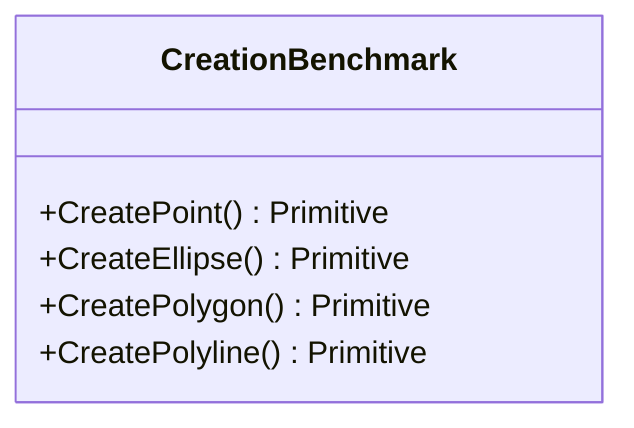

<div id="EllipseCollisionBenchmarks-class-diagram"></div>

##### `EllipseCollisionBenchmarks` class diagram

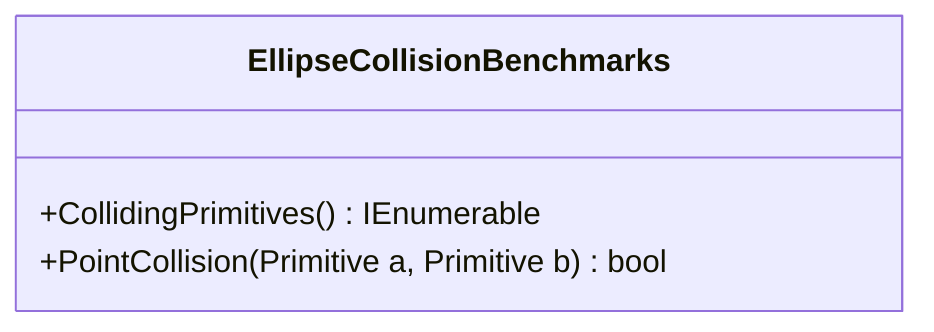

<div id="FastAndDirtyConfig-class-diagram"></div>

##### `FastAndDirtyConfig` class diagram

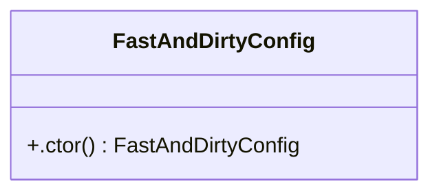

<div id="PointCollisionBenchmarks-class-diagram"></div>

##### `PointCollisionBenchmarks` class diagram

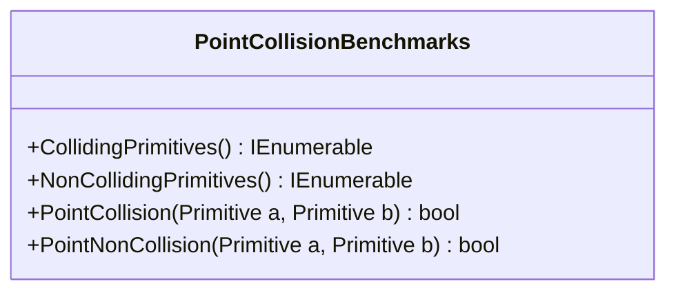

<div id="Program-class-diagram"></div>

##### `Program` class diagram

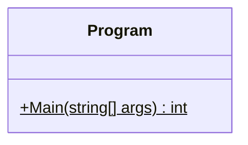

<div id="BenchmarkBase-class-diagram"></div>

##### `BenchmarkBase` class diagram

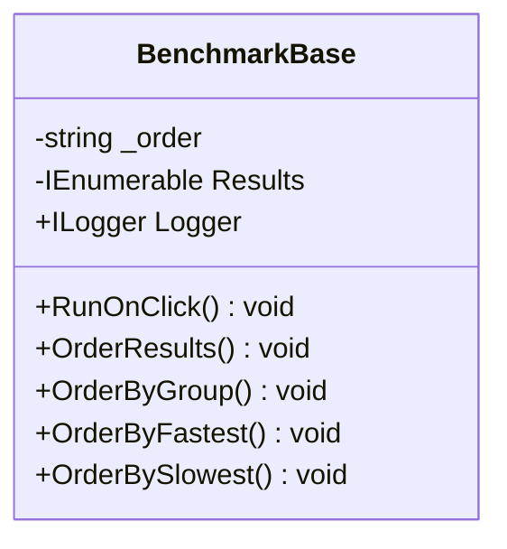

<div id="GeometryProfileFunctions-class-diagram"></div>

##### `GeometryProfileFunctions` class diagram

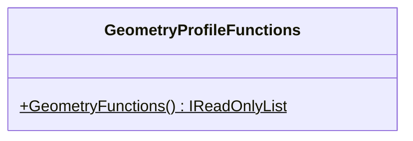

<div id="PrimitiveCreation&lt;T&gt;-class-diagram"></div>

##### `PrimitiveCreation<T>` class diagram

```mermaid
classDiagram
class PrimitiveCreation<T>{
    -Func<Random, T> _createPrimitive
    -string _primitiveName
    -Random _random
    +tiveCreation() void
    +Title() string
    +Setup() void
    +Run() void
}

```

<div id="PrimitiveFunction&lt;T&gt;-class-diagram"></div>

##### `PrimitiveFunction<T>` class diagram

```mermaid
classDiagram
class PrimitiveFunction<T>{
    -Func<Random, T> _createPrimitive
    -string _operationName
    -string _primitiveName
    -Action<T> _primitiveOperation
    -T _primitive
    -Random _random
    +tiveFunction(Action<T> primitiveOperation, string operationName) void
    +Title() string
    +Setup() void
    +Reset() void
    +Run() void
}

```

<div id="ProfileFunction-class-diagram"></div>

##### `ProfileFunction` class diagram

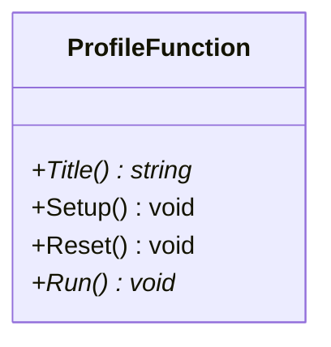

<div id="ProfileFunctionResult-class-diagram"></div>

##### `ProfileFunctionResult` class diagram

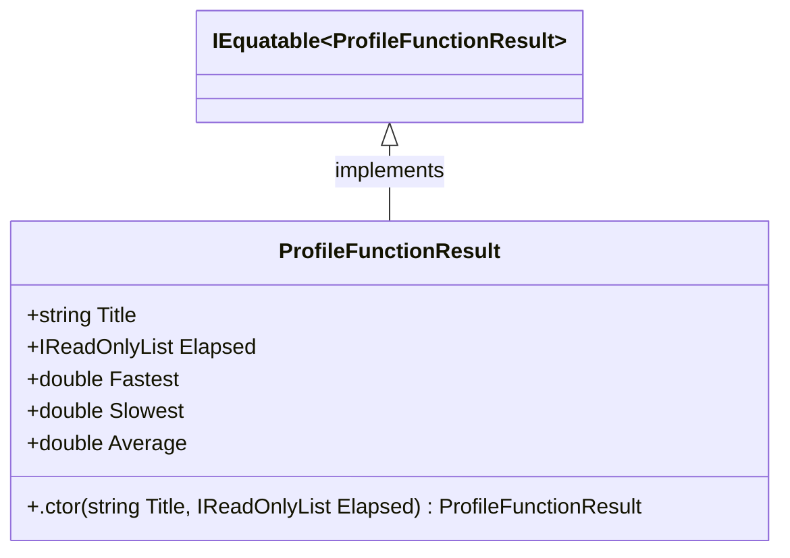

<div id="ProfileHelpers-class-diagram"></div>

##### `ProfileHelpers` class diagram

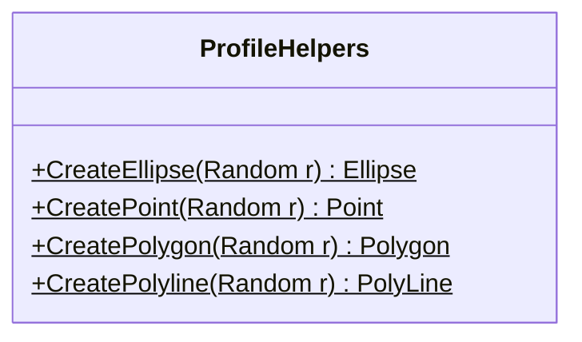

<div id="ProfileRunner-class-diagram"></div>

##### `ProfileRunner` class diagram

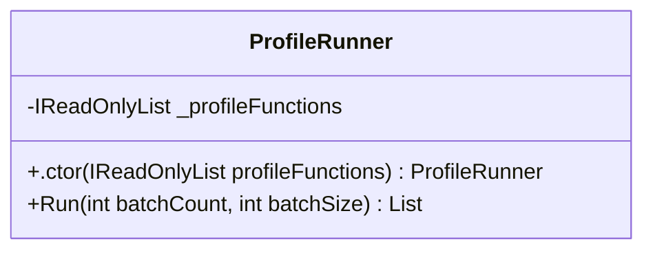

<div id="AsciiBase-class-diagram"></div>

##### `AsciiBase` class diagram

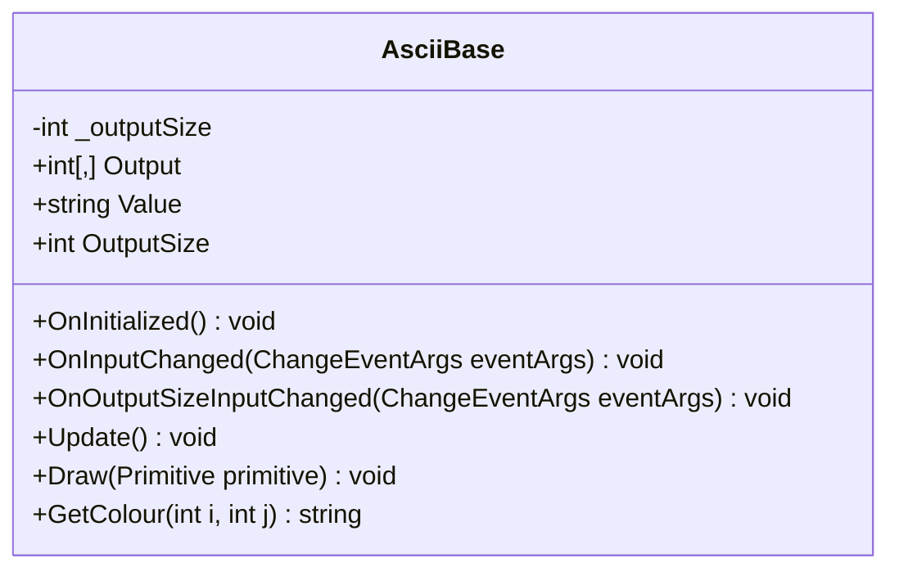

<div id="CanvasBase-class-diagram"></div>

##### `CanvasBase` class diagram

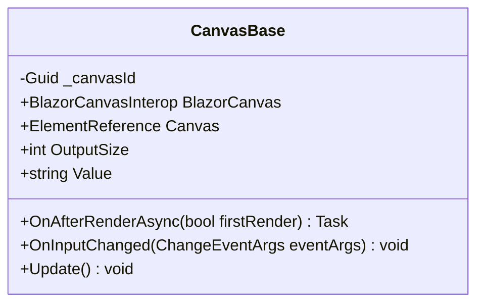

<div id="IndexBase-class-diagram"></div>

##### `IndexBase` class diagram

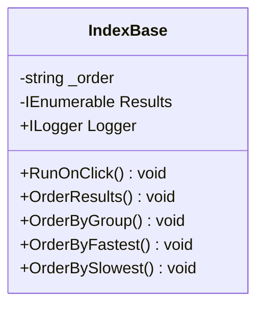

<div id="LineSegmentCollisionDetectionMethods-class-diagram"></div>

##### `LineSegmentCollisionDetectionMethods` class diagram

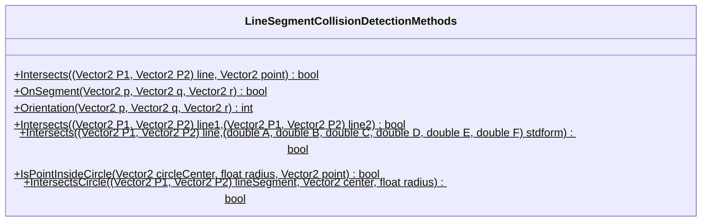

<div id="PrimitiveCollisionDetectionMethods-class-diagram"></div>

##### `PrimitiveCollisionDetectionMethods` class diagram

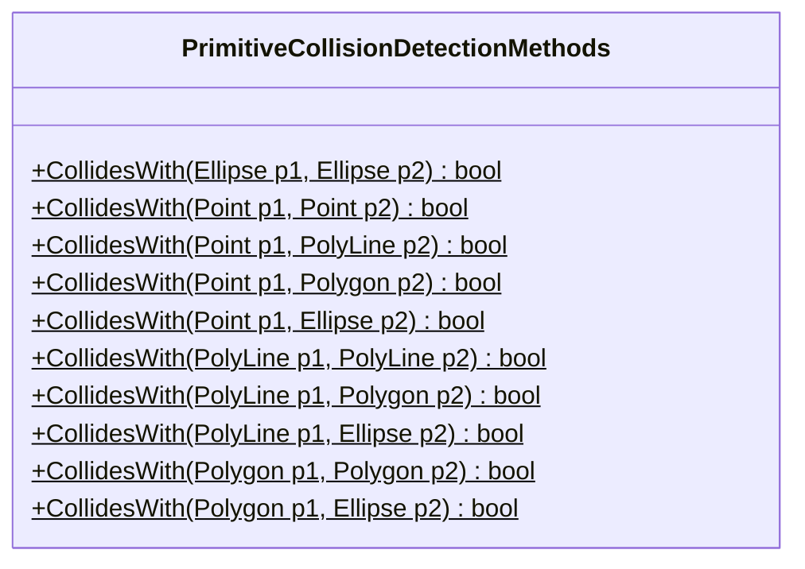

<div id="Vector2CollisionDetectionMethods-class-diagram"></div>

##### `Vector2CollisionDetectionMethods` class diagram

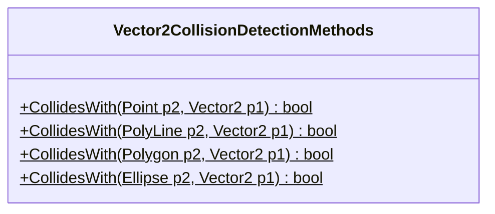

<div id="Constants-class-diagram"></div>

##### `Constants` class diagram

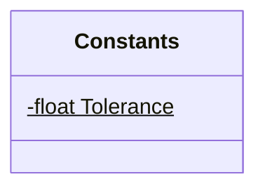

<div id="Ellipse-class-diagram"></div>

##### `Ellipse` class diagram

```mermaid
classDiagram
class Ellipse{
    -bool _updateStandardForm
    -(double A, double B, double C, double D, double E, double F) _standardForm
    -bool _updateFoci
    -(Vector2, Vector2) _foci
    -Ellipse Zero$
    -Ellipse Unit$
    +float Rotation
    +Vector2 Radii
    +(double A, double B, double C, double D, double E, double F) StandardForm
    +Vector2 Position
    +(Vector2, Vector2) Foci
    +bool IsCircle
    +ToString() string
    +.ctor(VertexArray vertexArray, BoundingRectangle boundingRectangle, Vector2 radii, float rotation) Ellipse
    +Create(float x, float y, float a, float b, float rotation)$ Ellipse
    +Create(Vector2 position, Vector2 radii, float rotation)$ Ellipse
    +Create(Vector2 position, float radius)$ Ellipse
    +GetHashCode() int
    +Equals(Primitive? other) bool
    +CollidesWith(Vector2 p) bool
    +CollidesWith(Point p) bool
    +CollidesWith(Ellipse p) bool
    +CollidesWith(PolyLine p) bool
    +CollidesWith(BoundingRectangle p) bool
    +CollidesWith(Polygon p) bool
    +Translate(Vector2 delta) Ellipse
    +ScaleAboutCenter(Vector2 delta) Ellipse
    +Rotate(float theta) Ellipse
    +Rotate(Vector2 rotationCenter, float theta) Ellipse
    +Skew(Vector2 delta) Ellipse
    +GetFoci() (Vector2 f1, Vector2 f2)
    +GetStandardForm() (double A, double B, double C, double D, double E, double F)
}

```

<div id="EllipseExtensions-class-diagram"></div>

##### `EllipseExtensions` class diagram

```mermaid
classDiagram
class EllipseExtensions{
    +GetBoundingRectangle(Vector2 position, Vector2 radii, float rotation)$ BoundingRectangle
    +GetResultantPolynomial(double a1, double b1, double c1, double d1, double e1, double f1, double a2, double b2, double c2, double d2, double e2, double f2)$ (double u0, double u1, double u2, double u3, double u4)
    +QuarticHasRealRoots(double u0, double u1, double u2, double u3, double u4)$ bool
}

```

<div id="Point-class-diagram"></div>

##### `Point` class diagram

```mermaid
classDiagram
class Point{
    +Vector2 Position
    +Point Zero$
    +Point Unit$
    +ToString() string
    +Equals(Primitive? other) bool
    +GetHashCode() int
    +CollidesWith(Vector2 p) bool
    +CollidesWith(Point p) bool
    +CollidesWith(Ellipse p) bool
    +CollidesWith(PolyLine p) bool
    +CollidesWith(BoundingRectangle p) bool
    +CollidesWith(Polygon p) bool
    +.ctor(VertexArray vertexArray, BoundingRectangle boundingRectangle) Point
    +Create(float x, float y)$ Point
    +Create(Vector2 position)$ Point
}

```

<div id="Polygon-class-diagram"></div>

##### `Polygon` class diagram

```mermaid
classDiagram
class Polygon{
    -bool _updateEdges
    -(Vector2 P1, Vector2 P2)[] _edges
    +(Vector2 P1, Vector2 P2)[] Edges
    +ToString() string
    +Equals(Primitive? other) bool
    +GetHashCode() int
    +CollidesWith(Vector2 p) bool
    +CollidesWith(Point p) bool
    +CollidesWith(Ellipse p) bool
    +CollidesWith(PolyLine p) bool
    +CollidesWith(BoundingRectangle p) bool
    +CollidesWith(Polygon p) bool
    +.ctor(VertexArray vertices, BoundingRectangle boundingRectangle) Polygon
    +Create(params Vector2[] vertices)$ Polygon
    +Create(params float[] points)$ Polygon
    +UpdateEdges() void
    +Translate(Vector2 delta) Polygon
    +ScaleAboutCenter(Vector2 delta) Polygon
    +Scale(Vector2 scaleCenter, Vector2 delta) Primitive
    +Rotate(float theta) Polygon
    +Rotate(Vector2 rotationCenter, float theta) Polygon
    +Skew(Vector2 delta) Polygon
}

```

<div id="PolyLine-class-diagram"></div>

##### `PolyLine` class diagram

```mermaid
classDiagram
class PolyLine{
    -bool _updateLineSegments
    -(Vector2 P1, Vector2 P2)[] _lineSegments
    -PolyLine Zero$
    +(Vector2 P1, Vector2 P2)[] LineSegments
    +ToString() string
    +Equals(Primitive? other) bool
    +GetHashCode() int
    +CollidesWith(Vector2 p) bool
    +CollidesWith(Point p) bool
    +CollidesWith(Ellipse p) bool
    +CollidesWith(PolyLine p) bool
    +CollidesWith(BoundingRectangle p) bool
    +CollidesWith(Polygon p) bool
    +.ctor(VertexArray vertices, BoundingRectangle boundingRectangle) PolyLine
    +Create(params float[] points)$ PolyLine
    +Create(params Vector2[] points)$ PolyLine
    +UpdateLineSegments() void
    +Translate(Vector2 delta) PolyLine
    +ScaleAboutCenter(Vector2 delta) PolyLine
    +Scale(Vector2 scaleCenter, Vector2 delta) Primitive
    +Rotate(float theta) PolyLine
    +Rotate(Vector2 rotationCenter, float theta) PolyLine
    +Skew(Vector2 delta) PolyLine
}

```

<div id="Primitive-class-diagram"></div>

##### `Primitive` class diagram

```mermaid
classDiagram
class Primitive{
    +VertexArray Vertices
    +BoundingRectangle BoundingRectangle
    +.ctor(VertexArray vertices, BoundingRectangle boundingRectangle) Primitive
    +ToString()* string
    +GetHashCode()* int
    +Equals(Primitive? other)* bool
    +Equals(object obj) bool
    +operator ==(Primitive lhs, Primitive rhs)$ bool
    +operator !=(Primitive lhs, Primitive rhs)$ bool
    +CollidesWith(Vector2 p)* bool
    +CollidesWith(Point p)* bool
    +CollidesWith(Ellipse p)* bool
    +CollidesWith(PolyLine p)* bool
    +CollidesWith(Polygon p)* bool
    +CollidesWith(BoundingRectangle p)* bool
    +CollidesWithPrimitive(Primitive p) bool
    +Translate(Vector2 delta) Primitive
    +Rotate(float theta) Primitive
    +Rotate(Vector2 rotationCenter, float theta) Primitive
    +ScaleAboutCenter(Vector2 delta) Primitive
    +Scale(Vector2 scaleCenter, Vector2 delta) Primitive
    +Skew(Vector2 delta) Primitive
    +SetSize(Vector2 delta) Primitive
    +SetPosition(Vector2 position) Primitive
}

```

<div id="Polygon.Rectangle-class-diagram"></div>

##### `Polygon.Rectangle` class diagram

```mermaid
classDiagram
class Rectangle{
    +FromTwoPoints(Vector2 a, Vector2 b)$ Polygon
}

```

<div id="BoundingRectangle-class-diagram"></div>

##### `BoundingRectangle` class diagram

```mermaid
classDiagram
IEquatable~BoundingRectangle~ <|-- BoundingRectangle : implements
class BoundingRectangle{
    -BoundingRectangle Zero$
    +Vector2 TopRight
    +Vector2 BottomLeft
    +Vector2 Size
    +Vector2 Center
    +float X
    +float Y
    +float Width
    +float Height
    +.ctor(Vector2 a, Vector2 b) BoundingRectangle
    +CollidesWith(BoundingRectangle rect) bool
    +CollidesWith(Vector2 point) bool
    +CollidesWith(Primitive primitive) bool
    +ToString() string
    +GetHashCode() int
    +Equals(object obj) bool
    +Equals(BoundingRectangle other) bool
    +operator ==(BoundingRectangle lhs, BoundingRectangle rhs)$ bool
    +operator !=(BoundingRectangle lhs, BoundingRectangle rhs)$ bool
}

```

<div id="BoundingRectangleExtensions-class-diagram"></div>

##### `BoundingRectangleExtensions` class diagram

```mermaid
classDiagram
class BoundingRectangleExtensions{
    +Translate(BoundingRectangle rectangle, Vector2 delta)$ BoundingRectangle
}

```

<div id="Vector2Extensions-class-diagram"></div>

##### `Vector2Extensions` class diagram

```mermaid
classDiagram
class Vector2Extensions{
    -Matrix3x2 RotationMatrix$
    +VectorCross(Vector2 a, Vector2 b)$ float
    +Perp(Vector2 a)$ Vector2
    +PerpDot(Vector2 a, Vector2 b)$ float
}

```

<div id="VertexArray-class-diagram"></div>

##### `VertexArray` class diagram

```mermaid
classDiagram
IEquatable~VertexArray~ <|-- VertexArray : implements
class VertexArray{
    -Vector2[] Vertices
    +Vector2 this[int key]
    +int Length
    +.ctor(Vector2[] vertices) VertexArray
    +Empty()$ VertexArray
    +Create(params Vector2[] vertices)$ VertexArray
    +Create(params float[] vertices)$ VertexArray
    +Create(IEnumerable<Vector2> vertices)$ VertexArray
    +GetHashCode() int
    +Equals(object obj) bool
    +Equals(VertexArray other) bool
    +operator ==(VertexArray lhs, VertexArray rhs)$ bool
    +operator !=(VertexArray lhs, VertexArray rhs)$ bool
    +ToString() string
}

```

<div id="VertexArrayExtensions-class-diagram"></div>

##### `VertexArrayExtensions` class diagram

```mermaid
classDiagram
class VertexArrayExtensions{
    +Concat(VertexArray vertexArray, params Vector2[] vertices)$ VertexArray
    +Concat(VertexArray vertexArrayA, VertexArray vertexArrayB)$ VertexArray
    +Remove(VertexArray vertexArray, int index)$ VertexArray
    +ToConvexHull(VertexArray vertexArray, float margin)$ VertexArray
    +Orientation(Vector2 p, Vector2 q, Vector2 r)$ int
    +ToConvexHull(Vector2[] points, int n)$ Vector2[]
    +OrderClockwiseFromLeastX(VertexArray vertexArray)$ VertexArray
    +ToBoundingRectangle(VertexArray vertexArray)$ BoundingRectangle
    +Transform(VertexArray vertexArray, Matrix3x2 transformationMatrix)$ BoundingRectangle
    +Translate(VertexArray vertexArray, Vector2 delta)$ BoundingRectangle
    +Rotate(VertexArray vertexArray, Vector2 rotationCenter, float theta)$ BoundingRectangle
    +Scale(VertexArray vertexArray, Vector2 scaleCenter, Vector2 delta)$ BoundingRectangle
    +Skew(VertexArray vertexArray, Vector2 delta)$ BoundingRectangle
}

```

<div id="EllipseBoundingRectangleCollisionTestDataGenerator-class-diagram"></div>

##### `EllipseBoundingRectangleCollisionTestDataGenerator` class diagram

```mermaid
classDiagram
class EllipseBoundingRectangleCollisionTestDataGenerator{
    -List<object[]> _data
    +GetEnumerator() IEnumerator<object[]>
    +GetEnumerator() IEnumerator
}

```

<div id="PointBoundingRectangleCollisionTestDataGenerator-class-diagram"></div>

##### `PointBoundingRectangleCollisionTestDataGenerator` class diagram

```mermaid
classDiagram
class PointBoundingRectangleCollisionTestDataGenerator{
    -List<object[]> _data
    +GetEnumerator() IEnumerator<object[]>
    +GetEnumerator() IEnumerator
}

```

<div id="PolygonBoundingRectangleCollisionTestDataGenerator-class-diagram"></div>

##### `PolygonBoundingRectangleCollisionTestDataGenerator` class diagram

```mermaid
classDiagram
class PolygonBoundingRectangleCollisionTestDataGenerator{
    -List<object[]> _data
    +GetEnumerator() IEnumerator<object[]>
    +GetEnumerator() IEnumerator
}

```

<div id="PolylineBoundingRectangleCollisionTestDataGenerator-class-diagram"></div>

##### `PolylineBoundingRectangleCollisionTestDataGenerator` class diagram

```mermaid
classDiagram
class PolylineBoundingRectangleCollisionTestDataGenerator{
    -List<object[]> _data
    +GetEnumerator() IEnumerator<object[]>
    +GetEnumerator() IEnumerator
}

```

<div id="BoundingRectangleBoundingRectangleCollisionTestDataGenerator-class-diagram"></div>

##### `BoundingRectangleBoundingRectangleCollisionTestDataGenerator` class diagram

```mermaid
classDiagram
class BoundingRectangleBoundingRectangleCollisionTestDataGenerator{
    -List<object[]> _data
    +GetEnumerator() IEnumerator<object[]>
    +GetEnumerator() IEnumerator
}

```

<div id="BoundingRectangleCollisionTests-class-diagram"></div>

##### `BoundingRectangleCollisionTests` class diagram

```mermaid
classDiagram
class BoundingRectangleCollisionTests{
    +BoundingRectangleBoundingRectangleCollision(BoundingRectangle p1, BoundingRectangle p2, bool collides) void
    +BoundingRectangleVector2Collision(BoundingRectangle p1, Vector2 p2, bool collides) void
}

```

<div id="BoundingRectangleEqualityTests.BoundingRectangleEqualityTestDataGenerator-class-diagram"></div>

##### `BoundingRectangleEqualityTests.BoundingRectangleEqualityTestDataGenerator` class diagram

```mermaid
classDiagram
class BoundingRectangleEqualityTestDataGenerator{
    -List<object[]> _data
    +GetEnumerator() IEnumerator<object[]>
    +GetEnumerator() IEnumerator
}

```

<div id="BoundingRectangleEqualityTests-class-diagram"></div>

##### `BoundingRectangleEqualityTests` class diagram

```mermaid
classDiagram
class BoundingRectangleEqualityTests{
    +BoundingRectangleEquality_Equality(BoundingRectangle p1, BoundingRectangle p2, bool areEqual) void
}

```

<div id="BoundingRectangleToStringTests.BoundingRectangleToStringTestDataGenerator-class-diagram"></div>

##### `BoundingRectangleToStringTests.BoundingRectangleToStringTestDataGenerator` class diagram

```mermaid
classDiagram
class BoundingRectangleToStringTestDataGenerator{
    -List<object[]> _data
    +GetEnumerator() IEnumerator<object[]>
    +GetEnumerator() IEnumerator
}

```

<div id="BoundingRectangleToStringTests-class-diagram"></div>

##### `BoundingRectangleToStringTests` class diagram

```mermaid
classDiagram
class BoundingRectangleToStringTests{
    +BoundingRectangleToString(BoundingRectangle p1, string expected) void
}

```

<div id="BoundingRectangleVector2CollisionTestDataGenerator-class-diagram"></div>

##### `BoundingRectangleVector2CollisionTestDataGenerator` class diagram

```mermaid
classDiagram
class BoundingRectangleVector2CollisionTestDataGenerator{
    -List<object[]> _data
    +GetEnumerator() IEnumerator<object[]>
    +GetEnumerator() IEnumerator
}

```

<div id="Collision_Tests-class-diagram"></div>

##### `Collision_Tests` class diagram

```mermaid
classDiagram
class Collision_Tests{
    +PrimitiveCollidesWithPrimitive(Primitive p1, Primitive p2, bool collides) void
    +PrimitiveCollidesWithVector2(Primitive p1, Vector2 p2, bool collides) void
    +PrimitiveCollidesWithBoundingRectangle(Primitive p1, BoundingRectangle rectangle, bool collides) void
}

```

<div id="EllipseCollisionTests-class-diagram"></div>

##### `EllipseCollisionTests` class diagram

```mermaid
classDiagram
class EllipseCollisionTests{
    -ITestOutputHelper _output
    +.ctor(ITestOutputHelper output) EllipseCollisionTests
    +CircleVector2CollisionTests(Ellipse p1, int[,] collisionMatrix) void
}

```

<div id="EllipseCreationTestDataGenerator-class-diagram"></div>

##### `EllipseCreationTestDataGenerator` class diagram

```mermaid
classDiagram
class EllipseCreationTestDataGenerator{
    -List<object[]> _data
    +GetEnumerator() IEnumerator<object[]>
    +GetEnumerator() IEnumerator
}

```

<div id="PointCreationTestDataGenerator-class-diagram"></div>

##### `PointCreationTestDataGenerator` class diagram

```mermaid
classDiagram
class PointCreationTestDataGenerator{
    -List<object[]> _data
    +GetEnumerator() IEnumerator<object[]>
    +GetEnumerator() IEnumerator
}

```

<div id="PolygonCreationTestDataGenerator-class-diagram"></div>

##### `PolygonCreationTestDataGenerator` class diagram

```mermaid
classDiagram
class PolygonCreationTestDataGenerator{
    -List<object[]> _data
    +GetEnumerator() IEnumerator<object[]>
    +GetEnumerator() IEnumerator
}

```

<div id="PolylineCreationTestDataGenerator-class-diagram"></div>

##### `PolylineCreationTestDataGenerator` class diagram

```mermaid
classDiagram
class PolylineCreationTestDataGenerator{
    -List<object[]> _data
    +GetEnumerator() IEnumerator<object[]>
    +GetEnumerator() IEnumerator
}

```

<div id="PrimitiveCreationTests-class-diagram"></div>

##### `PrimitiveCreationTests` class diagram

```mermaid
classDiagram
class PrimitiveCreationTests{
    +PrimitiveCreation(Primitive primitive, VertexArray expected) void
}

```

<div id="EllipseStandardFormTestDataGenerator-class-diagram"></div>

##### `EllipseStandardFormTestDataGenerator` class diagram

```mermaid
classDiagram
class EllipseStandardFormTestDataGenerator{
    -List<object[]> _data
    +GetEnumerator() IEnumerator<object[]>
    +GetEnumerator() IEnumerator
}

```

<div id="EllipseStandardformTests-class-diagram"></div>

##### `EllipseStandardformTests` class diagram

```mermaid
classDiagram
class EllipseStandardformTests{
    +TestStandardForm(Ellipse ellipse, float a, float b, float c, float d, float e, float f) void
}

```

<div id="EllipseEqualityTestDataGenerator-class-diagram"></div>

##### `EllipseEqualityTestDataGenerator` class diagram

```mermaid
classDiagram
class EllipseEqualityTestDataGenerator{
    -List<object[]> _data
    +GetEnumerator() IEnumerator<object[]>
    +GetEnumerator() IEnumerator
}

```

<div id="PointEqualityTestDataGenerator-class-diagram"></div>

##### `PointEqualityTestDataGenerator` class diagram

```mermaid
classDiagram
class PointEqualityTestDataGenerator{
    -List<object[]> _data
    +GetEnumerator() IEnumerator<object[]>
    +GetEnumerator() IEnumerator
}

```

<div id="PolygonEqualityTestDataGenerator-class-diagram"></div>

##### `PolygonEqualityTestDataGenerator` class diagram

```mermaid
classDiagram
class PolygonEqualityTestDataGenerator{
    -List<object[]> _data
    +GetEnumerator() IEnumerator<object[]>
    +GetEnumerator() IEnumerator
}

```

<div id="PolylineEqualityTestDataGenerator-class-diagram"></div>

##### `PolylineEqualityTestDataGenerator` class diagram

```mermaid
classDiagram
class PolylineEqualityTestDataGenerator{
    -List<object[]> _data
    +GetEnumerator() IEnumerator<object[]>
    +GetEnumerator() IEnumerator
}

```

<div id="PrimitiveEqualityTests-class-diagram"></div>

##### `PrimitiveEqualityTests` class diagram

```mermaid
classDiagram
class PrimitiveEqualityTests{
    +Primitive_Equality(Primitive p1, Primitive p2, bool areEqual) void
}

```

<div id="EllipseVector2CollisionTestDataGenerator-class-diagram"></div>

##### `EllipseVector2CollisionTestDataGenerator` class diagram

```mermaid
classDiagram
class EllipseVector2CollisionTestDataGenerator{
    -List<object[]> _data
    +GetEnumerator() IEnumerator<object[]>
    +GetEnumerator() IEnumerator
}

```

<div id="EllipseVector2CollisionTestDataGenerator2-class-diagram"></div>

##### `EllipseVector2CollisionTestDataGenerator2` class diagram

```mermaid
classDiagram
class EllipseVector2CollisionTestDataGenerator2{
    -List<object[]> _data
    +GetEnumerator() IEnumerator<object[]>
    +GetEnumerator() IEnumerator
}

```

<div id="EllipseVector2CollisionTestDataGenerator3-class-diagram"></div>

##### `EllipseVector2CollisionTestDataGenerator3` class diagram

```mermaid
classDiagram
class EllipseVector2CollisionTestDataGenerator3{
    -List<object[]> _data
    +GetEnumerator() IEnumerator<object[]>
    +GetEnumerator() IEnumerator
}

```

<div id="PointVector2CollisionTestDataGenerator-class-diagram"></div>

##### `PointVector2CollisionTestDataGenerator` class diagram

```mermaid
classDiagram
class PointVector2CollisionTestDataGenerator{
    -List<object[]> _data
    +GetEnumerator() IEnumerator<object[]>
    +GetEnumerator() IEnumerator
}

```

<div id="PolygonVector2CollisionTestDataGenerator-class-diagram"></div>

##### `PolygonVector2CollisionTestDataGenerator` class diagram

```mermaid
classDiagram
class PolygonVector2CollisionTestDataGenerator{
    -List<object[]> _data
    +GetEnumerator() IEnumerator<object[]>
    +GetEnumerator() IEnumerator
}

```

<div id="PolylineVector2CollisionTestDataGenerator-class-diagram"></div>

##### `PolylineVector2CollisionTestDataGenerator` class diagram

```mermaid
classDiagram
class PolylineVector2CollisionTestDataGenerator{
    -List<object[]> _data
    +GetEnumerator() IEnumerator<object[]>
    +GetEnumerator() IEnumerator
}

```

<div id="EllipsePrimitiveCollisionTestDataGenerator-class-diagram"></div>

##### `EllipsePrimitiveCollisionTestDataGenerator` class diagram

```mermaid
classDiagram
class EllipsePrimitiveCollisionTestDataGenerator{
    -List<object[]> _data
    +GetEnumerator() IEnumerator<object[]>
    +GetEnumerator() IEnumerator
}

```

<div id="PointPrimitiveCollisionTestDataGenerator-class-diagram"></div>

##### `PointPrimitiveCollisionTestDataGenerator` class diagram

```mermaid
classDiagram
class PointPrimitiveCollisionTestDataGenerator{
    -List<object[]> _data
    +GetEnumerator() IEnumerator<object[]>
    +GetEnumerator() IEnumerator
}

```

<div id="PolygonPrimitiveCollisionTestDataGenerator-class-diagram"></div>

##### `PolygonPrimitiveCollisionTestDataGenerator` class diagram

```mermaid
classDiagram
class PolygonPrimitiveCollisionTestDataGenerator{
    -List<object[]> _data
    +GetEnumerator() IEnumerator<object[]>
    +GetEnumerator() IEnumerator
}

```

<div id="PolylinePrimitiveCollisionTestDataGenerator-class-diagram"></div>

##### `PolylinePrimitiveCollisionTestDataGenerator` class diagram

```mermaid
classDiagram
class PolylinePrimitiveCollisionTestDataGenerator{
    -List<object[]> _data
    +GetEnumerator() IEnumerator<object[]>
    +GetEnumerator() IEnumerator
}

```

<div id="EllipseCenterScaleTestDataGenerator-class-diagram"></div>

##### `EllipseCenterScaleTestDataGenerator` class diagram

```mermaid
classDiagram
class EllipseCenterScaleTestDataGenerator{
    -List<object[]> _data
    +GetEnumerator() IEnumerator<object[]>
    +GetEnumerator() IEnumerator
}

```

<div id="PointCenterScaleTestDataGenerator-class-diagram"></div>

##### `PointCenterScaleTestDataGenerator` class diagram

```mermaid
classDiagram
class PointCenterScaleTestDataGenerator{
    -List<object[]> _data
    +GetEnumerator() IEnumerator<object[]>
    +GetEnumerator() IEnumerator
}

```

<div id="PolygonCenterScaleTestDataGenerator-class-diagram"></div>

##### `PolygonCenterScaleTestDataGenerator` class diagram

```mermaid
classDiagram
class PolygonCenterScaleTestDataGenerator{
    -List<object[]> _data
    +GetEnumerator() IEnumerator<object[]>
    +GetEnumerator() IEnumerator
}

```

<div id="PolylineCenterScaleTestDataGenerator-class-diagram"></div>

##### `PolylineCenterScaleTestDataGenerator` class diagram

```mermaid
classDiagram
class PolylineCenterScaleTestDataGenerator{
    -List<object[]> _data
    +GetEnumerator() IEnumerator<object[]>
    +GetEnumerator() IEnumerator
}

```

<div id="UnitTests-class-diagram"></div>

##### `UnitTests` class diagram

```mermaid
classDiagram
class UnitTests{
    +QuarticHasRealRoots_Test() void
    +Perp_Test() void
    +PerpDotXVectorCrossTest() void
    +newLineSegmentIntersection_Test() void
}

```

<div id="EllipseToStringTestDataGenerator-class-diagram"></div>

##### `EllipseToStringTestDataGenerator` class diagram

```mermaid
classDiagram
class EllipseToStringTestDataGenerator{
    -List<object[]> _data
    +GetEnumerator() IEnumerator<object[]>
    +GetEnumerator() IEnumerator
}

```

<div id="PointToStringTestDataGenerator-class-diagram"></div>

##### `PointToStringTestDataGenerator` class diagram

```mermaid
classDiagram
class PointToStringTestDataGenerator{
    -List<object[]> _data
    +GetEnumerator() IEnumerator<object[]>
    +GetEnumerator() IEnumerator
}

```

<div id="PolygonToStringTestDataGenerator-class-diagram"></div>

##### `PolygonToStringTestDataGenerator` class diagram

```mermaid
classDiagram
class PolygonToStringTestDataGenerator{
    -List<object[]> _data
    +GetEnumerator() IEnumerator<object[]>
    +GetEnumerator() IEnumerator
}

```

<div id="PolylineToStringTestDataGenerator-class-diagram"></div>

##### `PolylineToStringTestDataGenerator` class diagram

```mermaid
classDiagram
class PolylineToStringTestDataGenerator{
    -List<object[]> _data
    +GetEnumerator() IEnumerator<object[]>
    +GetEnumerator() IEnumerator
}

```

<div id="PrimitiveToStringTests-class-diagram"></div>

##### `PrimitiveToStringTests` class diagram

```mermaid
classDiagram
class PrimitiveToStringTests{
    +PrimitiveToStringTest(Primitive p1, string expected) void
}

```

<div id="PrimitiveTransformationTests-class-diagram"></div>

##### `PrimitiveTransformationTests` class diagram

```mermaid
classDiagram
class PrimitiveTransformationTests{
    +Primitive_Translation(Primitive p1, Vector2 delta, Primitive expected) void
    +Primitive_CenterScale(Primitive p1, Vector2 delta, Primitive expected) void
    +Primitive_SetSize_Test() void
    +Primitive_SetPosition_Test() void
}

```

<div id="EllipseTranslationTestDataGenerator-class-diagram"></div>

##### `EllipseTranslationTestDataGenerator` class diagram

```mermaid
classDiagram
class EllipseTranslationTestDataGenerator{
    -List<object[]> _data
    +GetEnumerator() IEnumerator<object[]>
    +GetEnumerator() IEnumerator
}

```

<div id="PointTranslationTestDataGenerator-class-diagram"></div>

##### `PointTranslationTestDataGenerator` class diagram

```mermaid
classDiagram
class PointTranslationTestDataGenerator{
    -List<object[]> _data
    +GetEnumerator() IEnumerator<object[]>
    +GetEnumerator() IEnumerator
}

```

<div id="PolygonTranslationTestDataGenerator-class-diagram"></div>

##### `PolygonTranslationTestDataGenerator` class diagram

```mermaid
classDiagram
class PolygonTranslationTestDataGenerator{
    -List<object[]> _data
    +GetEnumerator() IEnumerator<object[]>
    +GetEnumerator() IEnumerator
}

```

<div id="PolylineTranslationTestDataGenerator-class-diagram"></div>

##### `PolylineTranslationTestDataGenerator` class diagram

```mermaid
classDiagram
class PolylineTranslationTestDataGenerator{
    -List<object[]> _data
    +GetEnumerator() IEnumerator<object[]>
    +GetEnumerator() IEnumerator
}

```

<div id="VertexArrayConcatTestDataGenerator-class-diagram"></div>

##### `VertexArrayConcatTestDataGenerator` class diagram

```mermaid
classDiagram
class VertexArrayConcatTestDataGenerator{
    -List<object[]> _data
    +GetEnumerator() IEnumerator<object[]>
    +GetEnumerator() IEnumerator
}

```

<div id="VertexArrayEqualityTestDataGenerator-class-diagram"></div>

##### `VertexArrayEqualityTestDataGenerator` class diagram

```mermaid
classDiagram
class VertexArrayEqualityTestDataGenerator{
    -List<object[]> _data
    +GetEnumerator() IEnumerator<object[]>
    +GetEnumerator() IEnumerator
}

```

<div id="VertexArrayTests-class-diagram"></div>

##### `VertexArrayTests` class diagram

```mermaid
classDiagram
class VertexArrayTests{
    +VertexEquality(VertexArray v1, VertexArray v2, bool areEqual) void
    +VertexArray_Concat(VertexArray v1, VertexArray v2, VertexArray expected) void
    +VertexArray_Translate(VertexArray v1, Vector2 delta, VertexArray expected) void
}

```

<div id="VertexArrayTransformationTests-class-diagram"></div>

##### `VertexArrayTransformationTests` class diagram

```mermaid
classDiagram
class VertexArrayTransformationTests{
    +VertexArray_Translation_Test() void
    +VertexArray_Rotation_Test() void
    +VertexArray_Scale_Test() void
    +VertexArray_BoundingRectangle_Scale_Test() void
}

```

<div id="VertexArrayTranslateTestDataGenerator-class-diagram"></div>

##### `VertexArrayTranslateTestDataGenerator` class diagram

```mermaid
classDiagram
class VertexArrayTranslateTestDataGenerator{
    -List<object[]> _data
    +GetEnumerator() IEnumerator<object[]>
    +GetEnumerator() IEnumerator
}

```

*This file is maintained by a bot.*

<!-- markdownlint-restore -->
